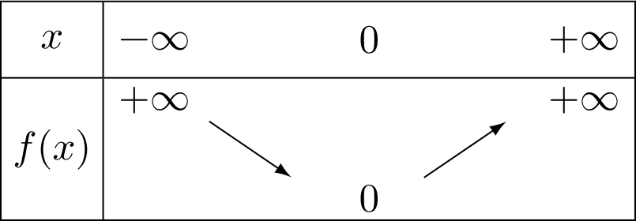
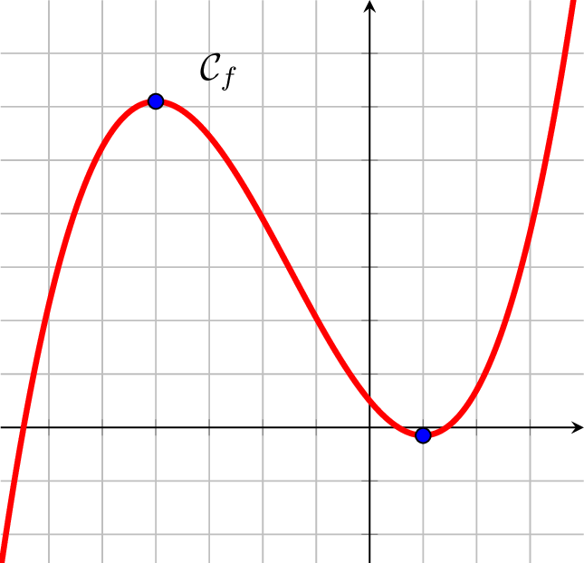
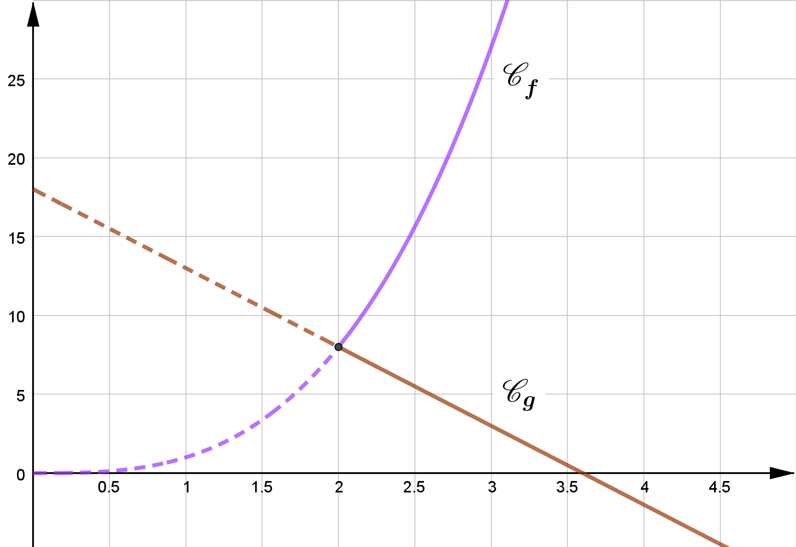

# Dérivation (2) : Fonctions dérivées

## Dérivées des fonctions usuelles

!!! exemple

    Soit la fonction $f$ définie sur $\R$ par $f(x)=x^2$.

    Démontrons que pour tout $x\in\R$ , on : $f'(x)=2x$.

    Pour cela, calculons le **nombre dérivé** de $f$ en un nombre réel quelconque $a$.

    {width=50%}

    Pour $h\neq 0$ :

    $$
        \begin{aligned}
    	    \cfrac{f(a+h)-f(a)}{h} & =\cfrac{(a+h)^2 -a^2 }{h}              \\\\
    	    ~                      & =\cfrac{a^2 +2ah+h^2 -a^2 }{h}          \\\\
    	    ~                      & =\cfrac{2ah+h^2 }{h}                  \\\\
    	    ~                      & =\cfrac{h\times\left(2a+h\right)}{h} \\\\
    	    ~                      & =2a+h
        \end{aligned}
    $$

    Or $\quad\lim\limits_{h\to 0}\left(\cfrac{f(a+h)-f(a)}{h}\right) = \lim\limits_{h\to 0}\left(2a+h\right)=2a$

    $~$

    Pour tout nombre $a$, on associe le **nombre dérivé** de la fonction $f$ égal à $2a$.

    On a donc défini sur $\R$ une fonction, notée $f'$, tel que $f'(x)=2x$.

    Cette fonction s'appelle la **fonction dérivée** de $f$.

!!! rem

    {width=40%}
    /// caption
    C'est au mathématicien français **Joseph-Louis Lagrange** (1736-1813) que l'on doit la notation $f'(x)$ au nom de "dérivée" pour désigner ce concept mathématique.
    ///

!!! definition

    Soit $f$ une fonction définie sur $I$.

    On dit que $f$ est dérivable sur $I$ si elle est dérivable en tout réel $x\in I$.

    Dans ce cas, la fonction qui à tout $x\in I$ associe le **nombre dérivé** de $f$ en $x$ est appelée **fonction dérivée** de $f$ et se note $f'$.

### Formules de dérivation des fonctions usuelles^:heart:^

!!! prop

    $$
        \begin{array}{|lcclc|}\hline
    	    \rule[-2mm]{0cm}{8mm} f                       & \Df  & \quad\quad      & f'                          & \Dfp \\\\ \hline
    	    \rule[-2mm]{0cm}{8mm} f(x)=a                  & \R   & \quad\rarr\quad & f'(x)=0                     & \R   \\\\
    	    \rule[-2mm]{0cm}{8mm} \text{avec}\quad a\in\R &      &                 &                             &      \\\\ \hline
    	    \rule[-2mm]{0cm}{8mm} f(x)=ax                 & \R   & \quad\rarr\quad & f'(x)=a                     & \R   \\\\
    	    \rule[-2mm]{0cm}{8mm} \text{avec}\quad a\in\R &      &                 &                             &      \\\\ \hline
    	    \rule[-2mm]{0cm}{8mm} f(x)=x^2                & \R   & \quad\rarr\quad & f'(x)=2x                    & \R   \\\\ \hline
    	    \rule[-2mm]{0cm}{8mm} f(x)=x^n                & \R   & \quad\rarr\quad & f'(x)=nx^{(n-1)}            & \R   \\\\
    	    \rule[-2mm]{0cm}{8mm} \text{avec}\quad n\ge 1 &      &                 &                             &      \\\\ \hline
    	    \rule[-2mm]{0cm}{8mm} f(x)=\cfrac{1}{x}       & \Ret & \quad\rarr\quad & f'(x)=\cfrac{-1}{x^2}       & \Ret \\\\ \hline
    	    \rule[-2mm]{0cm}{8mm} f(x)=\cfrac{1}{x^n}     & \Ret & \quad\rarr\quad & f'(x)=\cfrac{-n}{x^{(n+1)}} & \Ret \\\\
    	    \rule[-2mm]{0cm}{8mm} \text{avec}\quad n\ge 1 &      &                 &                             &      \\\\ \hline
    	    \rule[-2mm]{0cm}{8mm} f(x)=\sqrt{x}           & \Rp  & \quad\rarr\quad & f'(x)=\cfrac{1}{2\sqrt{x}}  & \Rpe \\\\ \hline
        \end{array}
    $$

!!! exemple

    - Soit $f$ définie sur $\R$ par $\quad \boxed{f(x)=x^4}\quad$ alors :
        - $f$ est dérivable sur $\R$
        - On a, pour tout $x\in\R$, $\quad \boxed{f'(x)=4x^3}$

    - Soit $f$ définie sur $\Ret$ par $\quad \boxed{f(x)=\cfrac{1}{x^5}}\quad$ alors :
        - $f$ est dérivable sur $\Ret$
        - On a, pour tout $x\in\Ret$, $\quad \boxed{f'(x)=\cfrac{-5}{x^6}}$

!!! demo

    **Dérivée de la fonction inverse**

    Soit la fonction $f$ définie sur $\Ret$ par $f(x)=\cfrac{1}{x}$.

    Démontrons que pour tout $x$ de $\Ret$, on a : $f'(x)=\cfrac{-1}{x^2}$.

    - Pour $h\neq 0$ et $h\neq-a$ :

    $$
        \begin{array}{rcl}
    	    \cfrac{f(a+h)-f(a)}{h} & = & \cfrac{\cfrac{1}{a+h}-\cfrac{1}{a}}{h}                                                                                            \\\\
    	                        & = & \cfrac{\cfrac{1\tc{red}{\times a}}{\pa{a+h}\tc{red}{\times a}}-\cfrac{1\tc{red}{\times \pa{a+h}}}{a\tc{red}{\times \pa{a+h}}}}{h} \\\\
    	                        & = & \cfrac{\quad\cfrac{a-(a+h)}{a(a+h)}\quad}{h}                                                                                      \\\\
    	                        & = & \cfrac{\quad\cfrac{-h}{a(a+h)}\quad}{h}\qquad = \cfrac{-1}{a(a+h)}
        \end{array}
    $$

    - Donc

    $$\lim\limits_{h\to 0}\left(\cfrac{f(a+h)-f(a)}{h}\right)=\lim\limits_{h\to 0}\left(\cfrac{-1}{a(a+h)}\right)=\cfrac{-1}{a^2}$$

    Pour tout nombre $a$, on associe le **nombre dérivé** de $f$ égal à $\cfrac{-1}{a^2}$.

    Ainsi, pour tout $x\in\Ret$, on a : $\boxed{f'(x)=\cfrac{-1}{x^2}}$.

!!! demo

    **Non dérivabilité de la fonction racine carrée en $0$**

    Soit la fonction $f$ définie sur $\left[0~;~+\infty\right[$ par $f(x)=\sqrt{x}$

    On calcule le taux de variation de $f$ en $0$ :

    - Pour $h>0$ :

    $$
        \begin{array}{rcl}
    	    \cfrac{f(0+h)-f(0)}{h} & = & \cfrac{\sqrt{0+h}-\sqrt{0}}{h}                                                               \\\\
    	                        & = & \cfrac{\sqrt{h}}{h}\qquad=\cfrac{\sqrt{h}}{\sqrt{h}\times\sqrt{h}}\qquad=\cfrac{1}{\sqrt{h}}
        \end{array}
    $$

    - Donc :

    $$\lim\limits_{h\to 0}\left(\cfrac{f(0+h)-f(0)}{h}\right)=\lim\limits_{h\to 0}\left(\cfrac{1}{\sqrt{h}}\right)=+\infty$$

    En effet, lorsque $h\to 0$, $\left(\cfrac{1}{\sqrt{h}}\right)$ prend des valeurs de plus en plus grandes.

    Donc $f$ n'est pas dérivable en $0$.

    Géométriquement, cela signifie que la courbe représentative de la fonction **racine carrée** admet une **tangente verticale** en $x=0$.

    {width=80%}

## Opérations sur les fonctions dérivées

### Somme, produit, inverse, quotient de dérivées

!!! exemple

    Soit la fonction $f$ définie sur $\R$ par $f(x)=x+x^2$.

    Pour $h\neq 0$ :

    $$
        \begin{array}{rcl}
    	    \cfrac{\tc{blue}{f(a+h)}-\tc{red}{f(a)}}{h} & = & \cfrac{\left(\tc{blue}{(a+h)+(a+h)^2 }\right)-\tc{red}{(a+a^2 )}}{h}           \\\\
    	    ~                                           & = & \cfrac{a+h+a^2 +2ah+h^2 -a-a^2 }{h}                                             \\\\
    	    ~                                           & = & \cfrac{h+2ah+h^2 }{h}=\cfrac{h(1+2a+h)}{h}\quad=1+2a+h
        \end{array}
    $$

    Donc : $\lim\limits_{h\to 0}\left(\cfrac{f(a+h)-f(a)}{h}\right)= \lim\limits_{h\to 0}\left(1+2a+h\right)=1+2a$.

    $~$

    On a $f$ dérivable sur $\R$ et pour tout $x\in\R$ et $f'(x)=1+2x$.

    On pose pour tout $x\in\R$ : $\quad u(x)=x~$ et $~v(x)=x^2$. On a ainsi : $f(x)=u(x)+v(x)$

    Pour tout $x\in\R$, on a donc : $\quad u'(x)=1~$ et $~v'(x)=2x$

    On constate sur cet exemple que : $~f'(x)=u'(x)+v'(x)$

    Soit encore $\boxed{~(u+v)'(x)=u'(x)+v'(x)~}$

### Formules d'opération sur les fonctions dérivées^:heart:^

!!! prop

    $u$ et $v$ sont deux fonctions dérivables sur $I$.

    | Dérivabilité                                      | Propriété                                         |
    | :------------------------------------------------ | :------------------------------------------------ |
    | $(u+v)$ est dérivable sur $I$                     | $(u+v)'=u'+v'$                                    |
    | $(ku)$ est dérivable sur $I$ avec $k\in\R$        | $(ku)'=ku'$                                       |
    | $(uv)$ est dérivable sur $I$                      | $(uv)'=u'v+uv'$                                   |
    | $(u^n)$ est dérivable sur $I$                     | $(u^n )'=nu'u^{n-1}$                              |
    | $\left(\cfrac{1}{u}\right)$ est dérivable sur $I$ | $\left(\cfrac{1}{u}\right)'=\cfrac{-u'}{u^2}$     |
    | Avec $u$ qui **ne s'annule pas** sur $I$          |                                                   |
    |                                                   |                                                   |
    | $\left(\cfrac{u}{v}\right)$ est dérivable sur $I$ | $\left(\cfrac{u}{v}\right)'=\cfrac{u'v-uv'}{v^2}$ |
    | Avec $v$ qui **ne s'annule pas** sur $I$          |                                                   |

!!! demo

    **$(uv)'=u'v+uv'$**

    - On veut démontrer que :

    $$\lim\limits_{h\to 0}\left(\cfrac{(uv)(a+h)-(uv)(a)}{h}\right) = u'(a)v(a)+u(a)v'(a)$$

    - Calculons $\pa{\cfrac{(uv)(a+h)-(uv)(a)}{h}}$

    $$
        \begin{array}{rl}
    	    \cfrac{(uv)(a+h)-(uv)(a)}{h} & =\cfrac{u(a+h)v(a+h)-u(a)v(a)}{h}                                                                                                                             \\\\
    	                                & =\cfrac{u(a+h)v(a+h)\quad\color{blue}-u(a)v(a+h)+u(a)v(a+h)\color{black}\quad-u(a)v(a)}{h}                                                                    \\\\
    	                                & =\cfrac{u(a+h)\color{violet}v(a+h)\color{black}-u(a)\color{violet}v(a+h)\color{black}+\color{red}u(a)\color{black}v(a+h)-\color{red}u(a)\color{black}v(a)}{h} \\\\
    	                                & =\cfrac{\Big(u(a+h)-u(a)\Big)\color{violet}v(a+h)\color{black}+\color{red}u(a)\color{black}\Big(v(a+h)-v(a)\Big)}{h}                                          \\\\
    	                                & =\cfrac{\Big(u(a+h)-u(a)\Big)v(a+h)}{h}+\cfrac{u(a)\Big(v(a+h)-v(a)\Big)}{h}                                                                                  \\\\
    	                                & =\cfrac{u(a+h)-u(a)}{h}\times v(a+h)\quad+\quad u(a)\times \cfrac{v(a+h)-v(a)}{h}
        \end{array}
    $$

    On a :

    - $\lim\limits_{h\to 0}\left(u(a+h)\right)=u(a)$
    - $\lim\limits_{h\to 0}\left(v(a+h)\right)=v(a)$

    De plus, on a $u$ et $v$ dérivables sur $I$ donc :

    - $\lim\limits_{h\to 0}\left(\cfrac{u(a+h)-u(a)}{h}\right)=u'(a)$
    - $\lim\limits_{h\to 0}\left(\cfrac{v(a+h)-v(a)}{h}\right)=v'(a)$

    En passant à la limite lorsque $h\to 0$, on a :

    $$
        \begin{array}{rclcl}
    	    (uv)' & = & \lim\limits_{h\to 0}\left(\cfrac{(uv)(a+h)-(uv)(a)}{h}\right)        & ~ & ~                                                                  \\\\
    	    ~     & = & \lim\limits_{h\to 0}\Big(\cfrac{u(a+h)-u(a)}{h}\times v(a+h)         & + & u(a)\times \cfrac{v(a+h)-v(a)}{h}\Big)                             \\\\
    	    ~     & = & \lim\limits_{h\to 0}\left(\cfrac{u(a+h)-u(a)}{h}\times v(a+h)\right) & + & \lim\limits_{h\to 0}\left(\cfrac{v(a+h)-v(a)}{h}\times u(a)\right) \\\\
    	    ~     & = & u'(a)v(a)                                                            & + & u(a)v'(a)
        \end{array}
    $$

    On conclut que $\boxed{~(uv)'=u'v+uv'~}$

!!! methode

    **Calculer les dérivées de sommes, produits et quotients de fonctions.**

    Calculons les fonctions dérivées des fonctions suivantes :

    - $\boxed{f_1(x)=5x^3}$

    On a : $\quad f_1(x)=5\times u(x)\quad$ avec $\quad u(x)=x^3\quad\Rarr u'(x)=3x^2$

    Donc :

    $$\quad f_1'(x)=5\times u'(x)\quad=5\times 3x^2 =15x^2 \quad\rarr\boxed{f_1'(x)=15x^2 }$$

    ---

    - $\boxed{f_2(x)=3x^2+4\sqrt{x}}$

    On a : $\quad f_2(x)=3\times u(x)+4\times v(x)\quad$ avec $\begin{cases}u(x)=x^2\\\\v(x)=\sqrt{x}\end{cases}\Rarr\begin{cases}u'(x)=2x\\\\v'(x)=\cfrac{1}{2\sqrt{x}}\end{cases}$

    Donc :

    $$f_2'(x)=\left(3\times u'(x)\right)+\left(4\times v'(x)\right)=\left(3\times 2x\right)+\left(4\times \cfrac{1}{2\sqrt{x}}\right)\quad\rarr\boxed{f_2'(x)=6x+\cfrac{2}{\sqrt{x}}}$$

    ---

    - $\boxed{f_3(x)=\cfrac{1}{2x^2+5x}}$

    On a : $\quad f_3(x)=\cfrac{1}{u}\quad$ avec $u(x)=2x^2+5x\quad\Rarr\begin{array}{rcl} u'(x)&=&\left(2\times 2x\right)+\left(5\times 1\right)\\\\~&=&4x+5\end{array}$

    Donc :

    $$f_3'(x)=\cfrac{u'}{u^2 }=\cfrac{4x+5}{(2x^2 +5x)^2 }\quad\rarr\boxed{f_3'(x)=\cfrac{4x+5}{(2x^2 +5x)^2 }}$$

    ---

    - $\boxed{f_4(x)=(3x^2+4x)(5x-1)}$

    On a : $\quad f_4(x)=u(x)\times v(x)\quad$ avec $\begin{cases}u(x)=3x^2+4x\\\\v(x)=5x-1\end{cases}\Rarr\begin{cases}u'(x)=6x+4\\\\v'(x)=5\end{cases}$

    Donc :

    $$
        \begin{array}{rcl}
    	    f_4'(x) & = & u'v+uv'                    \\\\
    	            & = & (6x+4)(5x-1)+(3x^2 +4x)(5) \\\\
    	            & = & 30x^2 -6x+20x-4+15x^2 +20x \\\\
    	            & = & 45x^2 +34x-4
        \end{array}
        \qquad\rarr\boxed{f_4'(x)=45x^2 +34x-4}
    $$

    ---

    - $\boxed{f_5(x)=\cfrac{6x-5}{x^3 -2x^2 -1}}$

    On a : $\quad f_5(x)=\cfrac{u(x)}{v(x)}\quad$ avec $\begin{cases}u(x)=6x-5\\\\v(x)=x^3 -2x^2 -1\end{cases}\Rarr\begin{cases}u'(x)=6\\\\v'(x)=3x^2 -4x\end{cases}$

    Donc :

    $$
        \begin{array}{rcl}
    	    f_5'(x) & = & \cfrac{u'v-uv'}{v^2 }                                       \\\\
    	            & = & \cfrac{(6)(x^3 -2x^2 -1)-(6x-5)(3x^2 -4x)}{(x^3 -2x^2 -1)^2 }    \\\\
    	            & = & \cfrac{6x^3 -12x^2 -6-18x^3 +24x^2 +15x^2 -20x}{(x^3 -2x^2 -1)^2 } \\\\
    	            & = & \cfrac{-12x^3 +27x^2 -20x-6}{(x^3 -2x^2 -1)^2 }
        \end{array}
    $$

    Donc $\quad\boxed{f_5'(x)=\cfrac{-12x^3 +27x^2 -20x-6}{(x^3 -2x^2 -1)^2 }}$

### Composée de dérivées

!!! prop

    | $f$       | $\mathcal{D}_f$       | $f'$        |
    | :-------- | :-------------------- | :---------- |
    | $f(ax+b)$ | $f$ dérivable sur $I$ | $af'(ax+b)$ |

!!! exemple

    $f(x)=\sqrt{5x-4}=u(5x-4)\quad$ avec $~u(x)=\sqrt{x}~\Rarr u'(x)=\cfrac{1}{2\sqrt{x}}$

    Donc $f'(x)=5\times u'(5x-4)=5\times\cfrac{1}{2\sqrt{5x-4}}$

### Cas de la fonction valeur absolue

!!! exemple

    - La valeur **absolue** de $8$ est égale à $8$.
    - La valeur **absolue** de $-5$ est égale à $5$.

!!! definition

    La **valeur absolue** d'un nombre $A$ est égal au nombre $A$ si $A$ est **positif**, et au nombre $-A$ si $A$ est négatif.

    La **valeur absolue** de $A$ se note $\abs{A}$.

    $$\abs{A}=\begin{cases}A&\text{si }A\ge0\\\\-A&\text{si }A\le 0\end{cases}$$

!!! exemple

    $$\abs{x-5}\quad=\begin{cases}x-5&\text{si }(x-5)\ge 0\\\\-(x-5)&\text{si }(x-5)\le 0\end{cases}\quad=\begin{cases}x-5&\text{si }x\ge5\\\\5-x&\text{si }x\le 5\end{cases}$$

!!! definition

    La fonction **valeur absolue** est la fonction $f$ définie sur $\R$ par $f(x)=\abs{x}$.

    {width=50%}

!!! propriete

    La fonction **valeur absolue** est :

    - strictement **décroissante** sur $\left]-\infty~;~0\right]$
    - strictement **croissante** sur $\left[0~;~+\infty\right[$.

    {width=50%}

!!! rem

    Dans un repère orthogonal, la courbe représentative de la fonction valeur absolue est symétrique par rapport à l'axe des ordonnées.

!!! demo

    **Étude de la dérivabilité en 0**

    Soit $f$ définie sur $\R$ par $f(x)=\abs{x}$.

    Calculons le taux de variation de $f$ en 0 :

    $$\cfrac{f(0+h)-f(0)}{h}=\cfrac{\abs{0+h}-\abs{0}}{h}=\cfrac{\abs{h}}{h}$$

    - Si $h>0\Rarr\abs{h}=h\quad$ donc $\quad\cfrac{f(0+h)-f(0)}{h}=\cfrac{h}{h}=1$
    - Si $h\lt 0\Rarr\abs{h}=-h\quad$ donc $\quad\cfrac{f(0+h)-f(0)}{h}=\cfrac{-h}{h}=-1$

    {width=70%}
    /// caption
    Où placer la tangente en $x=0$ ?
    ///

    Donc :

    $$
    \lim\limits_{h\to 0}\left(\cfrac{f(0+h)-f(0)}{h}\right)=\begin{cases}
    1\quad\text{si }h>0\\\\-1\quad\text{si }h\lt 0
    \end{cases}
    $$

    Cette limite n'existe pas car elle dépend du signe de $h$.

    La fonction **valeur absolue** n'est donc pas dérivable en 0.

!!! rem

    Cependant, il est à noter que la fonction $f(x)=\abs{x}$ est dérivable en tout nombre différent de $0$.

## Étude de fonctions

### Variations d'une fonction

!!! theoreme

    Soit une fonction $f$ définie et dérivable sur $I$.

    - Si $f'(x)\le 0$, alors $f$ est **décroissante** sur $I$.
    - Si $f'(x)\ge 0$, alors $f$ est **croissante** sur $I$.

!!! exemple

    Soit la fonction $f$ définie sur $\R$ par $f(x)=2x^2-8x+1$.

    {width=50%}

    ---

    **Calcul de $f'(x)$ :**

    $f$ est dérivable sur $\R$ et $\quad f'(x)=4x-8$

    ---

    **Signe de $f'$ en fonction de $x$.**

    Il faut résoudre $f'(x)>0$

    $$f'(x)>0~\iff~4x-8>0~\iff~4x>8~\iff~x>2$$

    Si $~x>2~$ alors $~f'(x)>0~$ donc $~f~$ est **croissante** sur $\left[2~;~+\infty\right[$

    {width=50%}

    $f(2)=2\times (2)^2-8\times(2)+1=-7$

    La fonction $f$ admet un minimum égal à $(-7)$ en $x=2$

!!! exemple

    Soit la fonction $f$ définie sur $\R$ par $f(x)=x^3 +\cfrac{9}{2}x^2 -12x+5$.

    **Calcul de $f'(x)$**

    $f$ est dérivable sur $\R$ et $\quad f'(x)=3x^2 +9x-12$

    ---

    **Signe de $f'$ en fonction de $x$**

    Il faut résoudre $f'(x)>0$

    $f'$ étant une fonction du 2$^{\text{nd}}$ degré, il faut trouver les racines de $~3x^2 +9x-12$.

    On a :

    $$\Delta=b^2 -4ac=9^2 -4\times 3\times (-12)=225\quad>0$$

    Il existe donc 2 racines : $\begin{cases}
    x_1=\cfrac{-b+\sqrt{\Delta}}{2a}=\cfrac{-9+\sqrt{225}}{2\times 3}=1\\\\~\\\\
    x_2=\cfrac{-b-\sqrt{\Delta}}{2a}=\cfrac{-9-\sqrt{225}}{2\times 3}=-4
    \end{cases}$

    On a :

    $$~a=3>0~\text{donc}~f'(x)=(3x^2+9x-12)\lt 0~\text{pour}~x\in\left[-4~;~1\right]$$

    - **Tableau de variations de $f$**

    {width=75%}

    On a :

    $f(-4)=(-4)^3 +\cfrac{9}{2}\times(-4)^2 -12\times(-4)+5=61$

    $f(1)=(1)^3 +\cfrac{9}{2}\times(1)^2 -12\times(1)+5=\cfrac{-3}{2}$

    {width=75%}

### Extremum d'une fonction

!!! theoreme

    Soit $f$ définie et dérivable sur $I$ et $f'$ sa dérivée.

    Si $~f'~$ s'**annule et change de signe** en $~x=c~$ de $~I~$ alors $~f~$ admet un **extremum local** en $x=c$.

!!! rem

    Extremum $=$ minimum ou maximum

!!! exemple

    Soit $f$ définie sur $\R$ par $f(x)=5x^2-3x+4$

    Pour tout $x\in\R$, on a : $~f'(x)=10x-3$

    Et $f'(x)=0~$ pour $~x=\cfrac{3}{10}$

    {width=50%}

    $~$

    On a $~f\left(\cfrac{3}{10}\right)=\cfrac{71}{20}$

    $f$ admet donc un **minimum** en $x=\cfrac{3}{10}$ égal à $\left(\cfrac{71}{20}\right)$.

### Position relative de deux courbes

!!! exemple

    Soit $f$ et $g$ deux fonctions définies sur $\left[2~;~+\infty\right[$ par :

    - $f(x)=x^3 $
    - $g(x)=-5x+18$

    L'étude de la position relative de $\Cf$ et de $\Cg$ revient à étudier le signe de la différence $f(x)-g(x)$

    On pose : $h(x)=f(x)-g(x)=x^3 +5x-18$

    Pour tout $x$ de $\left[2~;~+\infty\right[$, on a : $$h'(x)=3x^2 +5$$

    $h'$ est une fonction du 2$^{nd}$ degré :

    - $a=3$ , $b=0$ et $c=5$
    - $\Delta=b^2 -4ac=0^2 -4\times 3\times 5=-60\lt 0$

    Donc $h'(x)$ est du signe de $a=3>0$

    Donc $h'(x)>0 \Rarr h$ est strictement **croissante** sur $\left[2~;~+\infty\right[$

    {width=40%}

    De plus, on a : $h(2)=(2)^3+5\times (2)-18=0$

    $~$

    D'après le tableau de variations, on a $h(x)\ge 0$.

    Donc, pour tout $x\in\left[2~;+\infty\right[$, on a :

    $$h(x)\ge 0~\iff~f(x)-g(x)\ge 0~\iff~f(x)\ge g(x)$$

    On en déduit que $\Cf$ est **au-dessus** de $\Cg$ sur $x\in\left[2~;+\infty\right[$.

    {width=85%}
