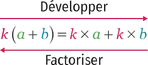

# Calcul algébrique

## Somme de termes et produit de facteurs

!!! exemple

    **Somme de terme :** La dernière opération est une somme (ou une différence)

    - $x-3$
    - $(x+4)-(6-x)$
    - $1+(x+1)(x-1)$
    - $x^2+2x+10$

!!! exemple

    **Produit de facteur :** La dernière opération est un produit (ou un quotient)

    - $3x(5-x)$
    - $(x+4)(6-x)$
    - $(x-1)^2$
    - $9\times\dfrac{4x-1}{1-x}$

### Valeurs interdites

Ce sont les valeurs de $x$ pour lesquelles il n'est pas possible de calculer l'expression algébrique.

!!! exemple

    Soit $f(x)=\dfrac{1-x}{x-4}$

    Si $x=4$ alors $(x-4)=0$ et il n'est pas possible de calculer $f(4)$ (division par zéro).

!!! exemple

    Soit $f(x)=\sqrt{x}$

    Si $x\le 0$ alors $\sqrt{x}$ n'est pas défini et il n'est pas possible de calculer $f(x)$

    Pour $f(x)$, $x$ est un nombre réel positif.

## Développer / Factoriser

{width=50%}

!!! definition

    - **Développer** : c'est transformer un **produit** en **somme**
    - **Factoriser** : c'est transformer une **somme** en **produit**

!!! exemple

    - **Développer** : $\qquad 3($:smile:$+$:book:$)\quad=\quad 3$:smile:$+3$:book:
    - **Factoriser** : $\qquad 3$:smile:$+3$:book:$\quad=\quad 3($:smile:$+$:book:$)$

!!! methode

    **Développer une expression algébrique**

    - $\cbox{lightblue}2(3-x)=\cbox{lightblue}2\times 3 + \cbox{lightblue}2\times (-x)=6-2x$
    - $\cbox{lightgreen}{4x}(3x-y)=\cbox{lightgreen}{4x}\times 3x + \cbox{lightgreen}{4x}\times (-y)=12x^2-4xy$
    - $\cbox{pink}{-}(x-y)=\cbox{pink}{(-1)}\times x + \cbox{pink}{(-1)}\times (-y)=-x+y=y-x$
    - $\cbox{yellow}{x}(3-a+3b)=\cbox{yellow}{x}\times 3 + \cbox{yellow}{x}\times (-a)+\cbox{yellow}{x}\times 3b=3x-ax+3xb$

!!! prop

    **Double distributivité**

    $$(\cbox{lightblue}{a}+\cbox{lightgreen}{b})(\cbox{pink}{c}+\cbox{yellow}{d})=\cbox{lightblue}{a}\cbox{pink}{c}+\cbox{lightblue}{a}\cbox{yellow}{d}+\cbox{lightgreen}{b}\cbox{pink}{c}+\cbox{lightgreen}{b}\cbox{yellow}{d}$$

    {width=50%}

!!! methode

    **Utiliser la double distributivité**

    $$
    	\begin{aligned}
    		(x+3)(y-1) & =(x\times y)+(-1\times x)+(3\times y)+\Big(3\times (-1)\Big) \\\\
    		~          & =xy-x+3y-3
    	\end{aligned}
    $$

!!! exemple

    $$
    \begin{aligned}
        A=(x+5)(x-2)&=(x\times x)+(-2\times x)+(5\times x)+\Big(5\times (-2)\Big)\\\\
        ~&=x^2-2x+5x-10\\\\
        ~&=x^2+3x-10\\
        \end{aligned}
    $$

    $$
    \begin{aligned}
    		B=(3-x)(3+x) & =(3\times 3)+(3\times x)+(-x\times 3)+(-x\times x) \\\\
    		~            & =9+3x-3x+x^2                                       \\\\
    		~            & =x^2+9                                             \\
    	\end{aligned}
    $$

!!! exemple

    $$
    	\begin{aligned}
    		(4x+5)(x-1)-2(x+1) & =(4x\times x)+(4x\times -1)+(5\times x)+(5\times -1)+\ldots \\\\
    		~                  & \qquad\ldots(-2\times x)+(-2\times 1)                             \\\\
    		~                  & =4x^2-4x+5x-5-2x-2                                          \\\\
    		~                  & =4x^2-x-7
    	\end{aligned}
    $$

!!! methode

    **Factoriser une expression**

    Pour factoriser une expression, il faut faire apparaître un **facteur commun**.

!!! exemple

    $$
    	\begin{array}{cc}
    		\begin{aligned}
    			4x-2y & =\boxed{2}\times 2x-\boxed{2}\times y \\\\
    			~     & =\boxed{2}\times(2x-y)                \\\\
    			~     & =2(2x-y)                              \\\\
    		\end{aligned}
    		\qquad & \qquad
    		\begin{aligned}
    			6x^2-5x & =\boxed{x}\times 6x-\boxed{x}\times 5 \\\\
    			~       & =\boxed{x}\times(6x-5)                \\\\
    			~       & =x(6x-5)                              \\\\
    		\end{aligned}
    		 &
    	\end{array}
    $$

    $$
    	\begin{aligned}
    		110a+11 & =\boxed{11}\times 10a+\boxed{11}\times 1 \\\\
    		~       & =\boxed{11}\times(10a+1)                 \\\\
    		~       & =11(10a+1)                               \\\\
    	\end{aligned}
    $$

!!! exemple

    $$
    	\begin{aligned}
    		3(2+3x)-(5+2x)(2+3x) & =\boxed{(2+3x)}\times 3-\boxed{(2+3x)}\times (5+2x) \\\\
    		~                    & =\boxed{(2+3x)}\times\Big(3-(5+2x)\Big)             \\\\
    		~                    & =(2+3x)\times\Big(3-5-2x)\Big)                      \\\\
    		~                    & =(2+3x)(-2-2x)                                      \\\\
    		~                    & =-(2+3x)(2+2x)                                      \\\\
    	\end{aligned}
    $$

!!! exemple

    $$
    \begin{aligned}
    		(2-5x)^2-(2-5x)(1+x) & =\boxed{(2-5x)}\times (2-5x)-\boxed{(2-5x)}\times (1+x) \\\\
    		~                    & =\boxed{(2-5x)}\times\Big((2-5x)-(1+x)\Big)             \\\\
    		~                    & =(2-5x)(2-5x-1-x)                                       \\\\
    		~                    & =(2-5x)(1-6x)                                           \\\\
    \end{aligned}
    $$

!!! rem

    Lorsque le facteur commun n'est pas immédiatement apparent, il est parfois possible de modifier l'écriture d'un des termes de l'expression pour faire apparaître un facteur commun.

!!! exemple

    $$
    	\begin{array}{rl}
    		4(1-x)^2-3x(x-1) & =4(1-x)(1-x)\cbox{lightgray}{{+}}3x(\cbox{lightgray}{1-x}) \\\\
    		~                & =\boxed{(1-x)}\times 4(1-x)+\boxed{(1-x)}\times (3x)       \\\\
    		~                & =\boxed{(1-x)}\Big( 4(1-x)+ (3x)\Big)                      \\\\
    		~                & =(1-x)(4-4x+ 3x)                                           \\\\
    		~                & =(1-x)(4-x)                                                \\\\
    	\end{array}
    $$

## Identités remarquables

### Propriété : Identités remarquables^:heart:^

!!! prop

    Pour tout $a$ et $b\in\R$, on a :

    - $\boxed{(a+b)^{2} = a^{2} + 2ab +b^{2}}$
    - $\boxed{(a-b)^{2} = a^{2} - 2ab +b^{2}}$
    - $\boxed{(a+b)(a-b) = a^{2} - b^{2}}$

    {width=50%}

!!! exemple

    $$
    	\begin{aligned}
    		23^2 = (20+3)^2 & = 20^2 + 2\times 20\times 3+3^2 \\\\
    		~               & =400+120+9                      \\\\
    		~               & =529
    	\end{aligned}
    $$

    Graphiquement, $23^2 = 529$

    {width=50%}

!!! methode

    **Utiliser les identités remarquables pour ^^développer^^**

!!! exemple

    $\begin{aligned}A=(x-5)^2 &=x^2 -2\times x\times 5+5^2 \\\\&=x^2 -10x+25\end{aligned}$

    ---

    $\begin{aligned}B=\left(6+\frac{1}{2}x\right)^2 &=6^2 +2\times 6\times \frac{1}{2}x+\left(\frac{1}{2}x\right)^2 \\\\&=36+6x+\frac{1}{4}x^2 \end{aligned}$

    ---

    $\begin{aligned}C=(2x-1)(2x+1)&=(2x)^2 -1^2 \\\\&=4x^2 -1\end{aligned}$

    ---

    $\begin{aligned}D=-2(1-x)^2 &=-2(1^2 -2x+x^2 )\\\\&=-2+4x-2x^2 \end{aligned}$

    ---

    $\begin{aligned}E=2(x+3)-(2x+3)(2x-3)&=2x+6-\left((2x)^2 -3^2 \right)\\\\&=2x+6-4x^2 +9\\\\&=-4x^2 +2x+15\end{aligned}$

!!! methode

    **Utiliser les identités remarquables pour ^^factoriser^^**

    Il faut faire apparaître les termes $a^2$, $b^2$ et $2ab$.

!!! exemple

    $$
    \begin{aligned}
    	    x^2-4x+4 & =\cbox{pink}x^2-2\times \cbox{pink}x\times \cbox{lightblue}2+\cbox{lightblue}2^2 \\\\
    	    ~        & =\cbox{pink}a^2-2\times \cbox{pink}a\times \cbox{lightblue}b+\cbox{lightblue}b^2 \\\\
    	    ~        & =(\cbox{pink}a-\cbox{lightblue}b)^2                                            \\\\
    	    ~        & =(x-2)^2                                                                     \\\\
        \end{aligned}
    $$

!!! exemple

    $$
        \begin{aligned}
    	    A = 25+x^2+10x & =\textcolor{red}{x}^2+2\times \textcolor{red}{x}\times \textcolor{blue!70}{5}+\textcolor{blue!70}{5}^2 \\\\
    	    ~              & =\textcolor{red}{a}^2+2\times \textcolor{red}{a}\times \textcolor{blue!70}{b}+\textcolor{blue!70}{b}^2 \\\\
    	    ~              & =(a+b)^2                                                                                               \\\\
    	    ~              & =(x+5)^2                                                                                               \\\\
        \end{aligned}
    $$

    $$
        \begin{aligned}
    	    B = 1-36x^2 & =1^2 -(6x)^2  \\\\
    	    ~           & =a^2 -b^2     \\\\
    	    ~           & =(a+b)(a-b))  \\\\
    	    ~           & =(1-6x)(1+6x) \\\\
        \end{aligned}
    $$

!!! exemple

    $$
        \begin{aligned}
    	    C = (2-x)^2 -64 & =(2-x)^2 -8^2       \\\\
    	    ~               & =a^2 -b^2           \\\\
    	    ~               & =(a+b)(a-b)         \\\\
    	    ~               & =((2-x)+8)((2-x)-8) \\\\
    	    ~               & =(10-x)(-6-x)       \\\\
    	    ~               & =-(10-x)(6+x)       \\\\
    	    ~               & =(x+10)(x+6)        \\\\
        \end{aligned}
    $$

## Réduire au même dénominateur

### Déf : Réduire au même dénominateur

!!! definition

    Réduire au même dénominateur c'est transformer une **somme** (ou une différence) de deux fractions en une seule fraction.

!!! prop

    Pour tout nombre $a$, $b$, $c$ et $d$, réels on a :

    $$\frac{a}{b}+\frac{c}{d}=\frac{ad+bc}{bd}$$

!!! rem

    Un dénominateur commun = Produit des dénominateurs

!!! exemple

    $$
    	\begin{aligned}
    		\frac{2}{5}+\frac{1}{3} & =\left(\frac{2}{5}\times\boxed{\frac{3}{3}}\right) & + & \left(\frac{1}{3}\times\boxed{\frac{5}{5}}\right)                  \\\\
    		~                       & =\left(\frac{6}{15}\right)                         & + & \left(\frac{5}{15}\right)                         & =\frac{11}{15}
    	\end{aligned}
    $$

!!! demo

    $$
    	\begin{alignedat}{5}\frac{a}{b}+\frac{c}{d} & =\pa{\frac{a}{b}\times\boxed{\frac{d}{d}}} & + & \pa{\frac{c}{d}\times\boxed{\frac{b}{b}}}                     \\\\
                     ~                          & =\pa{\frac{ad}{bd}}                        & + & \pa{\frac{bc}{bd}}                        & =\frac{ad+bc}{bd}
    	\end{alignedat}
    $$

!!! exemple

    $$
    	\begin{alignedat}{5}
    		A=\left(\frac{2}{x}\right)-\left(\frac{x+1}{2}\right) & =\left(\frac{2}{x}\times\boxed{\frac{2}{2}}\right) & - & \left(\frac{x+1}{2}\times\boxed{\frac{x}{x}}\right)                         \\\\
    		~                                                     & =\left(\frac{4}{2x}\right)                         & - & \left(\frac{(x+1)x}{2x}\right)                                              \\\\
    		~                                                     & =\left(\frac{4}{2x}\right)                         & - & \left(\frac{x^2 +x}{2x}\right)                      & =\frac{-x^2 -x+4}{2x}
    	\end{alignedat}
    $$

!!! exemple

    $$
    	\begin{alignedat}{5}
    		B=2-\left(\frac{5x}{x-2}\right) & =\left(\frac{2}{1}\times\boxed{\frac{x-2}{x-2}}\right) & - & \left(\frac{5x}{x-2}\times\boxed{\frac{1}{1}}\right)                     \\\\
    		~                               & =\left(\frac{2(x-2)}{x-2}\right)                       & - & \left(\frac{5x}{x-2}\right)                                              \\\\
    		~                               & =\frac{2x-4-5x}{x-2}                                   & ~ & =\frac{-3x-4}{x-2}                                   & =\frac{3x+4}{2-x}
    	\end{alignedat}
    $$

!!! exemple

    $$
        \begin{alignedat}{5}
    		C=\left(\frac{3x}{1-x}\right)+\left(\frac{5}{2x-3}\right) & =\left(\frac{3x\color{blue}(2x-3)}{(1-x)\color{blue}(2x-3)}\right) & + & \left(\frac{5\color{red}(1-x)}{(2x-3)\color{red}(1-x)}\right) \\\\
    		~                                                         & =\frac{6x^2-9x}{(1-x)(2x-3)}                                       & + & \frac{5-5x}{(1-x)(2x-3)}                                      \\\\
    		~                                                         & =\frac{6x^2-14x+5}{(1-x)(2x-3)}
    	\end{alignedat}
    $$
