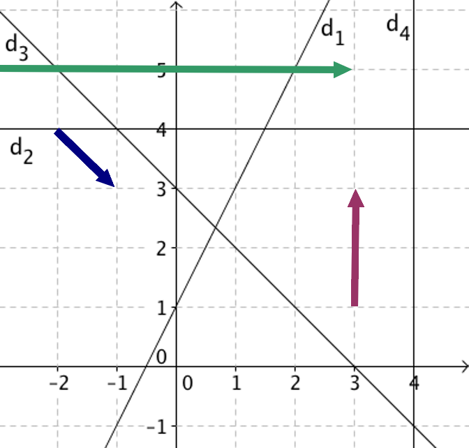

# Droites du plan

## Vecteur directeur d'une droite

### Définition : Vecteur directeur

!!! definition

    Soit $\mathscr{D}$ est une droite du plan.

    On appelle **vecteur directeur** de $\mathscr{D}$ tout vecteur non nul $\vec{u}$ qui possède la même direction que la droite $\mathscr{D}$.

    {width=50%}

!!! methode

    **Déterminer graphiquement un vecteur directeur d'une droite**

    :question: Donner des vecteurs directeurs des droites $d_1$, $d_2$, $d_3$ et $d_4$.

    {width=50%}

    /// details | Réponse

    - Pour $\textcolor{red}{d_1}$ : $\textcolor{red}{\vec{a}}\begin{pmatrix} 1 \\\\ 2\end{pmatrix}$ ou $\textcolor{red}{\vec{b}}\begin{pmatrix} 2 \\\\ 4 \end{pmatrix}$ ou encore $\textcolor{red}{\vec{c}}\begin{pmatrix} -1 \\\\ -2\end{pmatrix}$.
    - Pour $d_2$ : $\textcolor{green}{\vec{d}\begin{pmatrix} 6 \\\\ 0 \end{pmatrix}}$
    - Pour $d_3$ : $\textcolor{blue}{\vec{u}\begin{pmatrix} 1 \\\\ -1\end{pmatrix}}$
    - Pour $d_4$ : $\textcolor{violet}{\vec{v}\begin{pmatrix} 0 \\\\ 2\end{pmatrix}}$

    {width=50%}
    ///

$~$

## Équation cartésienne d'une droite

### Définition et propriétés : Équation cartésienne

!!! definition

    Toute droite $\mathscr{D}$ admet une équation de la forme :

    $$\boxed{ax + by + c = 0}\qquad\text{avec }a\neq 0\text{ et }b\neq 0$$

    Cette équation est appelée **équation cartésienne** de la droite $\mathscr{D}$.

!!! prop

    Un vecteur directeur de $\mathscr{D}$ est $\boxed{\vec{u}\coord{-b}{a}}$.

!!! exemple

    Soit une droite $(d)$ d'équation cartésienne $~\textcolor{blue}{4x-5y-1=0}$

    On a $~a=4~,~b=-5~,~c=-1~$ donc le vecteur $\textcolor{green}{\vec{u}\coord{5}{4}}$ est un **vecteur directeur** de $(d)$.

    {width=75%}

!!! theoreme

    L'ensemble des points $~M\left(x ; y\right)~$ tels que $~ax + by + c = 0~$ avec $~\left( a\ ;b \right) \neq \left( 0\ ;0 \right)~$ est une droite $\mathscr{D}$ de vecteur directeur $~\vec{u}\begin{pmatrix}-b\\\\a\end{pmatrix}~$.

!!! methode

    **Déterminer une équation cartésienne à partir d'un point et d'un vecteur directeur**

    {width=50%}

    :question: Déterminer une équation cartésienne de la droite $(d)$ passant par le point $A\left(3 ; 1\right)$ et de vecteur directeur $~\vec{u}\begin{pmatrix}-1\\\\5\end{pmatrix}$.

    ---

    **Méthode :one: :**

    Soit un point $M(x ; y)$ de la droite $(d)$.

    Les vecteurs $~\textcolor{green}{\vec{AM}}~$ et $~\textcolor{blue}{\vec{u}}~$ sont colinéaires.

    On a $\quad\vec{AM}\begin{pmatrix}x - 3 \\\\y - 1 \end{pmatrix}$ et $\vec{u}\begin{pmatrix} - 1 \\\\5 \end{pmatrix}$

    $$
    	\begin{aligned}
    		\textcolor{green}{\vec{AM}}\text{ et }\textcolor{blue}{\vec{u}}\text{ colinéaires } & \Lrarr \det\left( \vec{\text{AM}}\ ;\vec{u} \right) = 0                         \\\\
    		\quad                                                                               & \Lrarr \left| \begin{matrix}x - 3 & - 1 \\\\ y - 1 & 5 \end{matrix} \right| = 0 \\\\
    		\quad                                                                               & \Lrarr 5(x-3)-(y-1)(-1)=0                                                       \\\\
    		\quad                                                                               & \Lrarr 5x+y-16=0
    	\end{aligned}
    $$

    Une équation cartésienne de $(d)$ est : $~5x+y-16=0~$

    ---

    **Méthode :two: :**

    Le vecteur $\vec{u}\begin{pmatrix} \textcolor{blue}{-1}\\\\\textcolor{green}{5}\end{pmatrix}$ est un vecteur directeur de $(d)$ donc l'équation de la droite est de la forme :

    $$\textcolor{green}{5}x+\textcolor{blue}{1}y+c=0$$
    Le point $A\left(3 ; 1\right)$ appartient à la droite $(d)$ donc ses coordonnées vérifient l'équation :

    $$
    	\begin{aligned}
    		5x_A+y_A+c=0 & \Lrarr 5\times 3+ 1 +c=0 \\\\
    		             & \Lrarr 16 + c=0          \\\\
    		             & \Lrarr c=-16
    	\end{aligned}
    $$

    Une équation cartésienne de $(d)$ est : $~5x+y-16=0$

## Équation réduite d'une droite

### De l'équation cartésienne à l'équation réduite

!!! rem

    Si $b \neq 0$, alors l'équation cartésienne $ax + by + c = 0$ de la droite $(d)$ peut être ramenée à une équation réduite :

    $$y = \textcolor{red}{-\frac{a}{b}}x \textcolor{blue}{-\frac{c}{b}}\qquad\text{ou}\qquad y = \textcolor{red}{m}x +\textcolor{blue}{p}$$

    On note $\quad\textcolor{red}{m = -\dfrac{a}{b}}\quad$ et $\quad\textcolor{blue}{p = -\dfrac{c}{b}}$

    **Vocabulaire**

    - $\textcolor{red}{m}$ est **la pente** ou **le coefficient directeur** de $(d)$.
    - $\textcolor{blue}{p}$ est appelé **l'ordonnée à l'origine** de $(d)$.

    {width=50%}

!!! exemple

    Soit $(d)$ une droite d'équation cartésienne $\quad 4x + y - 6 = 0$

    $$
    	\begin{array}{rrl}
    		~      & 4x+y-6 & =0     \\\\
    		\Lrarr & y-6    & =-4x   \\\\
    		\Lrarr & y      & =-4x+6
    	\end{array}
    $$

    Son équation réduite est : $y = \textcolor{red}{-4}x + \textcolor{blue}{6}$

!!! rem

    Si $b=0$, alors l'équation cartésienne $ax+by+c=0$ de la droite $(d)$ peut être ramenée à l'équation réduite : $$x=\textcolor{green}{\dfrac{-c}{a}}$$

    Dans ce cas, la droite $(d)$ est parallèle à l'axe des ordonnées.

    {width=50%}

### Propriété : Équation réduite

!!! prop

    Soit $\left(O;\vec{i},\vec{j}\right)$ un repère du plan. Soit $\mathscr{D}$ une droite du plan.

    - Si $\mathscr{D}$ est parallèle à l'axe des ordonnées :
        - L'équation de $\mathscr{D}$ est de la forme $\quad x = \textcolor{green}{n}\qquad$ où $~\textcolor{green}{n}\in\R$.

    - Si $\mathscr{D}$ n'est pas parallèle à l'axe des ordonnées :
        - L'équation de $\mathscr{D}$ est de la forme $\quad y = \textcolor{red}{m}x + \textcolor{blue}{p}\qquad$ où $~\textcolor{red}{m}\in\R~$ et $~\textcolor{blue}{p}\in\R$.

    {width=75%}

!!! exemple

    {width=50%}

    - $D$ a pour équation $x = \textcolor{green}{3}$

    - $D^\prime$ a pour équation $y = \textcolor{red}{3}x + \textcolor{blue}{2}$
        - Son **ordonnée à l'origine** est $\textcolor{blue}{2}$
        - Son **coefficient directeur** est $\textcolor{red}{+3}$.

!!! methode

    **Représenter graphiquement une droite d'équation réduite**

    :question: Tracer les droites $d_1$, $d_2$ et $d_3$ d'équations réduites respectives :

    - $y = 2x + 3$
    - $y = 4$
    - $x = 3$

    ---

    La droite $~d_1~$ d'équation $~y =2x +3~$ a pour ordonnée à l'origine $3$.

    Donc le point $~A\left(0;3\right)~$ appartient à la droite $~d_1~$.

    Soit $~B~$ le point d'abscisse $1$ appartenant à la $~d_1~$.

    Les coordonnées de $~B~$ vérifient l'équation de $~d_1~$, donc :

    $$
    	\begin{aligned}
    		y_B & = 2\times x_B + 3     \\\\
    		    & = 2\times (1) + 3 = 5
    	\end{aligned}
    $$

    Le point $~B\left(1;5\right)~$ appartient à la droite $~d_1~$.

    On peut ainsi tracer la droite $~d_1~$ passant par $~A\left(0;3\right)~$ et $~B\left(1;5\right)~$.

    ---

    La droite $~d_2~$ d'équation $~y = 4~$ est l'ensemble des points dont l'ordonnée est égale à $4$.

    $~d_2~$ est donc la droite parallèle à l'axe des abscisses coupant l'axe des ordonnées au point de coordonnées $~\left(0;4\right)~$

    ---

    La droite $~d_3~$ d'équation $~x=3~$ est l'ensemble des points dont l'abscisse est égale à $3$.

    $~d_3~$ est donc la droite parallèle à l'axe des ordonnées coupant l'axe des abscisses au point de coordonnées $~\left(3;0\right)~$

    ---

    {width=75%}

### Propriété réciproque

!!! prop

    Soit $~\left(O;\vec{i},\vec{j}\right)~$ un repère du plan et $~m~$, $~p~$, $~n~$ trois nombres réels, $~m~$ étant non nul.

    L'ensemble des points $~M~$ du plan dont les coordonnées $~\left(x;y\right)~$ tels que $~y = mx + p~$ ou $~x = n~$ ,est une droite.

!!! methode

    **Vérifier si un point appartient à une droite d'équation donnée**

    :question: Les points $~A\left(6.4~;~42\right)~$ et $~B\left(346~; 2419\right)~$ appartiennent-ils à $~(d)~$ d'équation $~y=7x-3~$ ?

    ---

    Dire que le point $~A\left(6.4~; 42\right)~$ appartient à la droite $~(d)~$ d'équation $~y=7x-3~$ revient à dire que les coordonnées de $~A~$ vérifient l'équation de $~(d)~$.

    $$
    	\begin{aligned}
    		7\times x_A-3 & = 7\times 6.4-3 \\\\
    		              & =41.8\neq 42    \\\\
    	\end{aligned}
    $$

    Donc $~y_A \neq 7\times x_A-3\Rarr~$ Le point $~A~$ n'appartient pas à $~(d)~$.

    ---

    Dire que le point $~B\left(346~; 2419\right)~$ appartient à la droite $~(d)~$ d'équation $~y=7x-3~$ revient à dire que les coordonnées de $~B~$ vérifient l'équation de $~(d)~$.

    $$
    	\begin{aligned}
    		7\times x_B-3 & = 7\times 346-3 \\\\
    		              & =2419=y_B
    	\end{aligned}
    $$

    Donc $~y_B =7\times x_B-3\quad\Rightarrow~$ Le point $~B~$ appartient à $~(d)~$.

!!! rem

    Pour démontrer que $~A~$, $~B~$ et $~C~$ sont alignés, il suffit de montrer que le point $~A~$ vérifie l'équation de la droite $~(BC)~$.

!!! prop

    **Coefficient directeur**

    Si $~A\left(x_{A} ; y_{A}\right)~$ et $~B\left(x_{B} ; y_{B}\right)~$ sont deux points distincts d'une droite $~\mathscr{D}~$ tel que $~x_{A} \neq x_{B}~$ alors la droite $~\mathscr{D}~$ a pour **pente** (ou **coefficient directeur**) :

    $$\boxed{m = \dfrac{y_{B} - y_{A}}{x_{B} - x_{A}}=\dfrac{\Delta y}{\Delta x}}$$

!!! methode

    **Déterminer une équation réduite de droite dont on connaît deux points**

    Soit $~A\left(4 ; -1\right)~$ et $~B\left(3 ; 5\right)~$ deux points d'une droite $~(d)~$.

    :question: Déterminer une équation de la droite $(d)$.

    ---

    On a $~A\left(4 ; -1\right)~$ et $~B\left(3 ; 5\right)~$

    On a $~x_A\neq x_B~$ donc la droite $~(d)~$ n'est pas parallèle à l'axe des ordonnées. L'équation de $~(d)~$ est de la forme : $~y = mx + p~$

    où $~m~$ et $~p~$ sont deux nombres réels.

    Le coefficient directeur de $(d)$ est :

    $$m=\dfrac{y_{B} - y_{A}}{x_{B} - x_{A}}=\dfrac{5-(-1)}{3-4}=-6$$

    L'équation de $~(d)~$ est donc de la forme : $~y=-6x+p~$

    Comme $~A\left(4 ; -1\right)~$ appartient à $~(d)~$, ses coordonnées vérifient l'équation de $~(d)~$ soit :

    $$
    	\begin{aligned}
    		       & y_A & = & -6\times x_A+p  \\\\
    		\Lrarr & -1  & = & -6\times 4+p    \\\\
    		\Lrarr & p   & = & -1+6\times 4=23 \\\\
    	\end{aligned}
    $$

    Une équation de $(d)$ est donc : $~y = -6x + 23~$

    {width=50%}

## Position relative de deux droites

!!! prop

**À partir l'équation cartésienne**

Dire que $(D)$ et $(D')$ sont parallèles entre-elles équivaut à dire qu'elles ont des **vecteurs directeurs colinéaires**.

!!! methode

:question: Démontrer que deux droites sont parallèles

Démontrons que les droites $(d_1): 6x-10y-5=0$ et $(d_2):-9x+15y=0$ sont parallèles.

- Le vecteur $\vec{u}\left(10;6\right)$ est un vecteur directeur de la droite $(d_1)$.
- Le vecteur $\vec{v}\left(-15;-9\right)$ est un vecteur directeur de la droite $(d_2)$.

Calculons $\det\left(\vec{u}\ ;\vec{v} \right)$ :

$$\det\left(\vec{u};\vec{v}\right)=\left|\begin{matrix}10&-15\\6&-9\\\end{matrix}\right|\quad=10\times\left(-9\right)-6\times\left(-15\right)\quad=0$$

Donc $\vec{u}$ et $\vec{v}$ sont colinéaires et $(d_1)\parallel(d_2)$.

!!! prop

**À partir de l'équation réduite**

Soit $(D)$ et $(D')$ deux droites non parallèles à l'axe des ordonnées.

Dire que $(D)$ et $(D')$ sont parallèles entre-elles équivaut à dire qu'elles ont le **même coefficient directeur**.

!!! exemple

$(d_1):y=0.5x+2$ est parallèle à $(d_2):y=0.5x-1$ car leurs coefficients directeurs sont égaux à $0.5$

!!! exemple Dans un repère du plan, on a :

- $d_1 : y=3x+4$
- $d_2 : y=3x+9$
- $d_3 : x=8$

On a :

- $(d_1)\parallel(d_2)$ car elles ont un **coefficient directeur** égal à $3$.
- Les droites $(d_1)$ et $(d_3)$ sont **sécantes**.

## Projeté orthogonal d'un point sur une droite

!!! definition

**Projeté orthogonal**

Soit une droite $(d)$ et un point $M$ du plan.

Le **projeté orthogonal** du point $M$ sur $(d)$ est le point d'intersection $H$ de $(d)$ avec **la perpendiculaire** à $(d)$ passant par $M$.

!!! prop

**Distance minimale**

{width=50%}
/// caption
Projeté orthogonal de $M$ sur $(d)$
///

Le projeté orthogonal de $M$ sur $(d)$ est le point de la droite $(d)$ le plus proche du point $M$.

{width=50%}
///
Distance minimale entre $M$ et $(d)$
///

!!! demo

Soit $H$ le projeté orthogonal du point $M$ sur $(d)$.

**Supposons** qu'il existe un point $K$ de $(d)$ plus proche de $M$ que l'est $H$.

On a :

$KM\leq HM\quad$ (car $K$ est le point de $(d)$ le plus proche de $M$) donc $KM^2\leq HM^2$

Or, d'après l'égalité de Pythagore, on a :

$HM^2 + HK^2 = KM^2\quad\leq HM^2$

Donc

$HM^2 + HK^2 \leq HM^2\qquad$ Donc $HK^2 \leq 0$.

Ce qui est impossible sauf dans le cas où le point $K$ est le point $H$. ($HK=0$ dans ce cas).

On en déduit que $H$ est le point de $(d)$ le plus proche de $M$.

---

!!! demo

Démontrons que $\left(\cos\alpha\right)^2 + \left(\sin\alpha\right)^2 = 1$

Soit une droite $(d)$ et un point $P\in (d)$.

Soit un point $M$ n'appartenant pas à $d$.

On appelle $H$ le projeté orthogonal de $M$ sur $(d)$.

On note $\alpha$ l'angle $\widehat{\text{MPH}}$.

{width=50%}

Le triangle $PHM$ est rectangle en $H$, on a donc :

- $\cos\alpha =\frac{PH}{PM}\quad$ soit $\quad PH = PM \times \cos\alpha$.
- $\sin\alpha =\frac{HM}{PM}\quad$ soit $\quad HM = PM \times \sin\alpha$.

D'après le théorème de Pythagore, on a :
$$PH^2 + HM^2 = PM^2$$

Soit en remplaçant les valeurs de $PH$ et $HM$ :

$$
	\begin{aligned}
		~        & PH^2                                    & + & HM^2                                      & =~ & PM^2 \\
		~\Lrarr~ & \left( PM \times \cos\alpha \right)^2   & + & \left( PM \times \sin\alpha \right)^2     & =~ & PM^2 \\
		~\Lrarr~ & PM^2 \times \left( \cos\alpha \right)^2 & + & {PM^2 \times \left( \sin\alpha \right)}^2 & =~ & PM^2 \\
		~\Lrarr~ & \left( \cos\alpha \right)^2             & + & \left( \sin\alpha \right)^2               & =~ & 1\end{aligned}
$$

Donc, pour tout $\alpha\in\left[0^\circ;90^\circ\right[$, on a :

$$\left(\cos\alpha\right)^2+\left(\sin\alpha\right)^2 = 1$$
