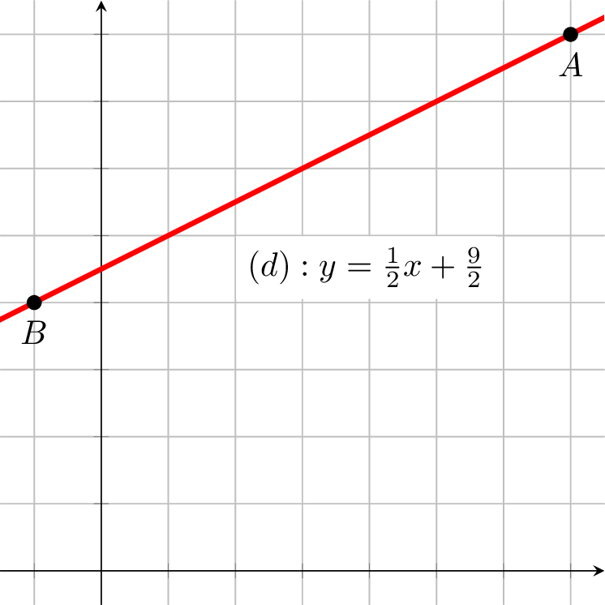
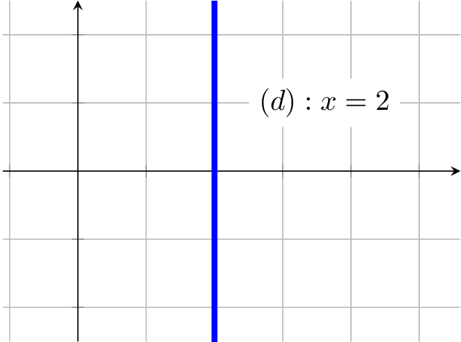

# Droites et systèmes

## Équations de droites

### Définition : Équation réduite de droites

!!! definition

    L'ensemble des points $M$ de coordonnées $(x;y)$, solution de l'équation $y=mx+p$, est une droite.

    L'équation de la forme $y=mx+p$ est appelée **équation réduite de droite**.

!!! exemple

    $y=3x+1$ est une équation de droite. Les solutions sont les coordonnées des points de la droite $(d)$.

    On dit aussi que la droite $(d)$ a pour équation $y=3x+1$

    Le point $A(0;1)$ est une solution de l'équation car ses coordonnées vérifient l'équation, car :

    $$3\times x_A+1=3\times 0+1=1=y_A ~\iff~ y_A=3x_A+1$$

    De même, on a $B(-2~;~-5)\in (d)$

    {width=75%}
    /// caption
    Représentation des solutions de l'équation : $y=3x+1$
    ///

!!! remarque

    - $y=mx+p$ est l'équation **réduite** de la droite $(d)$.
    - $m$ est le **coefficient directeur** de la droite.
    - $p$ est **l'ordonnée à l'origine** de la droite.

### Propriété : Coefficient directeur

!!! prop

    Soient les points $A(x_A;y_A)$ et $B(x_B;y_B)$ appartenant à la droite $(d)$ d'équation $y=mx+p$.

    On a :

    $$m=\cfrac{\Delta y}{\Delta x}=\cfrac{y_B-y_A}{x_B-x_A}$$

!!! methode

    **Établir l'équation d'une droite**

    Soient $A(7;8)$ et $B(-1;4)$

    Le coefficient directeur $m$ de la droite $(AB)$ est :

    $$m=\cfrac{\Delta y}{\Delta x}=\cfrac{y_B-y_A}{x_B-x_A}=\cfrac{4-8}{(-1)-7}=\cfrac{-4}{-8}=\cfrac{1}{2}$$

    On a $A\in (AB)$ donc :

    $$y_A=m\times x_A+p ~\iff~ p=y_A-m\times x_A=8-\cfrac{1}{2}\times 7=\cfrac{9}{2}$$

    Au final : $\quad (AB) : y=\cfrac{1}{2}x+\cfrac{9}{2}$

    {width=75%}

!!! remarque

    Les droites parallèles à l'axe des ordonnées n'ont pas **d'équation réduite**.

    En effet, si $(AB)$ est parallèle à l'axe des ordonnées alors $x_A=x_B$.

    Le coef. dir. $m=\cfrac{y_B-y_A}{x_B-x_A}$ n'est donc pas défini car $(x_B-x_A)=0$.

    L'équation d'une droite parallèle à l'axe des abscisses est de la forme : $~x=k~$

    {width=50%}

### Définition : Équations cartésiennes de droites

!!! definition

    Les équations de la forme $ax+by+c=0$ sont apellées **équations cartésiennes** de droites.

    L'ensemble des points $M$ de coordonnées $(x;y)$ est une droite.

!!! exemple

    $2x+3y+6=0$ est une **équation cartésienne** de la droite $(d)$.

    On peut retrouver **l'équation réduite** de $(d)$ :

    $$
        \begin{aligned}
    	    2x+3y+6=0 & \iff 3y=-2x-6           \\\\
    	    ~         & \iff y=\cfrac{-2}{3}x-2
        \end{aligned}
    $$

    {width=50%}

!!! remarque

    Les droites parallèles à l'axe des ordonnées ont une **équation cartésienne** avec $b=0$.

    La droite $(d)$ d'équation $x=2$ est parallèle à l'axe des ordonnées.

    {width=50%}

## Systèmes d'équations

### Définition : Système d'équations

!!! definition

    Un **système d'équations** se présente sous la forme de $2$ (ou plus) équations à $2$ (ou plus) inconnues.

    La (ou les) solution(s) de ce système doit vérifier les $2$ (ou plus) équations.

!!! exemple

    Soit le système suivant :

    $$
    	S:\begin{cases}
    		3\textcolor{red}{x}+2\textcolor{blue}{y}=7 \\\\2\textcolor{red}{x}-\textcolor{blue}{y}=0
    	\end{cases}
    $$

    La solution de ce système est $(1;2)$.

    En effet, si $\textcolor{red}{x=1}$ et $\textcolor{blue}{y=2}$

    $$
    	\begin{cases}
    		3\times \textcolor{red}{1}+2\times \textcolor{blue}{2}=7 \\\\2\times \textcolor{red}{1}-\textcolor{blue}{2}=0
    	\end{cases}
    $$

### Propriété géométrique

!!! prop

    Résoudre un système constitué des 2 **équations de droites** revient à trouver les **coordonnées** du **point d'intersection des droites**.

!!! exemple

    Soit le système suivant :

    $$
    \definecolor{c1}{rgb}{0.505, 0.301, 0.658}
    \definecolor{c2}{rgb}{0.721, 0.443, 0.301}
    S:\begin{cases}
    \textcolor{c1}{{3x+2y=7}}\\\\\textcolor{c2}{{2x-y=0}}
    \end{cases}
    $$

    Les droites d'équations $~\textcolor{c1}{{3x+2y-7=0}}~$ et $~\textcolor{c2}{{2x-y=0}}~$ ont un point d'intersection $A(1;2)$.

    En effet :

    - Si $A\in d_1$ alors ses coordonnées vérifient l'équation $\textcolor{c1}{{3x+2y=7}}$
    - Si $A\in d_2$ alors ses coordonnées vérifient l'équation $\textcolor{c2}{{2x-y=0}}$

    {width=50%}

### Méthode par substitution

!!! methode

    Cette méthode consiste à :

    - **Exprimer** une inconnue en fonction de l'autre.
    - **Substituer** cette inconnue par son expression, dans l'autre équation, pour obtenir une équation à une seule inconnue.

!!! exemple

    Soit le système : $\qquad S:\begin{cases}3x+2y=7\\\\2x-y=0\end{cases}$

    On a :

    $$
    	\definecolor{c3}{rgb}{0.066, 0.2 , 0.333}
    	\begin{aligned}
    		S & \iff\begin{cases}3x+2\textcolor{red}{y}=7\\\\\textcolor{red}{y=2x}\qquad\textcolor{c3}\rarr{\small{\text{on exprime }y\text{ en fonction de }x}}\end{cases}     \\\\
    		  & \iff\begin{cases}3x+2\textcolor{red}{(2x)}=7\qquad\textcolor{c3}\rarr{\small{\text{on remplace }y\text{ par son expression}}}\\\\\textcolor{red}{y=2x}\end{cases} \\\\
    		  & \iff\begin{cases}7x=7\\\\y=2x\end{cases}\iff\begin{cases}x=1\\\\y=2\end{cases}
    	\end{aligned}
    $$

### Méthode par combinaison

!!! methode

    Cette methode consiste à faire une **combinaison linéaire** des lignes 1 et 2 pour obtenir une équation à **une inconnue**.

!!! exemple

    Soit le système :

    $$S:\begin{cases}L_1:&3x+2y=7\\\\L_2:&2x-y=0\end{cases}\quad\Lrarr\quad S:\begin{cases}L_1:&3x\textcolor{c3}{+2y}=7\\\\2\times L_2:&4x\textcolor{c3}{-2y}=0\end{cases}$$

    Donc :

    $$
    	\begin{aligned}
    		L_1+(2\times L_2) & \iff (3x\textcolor{c3}{+2y})+(4x\textcolor{c3}{-2y})=7+0 \\\\
    		~                 & \iff 3x+4x\textcolor{c3}{+2y-2y}=7                       \\\\
    		~                 & \iff 7x=7\qquad\iff \boxed{x=1}                          \\\\
    	\end{aligned}
    $$

    Pour trouver $y$ :

    $$
    	\begin{aligned}
    		L_2 & \iff 2\boxed{x}-y=0                      \\\\
    		~   & \iff 2\times \boxed{1}-y=0\qquad\iff y=2 \\\\
    	\end{aligned}
    $$

    La solution du système est $(1;2)$

### Propriété : Nombre de solutions

!!! rem

    Il se peut que certains systèmes ne possèdent **pas de solution** ou **une infinité**.

!!! exemple

    $$S_1:\begin{cases}3x+2y&=4\\\\-6x-4y&=1\end{cases}$$

    On a :

    $$S_1 \iff\begin{cases}2y & =-3x+4 \\\\ -4y & =6x+1\end{cases} \iff\begin{cases}y=\cfrac{-3}{2}x+2 \\\\ y=\cfrac{6}{-4}x+\cfrac{1}{-4}\end{cases} \iff\begin{cases}y=\cfrac{-3}{2}x+2 \\\\ y=\cfrac{-3}{2}x-\cfrac{1}{4}\end{cases}$$

    Les 2 droites représentées par les 2 équations du système ont même coefficient directeur $\left(\cfrac{-3}{2}\right)$.

    Leurs ordonnées à l'origine sont différentes $\left(2\neq\cfrac{-1}{4}\right)$ donc elles sont donc **strictement parallèles**.

    Il n'existe pas de point d'intersection donc pas de solutions au système $\Rarr~S=\emptyset$

    ---

!!! exemple

    $$S_2:\begin{cases}3x+2y&=4\\\\-6x-4y&=-8\end{cases}$$

    On a :

    $$S_2 \iff\begin{cases}2y =-3x+4\\\\-4y =6x-8\end{cases}~\iff\begin{cases}y=\cfrac{-3}{2}x+2\\\\y=\cfrac{6}{-4}x+\cfrac{-8}{-4}\end{cases}~\iff\begin{cases}y=\cfrac{-3}{2}x+2\\\\y=\cfrac{-3}{2}x+2\end{cases}\\\\$$

    Les 2 droites représentées par les 2 équations du système ont même coefficient directeur $\left(\cfrac{-3}{2}\right)$ et même ordonnées à l'origine $(2)$ donc elles sont donc **confondues**.

    Les solutions du système sont les couples $(x;y)$ tel que $y=\cfrac{-3}{2}x+2$

    $$S=\left\\{(x;y)~\text{ tel que }~y=\cfrac{-3}{2}x+2\right\\}$$

    {width=50%}
