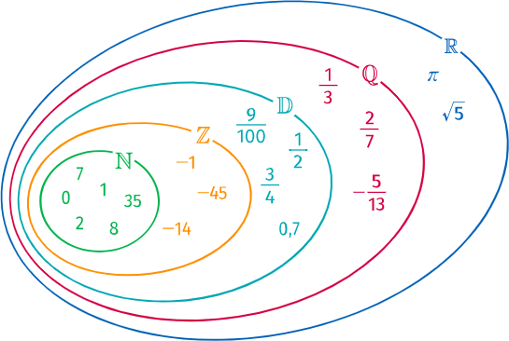

# Ensemble de nombres

## Les entiers

### Définition et représentation

**Rem. :** Dans le lycée, il y a un ensemble d'**humains**. Parmi eux, il y a des **élèves** et parmi ces élèves il y a des **secondes**.

{width="50%"}

!!! Définition

    Parmi les nombres **entiers**, il existe :

    - Entiers **naturels** : $\N$
        - Entiers (sans partie décimale) positifs : $1$ ; $4$ ; $999\ldots$
    - Entiers **relatifs** : $\Z$
        - Entiers positifs ou négatifs : $-6$ ; $-77$ ; $98$ ; $114$ $\ldots$

{width=62%}

**Ex. :**

- $17$ appartient à $\N$ et à $\Z\qquad\Rightarrow 17\in\N\quad\text{et}\quad17\in\Z$
- $(-2)$ n'appartient pas à $\N\qquad\Rightarrow (-2)\notin\N$
- $157 \ldots\ldots\ldots\ldots\ldots\ldots\ldots$ à $\N\qquad\Rightarrow 157 \ldots\ldots\ldots \N$

### Multiples – diviseurs

!!! Définition

    Soit $a$ et $b$, deux nombres entiers.

    On dit que $a$ est un **multiple** $b$ s'il existe un entier $k$ tel que :

    $$a=k\times b$$

    On dit aussi que $b$ est un **diviseur** de $a$.

**Ex. :**

- $27=3\times 9$ donc :
    - $27$ est **multiple** de $3$ (et de $9$)
    - $9$ est un **diviseur** de $27$
- $85$ n'est pas un **multiple** de $10$ car :
    - $85=k\times 10\Leftrightarrow k=8.5$ et $k$ pas entier

!!! Propriété

    Soit $a$ un entier. La somme de deux **multiples** de $a$, est un **multiple** de $a$.

**Ex. :**

$21$ et $33$ sont des **multiples** de $3$ donc $54=(21+33)$ est un **multiple** de $3$.

En effet, $54=18\times 3$

!!! Démonstration

    Soit $n_1$ et $n_2$, deux multiples de $a$ alors :

    $n_1=k_1\times a\quad$ et $\quad n_2=k_2\times a$

    On a donc :

    $n_1+n_2=(k_1\times a)+(k_2\times a)=(k_1+k_2)\times a$

    Donc : $(n_1+n_2)$ est multiple de $a$

### Pair – impair

!!! Définition

    Un nombre **pair** est un multiple de $2$.

    - Si $~n~$ est **pair** alors $~n=2k~$ avec $~k\in\Z~$
    - Si $~n~$ est **impair** alors $~n=2k+1~$ avec $~k\in\Z~$

**Ex. :**

- $~157~$ est **impair** car $~157=(2\times 78)+1~$
- $~2048~$ est **pair** car $~2048=(2\times 1024)~$

!!! Propriété

    Le **carré** d'un nombre **impair** est **impair**

!!! Démonstration

    Soit $n$ un nombre **impair**. On a donc $\quad n=2k+1$

    $$
    \begin{aligned}
    	    n^2 & =(2k+1)^2=(2k+1)(2k+1)                  \\\\
    	        & =4k^2+4k+1                              \\\\
    	        & =2\color{red}(2k^{2}+2k)\color{black}+1 \\\\
    	        & =2\color{red}K\color{black}+1
        \end{aligned}
    $$

    Si $n$ est **impair** alors $n^2$ est **impair**.

### Nombres premiers

!!! Définition

    Un entier naturel est dit **premier**, s'il admet _exactement_ **deux diviseurs** entiers positifs.

**Ex. :**

- $25$ admet comme diviseurs $1$, $5$ et $25$ $\rightarrow$ **pas premier**
- $17$ admet comme diviseurs $1$ et $17\rightarrow\quad$ **premier**
- $221$ admet comme diviseurs $\ldots\rightarrow\quad\ldots$

/// details | Les $100$ premiers nombres premiers
{width=50%}
///

#### Décomposition en facteurs premiers

**Ex. :**

- $60=30\times 2\quad=15\times 2\times 2\quad=5\times 3\times 2\times 2$

**Méthode pour décomposer $60$ :**

$$\begin{array}{r|l}60 & 2\\\\30 & 2\\\\15 & 3\\\\5 & 5 \\\\1 & ~\\\\  \end{array}$$

La décomposition de $60$ en facteurs **premiers** est : $~60=3^1\times 5^1\times 2^2$

**Ex. :**

- $1300=\ldots$

$$\begin{array}{r|l}1300 & 2\\\\650 & \ldots\\\\ \ldots & \ldots\\\\ \ldots & \ldots\\\\ \ldots & \ldots\\\\ \ldots & \ldots\end{array}\qquad\qquad\begin{array}{r|l}\ldots &\ldots\\\\ \ldots & \ldots\\\\ \ldots & \ldots\\\\ \ldots & \ldots\\\\ \ldots & \ldots\end{array}$$

## Les ensembles $\D$, $\Q$ et $\R$

### Les décimaux : $\D$

!!! Définition

    Nombres dont **la partie décimale est finie**. On peut les écrire sous la forme :

    $$\dfrac{a}{10^n}\quad\text{avec}\quad a\in\Z$$

**Ex. :**

À vous de compléter : $\qquad 0.009=\ldots\ldots\qquad\text{et}\qquad\dfrac{-1234}{10^2}=\ldots\ldots$

**Ex. :**

- $1.77=\dfrac{177}{100}=\dfrac{177}{10^2}\iff 1.77 \in \D$

- $-5.001=\dfrac{-5001}{1000}=\dfrac{-5001}{10^3}\iff -5.001\in\D$

!!! Démonstration

    Démontrons que $\frac{1}{3}$ **n'** appartient **pas** aux décimaux.

    **Supposons** que $\frac{1}{3}$ appartient aux décimaux alors il peut s'écrire sous la forme : $\dfrac{a}{10^n}$

    $$
    	\begin{aligned}
    		\dfrac{1}{3}\in\D\qquad & \Leftrightarrow\qquad\dfrac{1}{3}=\dfrac{a}{10^n} \\\\
    		\qquad                          & \Leftrightarrow\qquad 3\times a=1\times{10^n}     \\\\
    		\qquad                          & \Leftrightarrow\qquad 3a=10^n                     \\\\
    	\end{aligned}
    $$

    On a :

    - $3a$ est un multiple de $3$ donc la **somme des ses chiffres** doit être un multiple de $3$.
    - $10^n$ est un nombre constitué d'un seul $1$ et de zéros donc la **somme des ses chiffres** est $1$.

    Donc $10^n$ n'est pas un multiple de $3$,$\quad$ donc $10^n\neq 3\times a\quad$ donc $\frac{1}{3}\notin\D$

### Les rationnels : $\Q$

!!! Définition

    Ils peuvent s'écrire sous la forme : $\quad\dfrac{a}{b}\quad$ avec $~a\in\Z~$ et $~b\in\Z^{*}$

**Ex. :**

- $\dfrac{2}{7}\in\Q$

- $\dfrac{1}{3}=0.3333\ldots\in\Q$

- $\dfrac{50}{7}=7.142~857~142~857~\ldots\in\Q$

**Rem. :** La partie décimale peut se "répéter" à l'infini.

### Les réels : $\R$

!!! Définition

    Tous les nombres connus en 2^nde^.

**Ex :** $-16$ ; $\sqrt{3}$ ; $\pi$ ; $\ldots$

### Les ensembles de nombres^:heart:^

## Intervalles de $\R$ et valeur absolue

### Intervalles de $\R$

!!! Définition

    L'ensemble $I$ de tous les nombres réels $x$ tels que $~2 \le x \le 4~$ peut se représenter sur une droite graduée :

    

    Cet ensemble est appelé un **intervalle** et se note :

    $$I=\big[2~;~4\big]$$

**Ex. :**

L'ensemble $J$ des réels $x$ tels que $~ -2\le x\le 7~$ se note : $~J=\big[-2~;~7\big]$

On a : $\quad 4\in[-2~;~7]\quad$ et $\quad -5\notin[-2~;~7]$

**Ex. :**

|             Notation             |      Inégalité      |       Représentation        |
| :------------------------------: | :-----------------: | :-------------------------: |
|     $\lbrack 0 ; 1\rbrack $      |   $0\le x \le 1$    |  |
|     $\rbrack -1 ; 3\rbrack $     |   $-1\lt x \le 3$   |  |
|   $\lbrack -0.5 ; 2.3\lbrack $   | $-0.5\le x \lt 2.3$ |  |
|     $\rbrack 2 ; 4\lbrack $      |    $2\lt x \lt4$    |  |
| $\rbrack -\infty ; 1.5\rbrack $  |     $x \le 1.5$     |  |
| $\rbrack -\infty ; -1.7\lbrack $ |    $x \lt -1.7$     |  |
|  $\rbrack -2 ; +\infty\lbrack $  |     $x \gt -2$      |  |
| $\lbrack 2.7 ; +\infty\lbrack $  |     $x \ge 2.7$     |  |

**Rem :** L'ensemble $\R$ est un intervalle qui se note : $\R=\big]-\infty~;~+\infty\big[$

### Union et intersection d'intervalles

!!! Définition

    - L'**intersection** de deux ensembles $A$ et $B$ est l'ensemble des éléments qui appartiennent à $A$ **et** à $B$ et se note : $\boxed{A \cap B}$
    - L'**union** de deux ensembles $A$ et $B$ est l'ensemble des éléments qui appartiennent à $A$ **ou** à $B$ et se note : $\boxed{A \cup B}$

**Ex. :** $\quad I=\big[0~;~3\big]\qquad\text{et}\qquad J=\big[1~;~5\big]$

{width=80%}

### Valeur absolue

!!! Définition

    La distance de deux réels $a$ et $b$ est la distance des points $A$ et $B$ d'abscisses $a$ et $b$ sur la droite numérique.

**Ex. :**

**Rem :**

- Si $(a\lt b)$ alors la distance est $\left(b-a\right)$
- Si $(a\gt b)$ alors la distance est $\left(a-b\right)$

On note la distance : $\quad\abs{a-b}\quad$ et on lit $\quad$ **valeur absolue de** $(a-b)$

**Ex. :**

La distance de $5$ à $18$ est $\quad\left|5-18\right|=18-5=13$

!!! Définition

    La **valeur absolue** d'un réel $x$ est la distance de ce réel à $0$.

    Elle est notée : $\qquad\abs{x}$

**Ex. :** La valeur absolue de $-4$ est la distance de $-4$ à $0$. On a : $\abs{-4}=4$

{width=80%}

**Ex. :**

- $\abs{3}=3$
- $\abs{\sqrt{2}}=\sqrt{2}$
- $\abs{-4}=4$
- $\abs{-0.177}=0.177$

!!! Propriété

    On a, pour tout $x\in\R$ :

    $$\boxed{\left|x\right|=\begin{cases}x\quad&\text{si}~x\ge 0\\\\-x\quad&\text{si}~x\lt 0\end{cases}}$$

**Ex. :**

- $\abs{3}=3\quad$ car $~3\gt 0$
- $\abs{-7}=-(-7)=7\quad$ car $~(-7)\lt 0$

!!! Propriété

    L'intervalle $\big[a-r~;~a+r\big]$ est l'ensemble des $x$ tel que : $\qquad\abs{x-a}\le r$

**Ex. :**

L'ensemble des nombres $x$ tel que $\lvert x-5\rvert \le 3$ est l'intervalle $I=\big[5-3~;~5+3\big]=\big[2~;~8\big]$

{width=90%}
