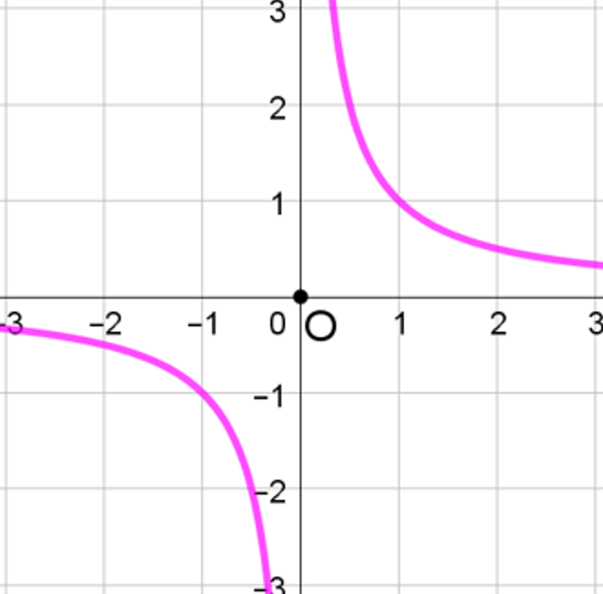
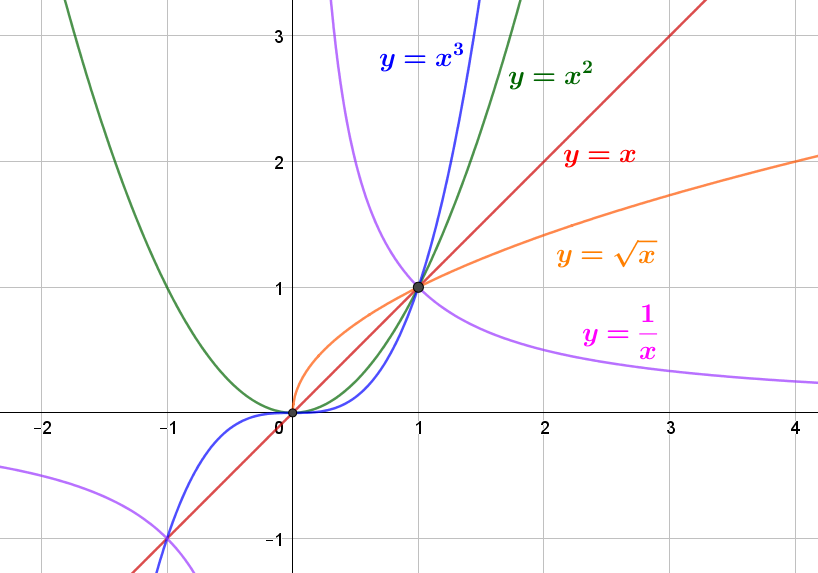

# Fonctions de références

## Rappel : Fonction du 1^er^ degré / Valeur absolue

### Définition : Fonction du 1^er^ degré

!!! definition

    Une fonction de la forme $\boxed{f(x)=\cbox{pink}{a}x+\cbox{lightgreen}{b}}$ est appelée **fonction du 1^er^ degré**.

    - $\cbox{pink}{a}$ : **Pente** ou **coefficient directeur** $\quad\rarr a=\cfrac{\Delta y}{\Delta x}$
    - $\cbox{lightgreen}{b}$ : **Ordonnée à l'origine** $\quad\rarr b=f(0)$

    {width=90%}

!!! exemple

    Soit $f(x)=\cfrac{-1}{2}x+1$ définie sur $\R$.

    $f$ est une fonction du 1^er^ degré avec $~\cbox{pink}{a}=\cfrac{-1}{2}~$ et $~\cbox{lightgreen}{b}=1$.

    - **Calcul d'image**

    $$f(\cbox{lightblue}{4})\quad=\cfrac{-1}{2}\times \cbox{lightblue}{4}+1\quad=-2+1=-1$$

    - **Tableau de valeurs et représentation**

    $$
    	\begin{array}{|c|c|c|c|c|}\hline
    		\rule[-3mm]{0mm}{8mm}x    & -2 & ~0~ & 1   & 4  \\\\ \hline
    		\rule[-3mm]{0mm}{8mm}f(x) & 2  & 1   & 0.5 & -1 \\\\ \hline
    	\end{array}
    $$

### Propriétés : Fonction du 1^er^ degré

!!! propriete

    **Sens de varitions**

    Soit $f(x)=ax+b$ définie sur $\R$.

    - Si $~a\gt 0~$ alors $~f~$ est **croissante** sur $\R$
    - Si $~a\lt 0~$ alors $~f~$ est **décroissante** sur $\R$
    - Si $~a=0~$ alors $~f~$ est **constante** sur $\R$

    

!!! propriete

    **Signe de $f$**

    - Pour $x=\cfrac{-b}{a}$, on a $f(x)=0$.
    - Si $~a\gt 0~$ alors $~f~$ est **négative** sur $\left]-\infty ; \cfrac{-b}{a}\right[$ et **positive** sur $\left]\cfrac{-b}{a} ; +\infty\right[$

    {width=50%}

    $~$

    - Si $~a\lt 0~$ alors $~f~$ est **positive** sur $\left]-\infty ; \cfrac{-b}{a}\right[$ et **négative** sur $\left]\cfrac{-b}{a} ; +\infty\right[$

    {width=50%}

### Valeur absolue

!!! definition

    Soit $x\in\R$. On a :

    $$\boxed{\abs{x}=\begin{cases}x&\text{si }~x\gt 0\\\\-x&\text{si }~x\lt 0 \end{cases}}$$

!!! exemple

    C'est la valeur "positive" du nombre donné :

    $$\abs{3}=3\qquad\abs{-1}=1\qquad\abs{-2.51}=2.51\qquad\abs{-\pi}=\pi$$

!!! prop

    **Représentation de $f(x)=\abs{ x}$**

    $$
    	\begin{array}{|c|c|c|c|c|c|c|c|}\hline
    		\rule[-3mm]{0mm}{9mm}x             & -3 & -2 & -1 & 0 & 1 & 2 & 3 \\\\ \hline
    		\rule[-3mm]{0mm}{9mm}f(x)=\abs{x} & 3  & 2  & 1  & 0 & 1 & 2 & 3 \\\\ \hline
    	\end{array}
    $$

    {width=80%}

## Fonction carré

### Définition : Fonction carré

!!! definition

    La fonction **carré** est définie sur $\R$ par $\qquad \boxed{f(x)=x^2}$

### Propriétés : Fonction carré

!!! prop

    **Tableau de valeurs et représentation**

    $$
    	\begin{array}{|c|c|c|c|c|c|c|c|c|c|}\hline
    		\rule[-3mm]{0mm}{9mm}   x & -3 & -2 & -1 & -0.5 & 0 & 0.5  & 1 & 2 & 3 \\\\ \hline
    		\rule[-3mm]{0mm}{9mm}f(x) & 9  & 4  & 1  & 0.25 & 0 & 0.25 & 1 & 4 & 9 \\\\ \hline
    	\end{array}
    $$

    {width=50%}

!!! rem

    - La fonction carré **n'est pas** une fonction **linéaire**.
    - La représentation graphique de la fonction carré est une **parabole** de sommet $O$.
    - La représentation graphique de la fonction carré est **symétrique par rapport à l'axe des ordonnées**.

!!! methode

    **Comparer des images**

    Comparons, graphiquement $f(0.5)$ et $f(2)$

    On constate que : $f(0.5)\lt f(2)$

    En effet, on a

    - $f(2)=2^2=4$
    - $f(0.5)=0.5^2=0.25$

    Donc $~f(2)\gt f(0.5)$

    {width=50%}

    ---

    Comparons, graphiquement $f(-1.5)$ et $f(-1)$

    On constate que : $f(-1.5)\gt f(-1)$

    En effet, on a

    - $f(-1.5)=(-1.5)^2=2.25$
    - $f(-1)=(-1)^2=1$

    Donc $~f(-1.5)\gt f(-1)$

    {width=50%}

    ---

    **Méthode sans graphique**

    Soit $f(x)=x^2$.$\quad$ Comparons $f(-0.5)$ et $f(-3)$

    On a

    - $f$ **décroissante** sur $\left]-\infty;0\right[$
    - $(-0.5)\in\left]-\infty;0\right[~$ et $~(-3)\in\left]-\infty;0\right[$
    - $(-3)\lt (-0.5)$

    Donc $\boxed{f(-3)\gt f(-0.5)}$

    En effet, $(-3)^2=9\quad\gt \quad(-0.5)^2=0.25$

!!! prop

    **Signe**

    La fonctions carré est **positive** sur $\R$

!!! prop

    **Sens de variations**

    {width=75%}

!!! methode

    **Résoudre des équations du type $x^2=k$**

    Résoudre $x^2=5$ revient à trouver tous les $x$ dont le carré est égal à $5$

    On a : $\qquad x^2=5\Lrarr\begin{cases}x=\sqrt{5}\\\\x=-\sqrt{5}\end{cases}$

    De manière générale, $x^2=k$ (avec $k\ge 0$) possède 2 solutions :

    $$\boxed{x^2=k\Lrarr\begin{cases}x=\sqrt{k}\\\\x=-\sqrt{k}\end{cases}}$$

    {width=50%}

## Fonction cube

### Définition : Fonction cube

!!! definition

    La fonction **cube** est définie sur $\R$ par $f(x)=x^3$

### Propriétés : Fonction cube

!!! prop

    - **Tableau de valeurs**

    $$\begin{array}{|c|c|c|c|c|c|c|}\hline
    \rule[-3mm]{0mm}{9mm}x & -2 & -1 & 0 & 1 & 2 & 3 \\\\ \hline
    \rule[-3mm]{0mm}{9mm}f(x) & (-2)^3=-8 & (-1)^3=-1 & 0^3=0 & (1)^3=1 & 2^3=8 & 3^3=27\\\\ \hline
    \end{array}$$

    - **Représentation :** La représentation graphique de la fonction cube est **symétrique** par rapport à **l'origine du repère**.

    {width=50%}

!!! prop

    **Signe**

    {width=85%}

!!! prop

    **Sens de variations**

    {width=60%}

!!! methode

    **Comparer des images**

    Soit $f(x)=x^3$.$\quad$ Comparons $f(0.5)$ et $f(2)$

    On a :

    - $f$ est **croissante** sur $\R$
    - $0.5\lt 2$

    Donc $\boxed{f(0.5)\lt f(2)}$

    En effet, $\quad 0.5^3=0.125\quad\lt \quad 2^3=8$

## Position relatives de $y=x~$ , $~y=x^2~$ et $~y=x^3$

!!! prop

    - Si $ x\ge 1$, on a $\tc{blue}x^3\tc{black}\ge\tc{lightgreen}x^2\tc{black}\ge\tc{red}x$
    - Si $ x\le 1$, on a $\tc{blue}x^3\tc{black}\le\tc{lightgreen}x^2\tc{black}\le\tc{red}x$

    {width=90%}

!!! demo

    - **Cas n°1 :** $\quad \boxed{x\ge 1}\qquad$ Étudions le signe de $(x^2-x)$ et de $(x^3 -x^2)$
        - $(x^2 -x)=x(x-1)~$ donc $\begin{cases}x\gt 0\\\\x-1\ge 0\end{cases}\Rarr(x^2 -x)\ge 0\Lrarr\boxed{x^2\ge x}$
        - $(x^3 -x^2 )=x^2 (x-1)~$ donc $\begin{cases}x^2 \gt 0\\\\x-1\ge0\end{cases}\Rarr(x^3 -x^2 )\ge 0\Lrarr \boxed{x^3 \ge x^2}$

    Donc si $\quad\boxed{x\ge 1 \Rarr x^3 \ge x^2 \ge x}$

    ---

    - **Cas n°2 :** $\quad \boxed{0\le x\le 1}\qquad$ Étudions le signe de $(x^2 -x)$ et $(x^3 -x^2)$
        - $(x^2 -x)=x(x-1)~$ donc $\begin{cases}x\gt 0\\\\x-1\le 0\end{cases}\Rarr(x^2 -x)\le 0\Lrarr\boxed{x^2 \le x}$
        - $(x^3 -x^2 )=x^2 (x-1)~$ donc $\begin{cases}x^2 \ge 0\\\\x-1\le 0\end{cases}\Rarr(x^3 -x^2 )\le 0\Lrarr\boxed{x^3 \le x^2 }$

    Donc si $~\boxed{0\le x\le1 \Rarr x^3\le x^2\le x}$

## Fonction inverse

### Définition : Fonction inverse

!!! definition

    La fonction **inverse** est définie sur $\R-\{0\}$ par \boxed{f(x)=\cfrac{1}{x}}

!!! rem

    - $\R-\{0\}$ désigne l'ensemble des nombres réels sauf $0$, c'est-à-dire :

        $$\left]-\infty;0\right[\cup\left]0;+\infty\right[$$

    - On peut aussi noter $\R-\{0\}=\R^{*}$.

    - La fonction **inverse** n'est pas définie en $0$.$\qquad$(division par $0$ impossible)

### Propriétés : Fonction inverse

!!! prop

    **Tableau de valeurs et représentation**

    On a, par ex. : $f(-2)=\cfrac{1}{-2}=-0.5$

    $$
    	\begin{array}{|c|c|c|c|c|c|c|c|c|c|}\hline
    		\rule[-3mm]{0mm}{9mm}   x & -3            & -2            & -1 & -0.5 & 0.25 & 0.5 & 1 & 2                & 3            \\\\ \hline
    		\rule[-3mm]{0mm}{9mm}f(x) & \cfrac{-1}{3} & \cfrac{-1}{2} & -1 & -2   & 4    & 2   & 1 & \cfrac{1}{2}=0.5 & \cfrac{1}{3} \\\\ \hline
    	\end{array}
    $$

    {width=75%}

!!! rem

    La représentation graphique de la fonction **inverse** est une **hyperbole** de centre $O$ et est **symétrique** par rapport à l'**origine**.

!!! prop

    **Signe**

    {width=75%}

!!! prop

    **Sens de variations**

    {width=75%}

!!! methode

    **Comparer des images**

    Soit $f(x)=\cfrac{1}{x}$.$\quad$ Comparons $f(0.5)$ et $f(3)$

    On a :

    - $f$ **décroissante** sur $\left]0;+\infty\right[$
    - $0.5\in\left]0;+\infty\right[~$ et $~3\in\left]0;+\infty\right[$
    - $0.5\lt 3$

    Donc $\boxed{f(0.5)\gt f(3)}$, en effet $\cfrac{1}{0.5}=2\gt \cfrac{1}{3}\approx 0.333\ldots$

    {width=75%}

!!! methode

    **Résoudre des équations du type $\cfrac{1}{x}=k$**

    Résoudre $\cfrac{1}{x}=5$ c'est trouver tous les $x$ dont l'inverse est $5$.

    On a :

    $$\cfrac{1}{x}=5\quad\Lrarr\quad\cfrac{1}{x}=\cfrac{5}{1}\quad\Lrarr\quad 5\times x=1\times 1\quad\Lrarr\quad\boxed{x=\cfrac{1}{5}}$$

    De manière générale, $\cfrac{1}{x}=k$ (avec $x\neq 0$ et $k\neq 0$) possède 1 solution : $$\boxed{\cfrac{1}{x}=k\quad\Lrarr\quad x=\cfrac{1}{k}}$$

!!! exemple

    $$\cfrac{1}{x}=\cfrac{2}{3}\quad\Lrarr x=\cfrac{~1~}{\cfrac{2}{3}}\quad\Lrarr x=\cfrac{3}{2}$$

## Fonction racine carrée

### Définition : Fonction racine carrée

!!! definition

    La fonction **racine carrée** est définie sur $\left[0;+\infty\right[$ par \boxed{ f(x)=\sqrt{x} }

!!! rem

    - La fonction **racine carrée** est définie pour des valeurs de $x$ **positives**. $\rarr\mathcal{D}_f=\R^{+}$
    - La fonction **racine carrée** est **positive** sur $\mathcal{D}_f$. $\rarr\forall x\in\mathcal{D}_f,\sqrt{x}\ge 0$

### Propriétés : Fonction racine carrée

!!! prop

    **Tableau de valeurs**

    $$
    	\begin{array}{|c|c|c|c|c|c|c|c|}\hline
    		\rule[-3mm]{0mm}{9mm}x    & 0          & 1          & 2                       & 3                       & 4          & 5                       & ... \\\\ \hline
    		\rule[-3mm]{0mm}{9mm}f(x) & \sqrt{0}=0 & \sqrt{1}=1 & \sqrt{2}\approx1.414... & \sqrt{3}\approx1.732... & \sqrt{4}=2 & \sqrt{5}\approx 2.23... & ... \\\\ \hline
    	\end{array}
    $$

    **Représentation**

    {width=75%}

!!! prop

    **Signe**

    {width=50%}

!!! prop

    **Sens de variations**

    {width=50%}

!!! methode

    **Comparer des images**

    Soit $f(x)=\sqrt{x}$.$\quad$ Comparons $f(0.5)$ et $f(3)

    On a :

    - $f$ **croissante** sur $\R^{+}$
    - $0.5\in\R^{+}~$ et $~3\in\R^{+}$
    - $0.5\lt 3$

    Donc $\boxed{f(0.5)\lt f(3)}$.

    En effet, $\sqrt{0.5}\approx 0.707...\lt\sqrt{3}\approx 1.732...$

!!! methode

    **Résoudre des équations du type $\sqrt{x}=k$**

    Résoudre $\sqrt{x}=5$ revient à trouver tous les nombres dont la racine carrée est $5$.

    On a : $\sqrt{x}=5\quad\Lrarr\quad\left(\sqrt{x}\right)^2 =5^2 \quad\Lrarr\quad\boxed{x=25}$

    De manière générale, $\sqrt{x}=k~$ (avec $k\ge 0$ et $x\ge 0$) possède 1 solution :
    $$\boxed{\sqrt{x}=k\quad\Lrarr\quad x=k^2}$$

!!! exemple

    $$\sqrt{x+1}=2\quad\Lrarr\quad(x+1)=2^2=4\quad\Lrarr\quad x=3$$

## Fonction paire/impaire

### Définition : parité d'une fonction

!!! definition

    - Une fonction $f$ est **paire** lorsque pour tout réel $x\in\mathcal{D}_f$, on a :

    $$f~\text{paire}~\iff~\begin{cases}(-x)\in\mathcal{D}_f\\\\f(-x)=f(x)\end{cases}$$

    - Une fonction $f$ est **impaire** lorsque pour tout réel $x\in\mathcal{D}_f$, on a :

    $$f~\text{impaire}~\iff~\begin{cases}(-x)\in\mathcal{D}_f\\\\f(-x)=-f(x)\end{cases}$$

!!! exemple

    La fonction $f(x)=x^2$ définie sur $\R$ est **paire** car, pour tout $x\in\R$, on a :

    $$\begin{aligned}f(-x)=(-x)^2 &=(-1\times x)^2 \\\\&=(-1)^2 \times x^2 \\\\&=x^2 =f(x)\end{aligned}$$

!!! exemple

    La fonction $f(x)=\cfrac{1}{x}$ définie sur $\R^* $ est **impaire** car, pour tout $x\in\R^{*}$, on a :

    $$\begin{aligned}f(-x)=\cfrac{1}{-x}&=-\cfrac{1}{x}\\\\&=-\left(\cfrac{1}{x}\right)=-f(x)\end{aligned}$$

!!! rem

    - Une fonction peut être ni paire, ni impaire. Ex: $f(x)=\sqrt{x}$
    - La représentation d'une fonction **paire** est **symétrique** par rapport à **l'axe des ordonnées**.
    - La représentation d'une fonction **impaire** est **symétrique** par rapport à **l'origine du repère**

    |       Fonction **paire**       |      Fonction **impaire**      |
    | :----------------------------: | :----------------------------: |
    | {width=75%} | {width=75%} |

!!! methode

    **Étudier la parité d'une fonction**

    Soit $f(x)=2x^2-1$ définie sur $\R$

    Pour tout $x\in\R$, on a :

    $$\begin{aligned}f(-x)&=2(-x)^2-1\\\\ &=2\times (-1\times x)^2-1\\\\ &=2\times (-1)^2\times x^2-1\\\\ &=2x^2-1\qquad=f(x)\end{aligned}$$

    Donc $f$ est **paire**, sa représentation graphique est **symétrique** par rapport à **l'axe des ordonnées**.

    {width=50%}

## Représentation des fonctions de références

{width=100%}
