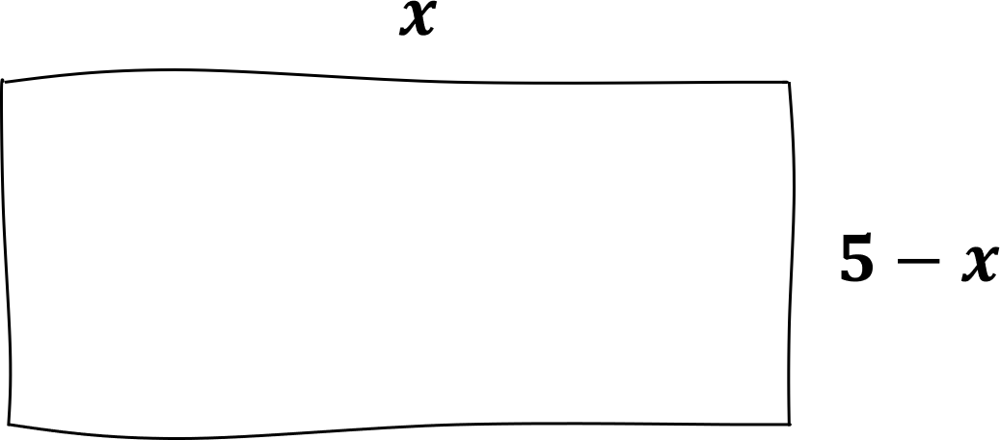

# Généralités sur les fonctions

## Vocabulaire et notations

!!! exemple

    Avec une ficelle de $10$cm, on fabrique un rectangle.

    On désigne par $x$ la longueur d'un côté de ce rectangle.

    {width=50%}

    $~$

    - alculons l'aire du rectangle lorsque $x=3$
        - Longueur = $3$ donc Largeur = $2$ donc l'aire $A=3\times 2=6$

    - Exprimons l'aire du rectangle quelque soit $x$
        - Longueur = $x$ donc Largeur = $5-x$ donc l'aire :

    $$\begin{aligned}A~&=\text{Long.}\times\text{Larg.}\\\\~&=x(5-x)\\\\~&=5x-x^2\end{aligned}$$

    {width=50%}

    $~$

    - aculons quelques valeurs de $A$ pour des valeurs de $x$ :
        - Si $x=\cbox{lightblue}1$ alors $A=\cbox{lightblue}1\times (5-\cbox{lightblue}1)=4$
        - Si $x=\cbox{lightgreen}2$ alors $A=\cbox{lightgreen}2\times (5-\cbox{lightgreen}2)=6$
        - $...$

    |      $x$ | $0$ | $1$ | $1.5$  | $2$ | $2.5$  | $3$ | $3.5$  | $4$ | $4.5$  | $5$ |
    | -------: | :-: | :-: | :----: | :-: | :----: | :-: | :----: | :-: | :----: | :-: |
    | $x(5-x)$ | $0$ | $4$ | $5.25$ | $6$ | $6.25$ | $6$ | $5.25$ | $4$ | $2.25$ | $0$ |

    e tableau est appelé un **tableau de valeurs**.

    Pour chaque nombre $x$, on associe un nombre égal à l'aire du rectangle.

    - $1\mapsto 4\qquad$ Pour un côté de $1$ cm, on a une aire de $4$ cm$^2$
    - $2\mapsto 6\qquad$ Pour un côté de $2$ cm, on a une aire de $6$ cm$^2$

    De façon générale, on note : $\quad A :x\mapsto x(5-x)$

    ela se lit : $\qquad$**"à $x$, on associe $x(5-x)$"**

    $~$

    $A$ est appelée une **fonction**. 'est un **programme de calcul** qui, à un nombre donné, fait correspondre un autre nombre.

    - $A$ est le **nom** de la fonction
    - $x$ est le nombre de départ : **l'antécédent**
    - $x(5-x)$ est le nombre d'arrivée : **l'image**

    L'expression de $A$ dépend de la valeur de $x$ donc on note : $\quad A(x)=x(5-x)$

!!! rem

    $A(x)~$se lit "$A$ de $x$"

### Définition : Fonction

!!! def

    Soit $\Df$ un intervalle de $\R$.

    Une **fonction** $f$, définie sur $\Df$, associe à tout nombre $x$ de $\Df$, un unique nombre noté $f(x)$.

    $\Df$ est l'**ensemble de définition** de $f$.

    $~$

    ^^Notation :^^

    $f:\begin{matrix}\Df&\mapsto&\R\\\\x&\mapsto&f(x)\end{matrix}\qquad$ou$\qquad$La fonction $f$ définie sur $\Df$ tel que $f(x)=...$

!!! exemple

    Dans l'ex. du rectangle, la longueur ne peut pas dépasser $5$cm donc $x\in [0;5]$

    On note :

    $$A:\begin{matrix}[0;5]&\mapsto&\R\\\\x&\mapsto&x(5-x)\end{matrix}$$

    ou $\quad$"Soit la fonction $A$ définie sur $[0;5]$ tel que $A(x)=x(5-x)$"

### Image, antécédent

!!! exemple

    Pour la fonction $~f(x)=x(5-x)~$, on a $\quad f(2.5)=6.25~$ et $~f(1)=4$

    On dit que :

    - L'**image** de $2.5$ par la fonction $f$ est $6.25$
    - Un **antécédent** de $6.25$ par la fonction f est $2.5$

!!! rem

    - Un nombre possède une **unique** image.
    - ependant, un nombre peut posséder plusieurs antécédents.
        - Dans l'ex. du rectangle, des antécédents de $5.25$ sont $1.5$ et $3.5$

    |           $x$ | $\ldots$ | $1.5$  | $\ldots$ | $3.5$  | $\ldots$ |
    | ------------: | :------: | :----: | :------: | :----: | :------: |
    | $A(x)=x(5-x)$ | $\ldots$ | $5.25$ | $\ldots$ | $5.25$ | $\ldots$ |

!!! methode

    **alculer une image ou un antécédent**

    Soit la fonction $f$ définie sur $\left[0;+\infty\right[$ par $f(x)=\sqrt{x}+1$

    - $f(\cbox{pink}{4})=\sqrt{\cbox{pink}{4}}+1=3$
    - $f(\cbox{lightgreen}{10.24})=\sqrt{\cbox{lightgreen}{10.24}}+1=4.2$
    - $\ldots$

    **Tableau de valeurs :**

    |    $x$ | $0$ | $4$ | $10.24$ | $16$ | $20.25$ |
    | -----: | :-: | :-: | :-----: | :--: | :-----: |
    | $f(x)$ | $1$ | $3$ |  $4.2$  | $5$  |  $5.5$  |

    - L'image de $4$ par $f$ est $...$
    - un antécéent de $5$ par $f$ est $...$
    - $f: ...\mapsto 4.2$
    - $f(20.25)=...$

    /// details | Réponses
    - L'image de $4$ par $f$ est $\boxed{3}$
    - un antécéent de $5$ par $f$ est $\boxed{16}$
    - $f: \boxed{10.24} \mapsto 4.2$
    - $f(20.25)=\boxed{5.5}$
    ///

!!! methode

    **Tableau de valeurs à l'aide de la calculatrice**

    {width=90%}

## Représentation graphique

!!! exemple

    Soit $f(x)=x(5-x)$ définie sur $[0;5]$

    On peut représenter $f$ à l'aide du tableau de valeurs.

    |    $x$ | $0$ | $0.5$  | $1$ | $\ldots$ | $2.5$  | $3$ | $\ldots$ | $5$ |
    | -----: | :-: | :----: | :-: | :------: | :----: | :-: | :------: | :-: |
    | $f(x)$ | $0$ | $2.25$ | $4$ | $\ldots$ | $6.25$ | $6$ | $\ldots$ | $0$ |

    Dans un repère, on place les points $(x~;~f(x))$

    En reliant les points, on obtient une courbe $\Cf$.

    {width=50%}

!!! rem

    L'ensemble des points de coordonnées $(x;y)$ avec $y=f(x)$ définissent la **courbe représentative** de la fonction $f$.

    On dira que $y=f(x)$ est l'**équation de la courbe**.

!!! methode

    **Représentation graphique, à l'aide de la calculatrice**

    

    {width=75%}

!!! rem

    On peut établir un tableau de signes de $f$ à l'aide de $\mathcal{}_f$ sur $[-1;6]$

    {width=75%}

## Résolution graphique d'équations et d'inéquations

!!! methode

    **Résoudre graphiquement une équation du type $f(x)=k$**

    Soit $f(x)=x(5-x)$

    Résoudre l'équation $f(x)=2$, c'est trouver les antécédents de $2$ par $f$.

    {width=75%}

    On détermine les abscisses des points d'intersections de $\mathcal{}_f$ avec la droite parallèle à l'axe des abscisses passant par le point $(0;2)$.

    On peut "lire" 2 solutions : $0.5$ et $4.5$

    $$\begin{aligned}f(x)=2~&\Leftrightarrow x(5-x)=2\\\\~&\Leftrightarrow\begin{cases}x_1\approx 0.5\\\\x_2\approx 1.5\end{cases}\end{aligned}$$

    ^^Interprétation :^^

    Le rectangle de dimensions $0.5$cm sur $4.5$cm possède une aire **d'environ** $2$cm$^2$.

    - Aire pour $x=0.5$ : $\qquad 0.5(5-0.5)=0.5\times 4.5=2.25\approx 2$
    - Aire pour $x=4.5$ : $\qquad 4.5(5-4.5)=4.5\times 0.5=2.25\approx 2$

    Une lecture graphique est rarement exacte.

!!! rem

    - Par lecture graphique, les solutions obtenues sont **approchées**. (sauf cas particulier)
    - L'équation $f(x)=7$ n'a pas de solution car la droite ne coupe pas la courbe.
    - Graphiquement, on **ne peut pas être certain** que les solutions qui apparaissent sont les seules. Il pourrait y en avoir d'autres au-delà des limites de la représentation graphique tracée.

    {width=50%}

!!! methode

    **Résoudre graphiquement une équation du type $f(x)=g(x)$**

    On considère les fonctions $f$ et $g$ définie sur $\R$ par :

    - $f(x)=x^2+2$
    - $g(x)=-x^2+3x+2$

    Pour déterminer les solutions de l'équation $f(x)=g(x)$, il suffit de lire l'abscisse des points d'intersection de $\f$ et $\Cg$.

    {width=75%}

    Graphiquement l'équation $f(x)=g(x)$ admet pour solutions :

    $$x_1=0\quad\text{et}\quad x_2=1.5$$

    ^^Vérification :^^

    - Pour $x=0$ :
        - $f(0)=0^2+2=2$
        - $g(0)=-0^2+3\times 0+2=2$
        - $f(0)=g(0)\qquad$donc $0$ est solution

    - Pour $x=1.5$ :
        - $f(1.5)=1.5^2+2=4.25$
        - $g(1.5)=-1.5^2+3\times 1.5+2=4.25$
        - $f(1.5)=g(1.5)\qquad$donc $1.5$ est solution

!!! methode

    **Résoudre graphiquement une équation du type $f(x)\le g(x)$**

    - Pour résoudre de l'inéquation $f(x)\le g(x)$, il faut déterminer l'ensemble des valeurs de $x$ pour lesquelles $\f$ se trouve **au-dessous** de $\Cg$

    {width=75%}

    On lit **graphiquement** que l'inéquation $f(x)\le g(x)$ admet pour solution l'intervalle $[0;1,5]$

    $$f(x)\le g(x)~\Leftrightarrow~x\in[0;1,5]$$
