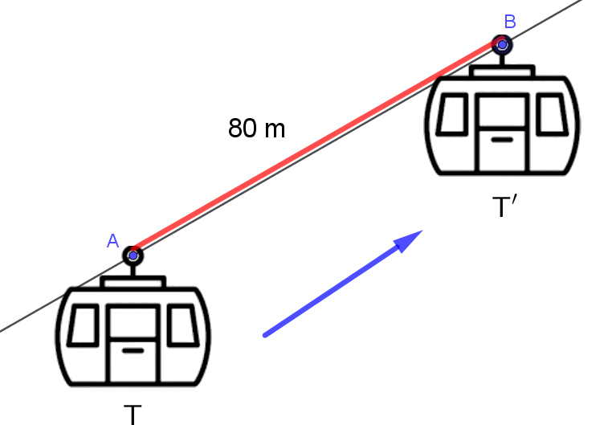
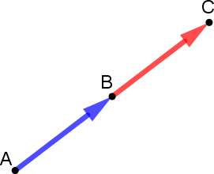

# Notion de vecteur

## Rappel : Translation

!!! exemple

    {width=75%}

    $~$

    Une translation est un glissement :

    - avec une **direction** donnée $\Rarr$ câble du téléphérique, la droite $(AB)$,
    - avec un **sens** donné $\Rarr$ le téléphérique monte de $A$ vers $B$,
    - avec une **longueur** donnée $\Rarr$ 80m, longueur $AB$

    On dit que :

    - Le téléphérique $T'$ est l'image du téléphérique $T$ par la translation qui transforme $A$ en $B$.

### Translation : Définition

!!! definition

    Soit $A$ et $A'$ deux points distincts du plan.

    On appelle **translation** qui envoie $A$ sur $A'$ la transformation dont l'image $F'$ d'une figure $F$ est obtenue en faisant glisser la figure $F$ :

    - selon la **direction** de la droite $(AA')$,
    - dans le **sens** de $A$ vers $A'$,
    - d'une **longueur** égale à $AA'$.

    {width=50%}

!!! methode

    **Construire l'image d'une figure par une translation**

    Soit **t** la translation qui transforme $A$ en $A'$.

    Construction de l'image $B'C'D'E'$ du polygone $BCDE$ par la translation **t**.

    

## Vecteurs dans le plan

### Vecteur : Définition

!!! definition

    Soit **t** la translation qui envoie $A$ sur $A'$, $B$ sur $B'$ et $C$ sur $C'$.

    Les couples de points $(A ; A')$, $(B ; B')$ et $(C ; C')$ définissent un **vecteur** caractérisé par :

    - **une direction** : celle de la droite $(AA')$
    - **un sens** : de $A$ vers $A'$
    - **une longueur** : la longueur $AA'$

    {width=50%}

    On note $\vec{u}$ ce vecteur et on écrit : $\quad\vec{u}=\vec{AA'}$

    On dit que :

    - $\vec{AA'}$ est un **représentant** de $\vec{u}$
    - $\vec{BB'}$ et $\vec{CC'}$ sont également des représentants de $\vec{u}$.

!!! rem

    La longueur d'un vecteur est aussi appelée la **norme** du vecteur.

    On note : $\qquad\norm{\vec{u}}=\norm{\vec{AA'}}=AA'$

### Égalité de vecteurs

!!! definition

    Les vecteurs $\vec{AB}$ et $\vec{CD}$ sont **égaux** lorsqu'ils ont :

    - même **direction**
    - même **sens**
    - même **longueur**.

    On note $\quad\vec{AB} = \vec{CD}$.

    {width=50%}

!!! rem

    On peut poser : $\qquad\vec{u}=\vec{AB}=\vec{CD}$

    $\vec{AB}$ et $\vec{CD}$ sont des **représentants** de $\vec{u}$

!!! prop

    **Vecteurs et parallélogramme**

    {width=50%}

    Dire que $\vec{AB}$ et $\vec{CD}$ sont égaux revient à dire que $ABDC$ est un **parallélogramme**.

    $$\vec{AB} = \vec{CD} \quad\Leftrightarrow\quad ABDC \text{ parallélogramme}$$

!!! demo

    Si $\vec{AB} = \vec{CD}$, la translation de vecteur $\vec{AB}$ transforme $C$ en $D$.

    Les segments $\left[AB\right]$ et $\left[CD\right]$ ont donc même longueur et même direction.

    $$\vec{AB} = \vec{CD}\quad\Rightarrow\quad\begin{cases}AB=CD\\(AB)\parallel(CD)\end{cases}$$

    Donc **ABDC** est donc un **parallélogramme**.

    **Réciproquement :**

    Les côtés opposés d'un parallélogramme sont :

    - parallèles
    - de même longueur

    Donc $\vec{AB}$ et $\vec{CD}$, définis à l'aide des segments $\left[AB\right]$ et $\left[AB\right]$ d'un parallélogramme $ABDC$, sont égaux.

    $$\begin{cases}AB=CD\\(AB)\parallel(CD)\end{cases}\quad\Rightarrow\quad\vec{AB} = \vec{CD}$$

!!! prop

    **Vecteurs et milieu**

    Dire que $B$ est le milieu de $\left[AC\right]$ revient à dire que $\vec{AB} = \vec{BC}$.

    $$\vec{AB} = \vec{BC}\quad\Leftrightarrow\quad B \text{ mileu de }\left[AC\right]$$

    {width=30%}

### Vecteur nul

!!! definition

    Un vecteur $\vec{AB}$ est **nul** lorsque $A$ et $B$ sont confondus.

    On note : $\vec{AB} = \vec{0}$

!!! rem

    Pour tout point $M$, on a : $\quad\vec{MM} = \vec{0}$

### Vecteurs opposés

!!! definition

    Deux vecteurs sont **opposés** lorsqu'ils ont :

    - la **même direction**
    - la **même longueur**
    - et qu'ils sont de **sens contraire**

    On note : $\qquad\vec{AB} = -\vec{DC}$

    {width=30%}

!!! rem

    $\vec{AB}$ et $\vec{BA}$ sont des vecteurs opposés. $\quad\Rarr\quad\vec{AB}=-\vec{BA}$

### Somme de vecteurs

!!! definition

    $\vec{u}$ et $\vec{v}$ sont deux vecteurs quelconques.

    On appelle **somme** de $\vec{u}$ et $\vec{v}$, le vecteur $\vec{w}$ associé à la translation **composée** des translations de $\vec{u}$ et $\vec{v}$.

    $$\vec{u}+\vec{v}=\vec{w}$$

    {width=75%}

#### Relation de Chasles

!!! prop

    **Relation de Chasles**

    Pour tous points $A$, $B$ et $C$ du plan, on a :

    $$\boxed{\vec{AC} = \vec{AB} +\vec{BC}}$$

    {width=50%}

!!! rem

    Dans un triangle $ABC$, on a :

    $\vec{AB} = \vec{AC} + \vec{CB}\quad$ et $\quad\vec{BC} = \vec{BA} + \vec{AC}$

    {width=30%}

!!! methode

    Appliquer la relation de Chasles

    - $\vec{AM}+\vec{MN}\quad=\vec{AN}$
    - $\vec{MP}+\vec{AM}\quad=\vec{AM}+\vec{MP}\quad=\vec{AP}$
    - $\vec{OP}+\vec{KO}+\vec{NK}\quad=\vec{NK}+\vec{KO}+\vec{OP}\quad=\vec{NP}$
    - $\vec{KN}~-~\vec{ON}+\vec{OK}\quad=\vec{KN}+\vec{NO}+\vec{OK}\quad=\vec{KK}\quad=\vec{0}$

!!! prop

    Dire que $ABDC$ est un parallélogramme revient à dire que $\quad\vec{AD}=\vec{AB} + \vec{AC}$

    $$ABDC\quad\text{parallélogramme}\quad\Leftrightarrow\quad\vec{AD}=\vec{AB} + \vec{AC}$$

    {width=50%}

### Différence de deux vecteurs

!!! definition

    $\vec{u}$ et $\vec{v}$ sont deux vecteurs quelconques.

    On appelle **différence** de $\vec{u}$ et de $\vec{v}$, le vecteur noté $\vec{u}-\vec{v}$, tel que :

    $$\vec{u} - \vec{v} = \vec{u} + \left(-\vec{v}\right)$$

    {width=75%}

!!! methode

    **Construire un point défini à partir d'une somme de vecteurs**

    Soit un triangle $ABC$. Construire le point $F$ tel que $\vec{AF} = \vec{BA} + \vec{BC}$

    On construit à partir de $A$ (origine de $\vec{AF}$) le vecteur $\vec{BA} + \vec{BC}$ en mettant "bout à bout" les vecteurs $\vec{BA}$ et $\vec{BC}$.

    On a ainsi construit un vecteur $\vec{AF}$ et donc le point $F$.

    {width=85%}
