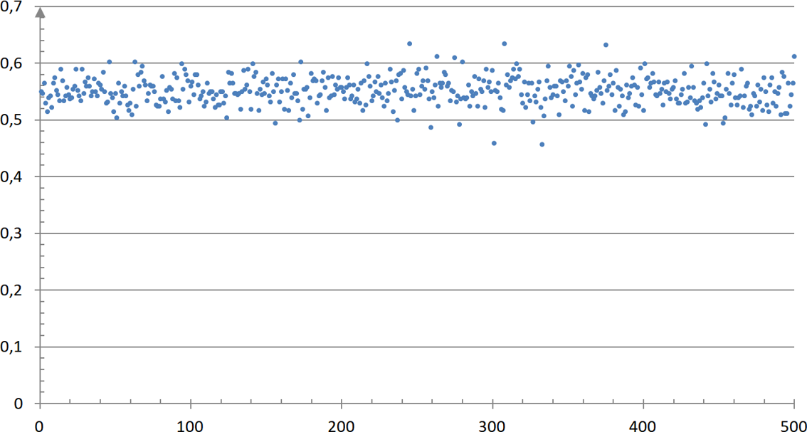

# Probabilité et échantillonnage

## Notion d'échantillon

### Définition : Échantillon

!!! def

    Un échantillon de taille $n$ est constitué des résultats de $n$ **répétitions indépendantes** de la même expérience sur l'ensemble des personnes ou objets sur lesquels porte l'étude statistique (la population).

    Un **échantillon** issu d'une population est donc **l'ensemble de quelques éléments** de cette population.

{width=70%}

!!! ex

    - Sur l'ensemble des cartes à puce produites par une entreprise en une semaine, on en prélève $200$.
        - On dit que cet ensemble de $200$ cartes à puce constitue un **échantillon** de **taille 200** de la population de toutes les cartes à puce produites en une semaine.

    - On s'intéresse aux intentions de vote lors d'une élection. On sonde $1000$ personnes en leur demandant leur intention de vote.
        - L'ensemble de ces $1000$ personnes constitue un **échantillon** de **taille 1000** de la population totale des électeurs.

    - On lance une pièce de monnaie $50$ fois de suite et on note les résultats obtenus.
        - L'ensemble de ces $50$ lancers constitue un **échantillon de taille 50**.

### Simulation d'une expérience aléatoire

!!! ex

    On considère l'expérience aléatoire qui consiste à lancer un dé à 6 faces.

    Le programme Python suivant permet de simuler cette expérience.

    ```python
    from random import *

    def de():
        r=randint(1,6)
        return(r)
    ```

    On exécute le programme et on obtient l'affichage ci-dessous.

    ```python
    >>> de()
    2
    ```

    Cela signifie que le logiciel a simulé un lancer de dé et on a obtenu un "2".

    La règle du jeu veut que si le résultat est "3" ou "4", on gagne. Dans le cas contraire, on perd.

    On répète $n$ fois de suite cette expérience à deux issues (gagner ou perdre) consistant à lancer le dé.

    On modifie et complète le programme afin de simuler $n$ lancers de dé.

    Le programme affiche le nombre de fois que l'on gagne.

    ```python
    from random import *

    def de(n):
      s=0
      for i in range(n):
        r=randint(1,6)
        if r==3 or r==4:
          s=s+1
      return(s)
    ```

    La variable **n** désigne le nombre de lancers.
    La variable **s** permet de compter le nombre de fois que l'on gagne.

    On exécute le programme et on obtient l'affichage ci-dessous. Cela signifie que sur $100$ lancers, on a gagné $35$ fois.

    ```python
    >>> de(100)
    35
    ```

## Loi des grands nombres

!!! ex

    Modifions le programme afin d'afficher en sortie **la fréquence** de jeux gagnés sur un échantillon de $n$ lancers de dé.

    Il suffit de remplacer dans la dernière ligne `return(s)` (l'effectif) par `return(s/n)` (la fréquence).

    ```python
    from random import *

    def de(n):
      s=0
      for i in range(n):
        r=randint(1,6)
        if r==3 or r==4:
          s=s+1
      return(s/n)
    ```

    Exécutons le programme pour des valeurs de $n$ de plus en plus grandes.

    ```python
    >>> de(10)
    0.6
    >>> de(100)
    0.39
    >>> de(1000)
    0.356
    >>> de(10000)
    0.3342
    >>> de(100000)
    0.33221
    ```

    Plus $n$ devient grand, plus **les fréquences observées** semblent se rapprocher d'une valeur théorique égale à $~\frac{1}{3}$ .

    En effet, la probabilité de gagner (obtenir "3" ou "4") est égale à $\frac{2}{6}=\frac{1}{3}$

### Définition : Loi des grands nombres

!!! def

    Lorsque l'on répète un grand nombre de fois une expérience aléatoire, la fréquence de réalisation d'un événement est proche de sa probabilité.

!!! ex

    Si l'on choisit, au hasard une lettre dans l'alphabet, **la fréquence** d'apparition du $A$ sera proche de $\frac{1}{26}$

## Estimation d'une probabilité

!!! ex

    On se propose maintenant de répéter $N$ fois la simulation de l'expérience aléatoire précédente.

    Dans chaque cas, pour $n$ suffisamment grand, la fréquence observée $f$ devrait être proche de la probabilité théorique $p = \frac{1}{3}$.

    On veut calculer la proportion des cas pour lesquels l'écart entre $f$ et $p$ est inférieur ou égale à $\frac{1}{\sqrt{n}}$

    ```python
    from random import *       ## Pour la fonction 'randint'
    from math import *         ## Pour les fonctions : 'sqrt' (racine carrée)
                               ##                    : 'abs'  (valeur absolue)

    def de(n):                 ## Simule 'n' lancers de dé
      s=0                      ## et retourne la _fréquence_ de jeux gagnés
      for k in range(n):
        r=randint(1,6)
        if r==3 or r==4:
          s=s+1
      return(s/n)

    def estim(N,n):            ## Répète 'N' fois la fonction 'de(n)'
      c=0                      ## Renvoi la proportion de fois où ...
      p=1/3                    ## ... la différence entre f et p est inf. à 1/sqrt(n)
      for k in range(N):
        f=de(n)
        if abs(f-p) < (1/sqrt(n)) :   ## abs(f-p) : Différence entre f et p
          c=c+1                       ## 1/sqrt(n) : 1/racine(n)
      return(c/N)
    ```

    Exécutons le programme avec $n=10~000$ et pour différente valeur de $N$

    ```python
    >>> estim(10,10000)
    0.8
    >>> estim(40,10000)
    0.91
    >>> estim(50,10000)
    0.96
    >>> estim(100,10000)
    0.94
    >>> estim(100,10000)
    0.95
    >>> estim(1000,10000)
    0.956
    ```

    On trouve des valeurs proches de $0.95$. Cela signifie que dans $95\%$ des cas, l'écart entre la **fréquence observée** $f$ et **la probabilité** $p$ est inférieur à $0.01$.

    En effet, on a $~\frac{1}{\sqrt{n}}=\frac{1}{\sqrt{10~000}}=0.01$

    On a: $$\quad p-\frac{1}{\sqrt{n}}~\lt~f~\lt~p+\frac{1}{\sqrt{n}}$$

### Propriété : Estimation d'une probabilité

!!! prop

    - Pour $n$ assez grand, $f$ donne une estimation de $p$ dans environ 95% des cas.
    - Pour $n$ assez grand, 95% des **fréquences observées** se situent dans l'intervalle :

    $$\left[p-\frac{1}{\sqrt{n}}~;~p+\frac{1}{\sqrt{n}}\right]$$

!!! ex

    Le graphique ci-dessous représente les fréquences d'apparition d'un caractère, au sein d'une population, dans des échantillons de taille $n$.

    

    Les fréquences observées semble situées entre $~0.5~$ et $~0.6$

    On peut alors estimer que la probabilité d'apparition du caractère est de :

    $$p=\dfrac{0.5+0.6}{2}=0.55$$

    On peut aussi estimer la taille de l'échantillon $n$.

    $$
        \begin{array}{rcll}
    	    p+\dfrac{1}{\sqrt{n}}=0.6 & \iff & 0.55+\dfrac{1}{\sqrt{n}}=0.6 & ~    \\\\
    	    ~                         & \iff & \dfrac{1}{\sqrt{n}}=0.05     & ~    \\\\
    	    ~                         & \iff & \sqrt{n}=\dfrac{1}{0.05}     & =20  \\\\
    	    ~                         & \iff & n=20^2\quad                  & =400
        \end{array}
    $$

Les échantillons sont de tailles $400$.
