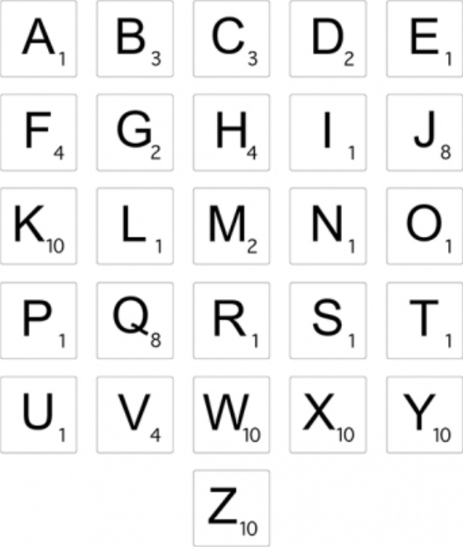
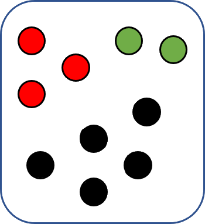

# Probabilité

## Vocabulaire : Expérience aléatoire, issue, univers, ...

### Définition : Expérience aléatoire

!!! def

    Une expérience est dite **aléatoire** lorsque l'on ne peut pas prévoir l'issue de cette expérience.

!!! ex

    "Lancer cette roue et noter le gain obetnu"

    {width=50%}

### Vocabulaire

!!! def

    - **Issue** : Un résultat de l'expérience aléatoire
        - $50$ ; $1000$ ou $\text{Jackpot}$ ...

    - **Univers** : L'ensemble de toutes les issues possibles
        - $\Omega=\lbrace \text{LOSE} ; 50 ; 100 ;... ;1000 ;\text{JACKPOT}\rbrace $

    - **Événement** : Un ensemble d'issues
        - $A$ : "Obtenir - de 450€"
          $\Rightarrow A=\lbrace \text{LOSE} ;50 ;100 ;200 ;300\rbrace $

!!! ex

    {width=50%}

    - **Expérience aléatoire** : "Choisir, au hasard, une lettre dans l'alphabet"
        - $\Omega =\lbrace A;B;C;D;E;F;G;H;...;X;Y;Z\rbrace$

    - $E_1=\lbrace A;E;I;O;U\rbrace $ est un **événement**.
        - En français, cet événement se traduit par : $E_1:$ "La lettre choisie est une voyelle"

    - $E_2=\lbrace K;W;X;Y;Z\rbrace $ est un autre **événement**.
        - Ce second événement se traduit par : $E_2:$ "La lettre choisie vaut 10 pts"

!!! rem

    - Évènement **impossible** :
        - L'évènement impossible est l'ensemble vide noté $\varnothing$.

    - Évènement **certain** :
        - L'évènement certain est l'univers $\Omega$.
        - Toutes les issues le réalisent.

!!! ex

    - Expérience aléatoire : "Lancer un dé"

    - Univers : $\Omega=\lbrace 1;2;3;4;5;6\rbrace $

    - Événements :
        - A : "Obtenir un nombre pair" $\quad\Rightarrow A :\lbrace 2 ;4 ;6\rbrace $
        - B : "Obtenir un nombre $>4$" $\quad\Rightarrow B :\lbrace 5 ;6\rbrace $

    - Événement **certain** : "Obtenir un nombre entre $1$ et $6$"

    - Événement **impossible** : "Obtenir $7$"

## Calcul de probabilités

### Définition : Loi de probabilité

!!! def

    Définir une **loi de probabilité** d'une expérience aléatoire, c'est associer chaque issue à sa probabilité.

!!! ex

    - Exp. aléatoire : "Lancer un dé"

    - Univers : $\Omega=\lbrace 1;2;3;4;5;6\rbrace $

    On a :

    $$
    \begin{array}{|c|c|c|c|c|c|c|}\hline
    \rule[-3mm]{0mm}{9mm}e_i & 1 & 2 & 3 & 4 & 5 & 6\\\\ \hline
    \rule[-3mm]{0mm}{9mm}P(e_i)&\cfrac{1}{6}&\cfrac{1}{6}&\cfrac{1}{6}&\cfrac{1}{6}&\cfrac{1}{6}&\cfrac{1}{6}\\\\ \hline
    \end{array}
    $$

!!! ex

    {width=30%}

    Une urne contient $10$ boules ($3$ rouges, $2$ vertes, $5$ noires)

    - **Exp. aléatoire** : "On tire une boule et on note **sa couleur**"

    - **Univers** : $\Omega :\lbrace\text{\color{Red}{Rouge}} ; \text{\color{green}{Verte}} ; \text{\color{Black}{Noire}} \rbrace$

    - **Loi de probabilité** :

    $$
    \begin{array}{|c|c|c|c|}\hline
    e_i&\text{\color{Red}{Rouge}} &\text{\color{green}{Verte}}& \text{\color{Black}{Noire}}\\\\ \hline
    \rule[-3mm]{0mm}{9mm}P(e_i)&\cfrac{3}{10}=0.3&\cfrac{2}{10}=0.2&\cfrac{5}{10}=0.5\\\\ \hline\end{array}
    $$

!!! prop

    Soit la loi de probabilité suivante :

    $$
    \begin{array}{|c|c|c|c|c|}\hline
    e_i& e_1 &e_2&\ldots&e_n \\\\ \hline
    \rule[-3mm]{0mm}{9mm}P(e_i)&p_1 &p_2&\ldots&p_n\\\\ \hline\end{array}
    $$

    On a $\qquad\boxed{P(e_1)+P(e_2)+...+P(e_n)=1}$

### Définition : Équiprobabilité

!!! def

    On dit qu'il y a **équiprobabilité** (ou que la situation est **équiprobable**) si la probabilité de chaque issue est **égale**.

    $$\boxed{P(e_1)=P(e_2)=...=P(e_n)}$$

!!! ex

    - Exp. aléatoire : "Lancer un dé **non truqué**"

    - Univers : $\Omega=\lbrace 1;2;3;4;5;6\rbrace $

    On a : $\quad P("1")=P("2")=...=P("6")=\cfrac{1}{6}$

    C'est une situation d'**équiprobabilité**.

!!! ex

    "Lancer une piece non truquée", "Choisir une carte au hasard", ...

### Définition : Probabilité d'un événement

!!! def

    La probabilité d'un événement est la **somme** des probabilités des issues qui le composent.

!!! ex

    Si $\quad A:\lbrace e_1;e_3;e_7\rbrace \quad$ alors $\quad P(A)=P(e_1 )+P(e_3)+P(e_7)$

!!! ex

    - Exp. aléatoire : "Lancer un dé"
    - Univers : $\Omega=\lbrace 1;2;3;4;5;6\rbrace $
    - Événements :
        - $A:~$"Obtenir un nombre pair"$\quad\Rightarrow A:\lbrace 2;4;6\rbrace $
        - $B:~$"Obtenir un nombre $\gt 4$"$\quad\Rightarrow B:\lbrace 5;6\rbrace $

    On a :

    - $P(A)=P("2")+P("4")+P("6")=\cfrac{1}{6}+\cfrac{1}{6}+\cfrac{1}{6}=\quad\cfrac{3}{6}$
    - $P(B)=P("5")+P("6")=\cfrac{1}{6}+\cfrac{1}{6}=\quad\cfrac{2}{6}$

### Propriétés

!!! prop

    - La probabilité de l'évènement **certain** $\Omega$ est : $\quad \boxed{P(\Omega) = 1}$
    - La probabilité de l'évènement **impossible** est : $\quad \boxed{P(\varnothing) = 0}$
    - Pour tout évènement A on a : $\quad\boxed{ 0 \le p(A) \le 1 }$

## Intersection, réunion, évènement contraire

!!! ex

    - Exp. aléatoire : "Lancer un dé" $~\Rightarrow~$ Univers : $\Omega=\lbrace 1;2;3;4;5;6\rbrace $
    - Événements :
        - $A:~$"Obtenir un nombre pair"$\quad\Rightarrow A:\lbrace 2;4;6\rbrace $
        - $B:~$"Obtenir un nombre $>4$"$\quad\Rightarrow B:\lbrace 5;6\rbrace $

    On a :

    - L'événement **contraire** de $A$ :
        - $\overline{A}:~$ "Obtenir un nombre impair" $\quad\Rightarrow\overline{A}:\lbrace 1;3;5\rbrace $
    - L'**intersection** de $A$ et de $B$ :
        - $A \cap B:~$ "Obtenir un nombre pair $\boxed{\text{et}}$ $>4$" $\quad\Rightarrow A \cap B:\lbrace 6\rbrace $
    - L'**union** de $A$ et de $B$ :
        - $A \cup B:~$ "Obtenir un nombre pair $\boxed{\text{ou}}$ $>4$" $\quad\Rightarrow A \cup B:\lbrace 2;4;5;6\rbrace $

!!! ex

    On tire une boule dans l'urne, et on note le nombre inscrit.

    {width=50%}

    - $\Omega=\lbrace 1;2;3;4\rbrace $
    - Événement
        - $A:~$"Tirer une boule n°1 ou n°2"$\quad\Rightarrow A:\lbrace 1;2\rbrace $
        - $C:~$"Tirer une boule n°1 ou n°3"$\quad\Rightarrow C:\lbrace 1;3\rbrace $

    On a :

    - $\overline{A}:\lbrace 3;4\rbrace \quad\Rightarrow~$Les issues de $\Omega$ qui **ne** sont **pas** dans $A$.
    - $A\cap C:\lbrace 1\rbrace \quad\Rightarrow~$Les issues "en commun" de $A$ et $C$.
    - $A\cup C:\lbrace 1;2;3\rbrace \quad\Rightarrow~$La réunion de $A$ et $C$.

    On peut représenter la situation à l'aide d'un diagramme de **Venn** :

    

    $$\overline{A}:\lbrace 3;4\rbrace \qquad A\cap C:\lbrace 1\rbrace \qquad A\cup C:\lbrace 1;2;3\rbrace $$

### Propriétés : Probabilité contraire et union

!!! prop

    - La probabilité de l'événement **contraire** de $A$ est :
      $$\boxed{P\left(~\overline{A}~\right)=1-P(A)}$$

    - La probabilité de l'**union** de $A$ et de $B$ est :
      $$\boxed{P(A\cup B)=P(A)+P(B)-P(A\cap B)}$$

!!! ex

    On tire une boule dans l'urne, et on note le nombre inscrit.

    {width=50%}

    On a :

    - $\Omega=\lbrace \text{1};\text{2};\text{3};\text{4}\rbrace $

    - Loi de probabilité :

    $$
    \begin{array}{|c|c|c|c|c|}\hline
    e_i&\text{1}&\text{2}&\text{3}&\text{4}\\\\ \hline
    \rule[-3mm]{0mm}{9mm}P(e_i)&\cfrac{2}{8}=0.25&\cfrac{2}{8}=0.25&\cfrac{3}{8}=0.375&\cfrac{1}{8}=0.125\\\\ \hline
    \end{array}
    $$

    ---

    Soit $~B:~$"Obternir $\text{2}$ ou $\text{4}$"$\quad\Rightarrow B:\lbrace \text{2};\text{4}\rbrace $

    On a :

    $$
    	\begin{array}{rccccc}
    		P(B) & = & P(\text{2}) & + & P(\text{4})                      \\\\
    		     & = & \cfrac{2}{8} & + & \cfrac{1}{8} & =\cfrac{3}{8}=0.375
    	\end{array}
    $$

    Donc : $~P\left(\overline{B}\right)=1-P(B)=1-0.375=0.625$

    **Vérification :**

    - $B:~$"Obternir $\text{2}$ ou $\text{4}$"$\quad\Rightarrow B:\lbrace \text{2};\text{4}\rbrace $
    - $\overline{B}:~$"Obternir $\text{1}$ ou $\text{3}$"$\quad\Rightarrow \overline{B}:\lbrace \text{1};\text{3}\rbrace $

    $$
    	\begin{array}{rccccc}
    		P\left(\overline{B}\right) & =& P(\text{1}) & + & P(\text{3})                         \\\\
    		                           & =& \cfrac{2}{8} & + & \cfrac{3}{8}&=\cfrac{5}{8}=0.625
    	\end{array}
    $$

    ---

!!! ex

    Soit $\quad A:\lbrace \text{1};\text{2}\rbrace \quad$ et $\quad C:\lbrace \text{1};\text{3}\rbrace\quad$ Donc $\quad A\cap C:\lbrace 1 \rbrace$

    On a :

    - $P(A)=P(\text{1})+P(\text{2})=\cfrac{2}{8}+\cfrac{2}{8}=\cfrac{4}{8}$
    - $P(C)=P(\text{1})+P(\text{3})=\cfrac{2}{8}+\cfrac{3}{8}=\cfrac{5}{8}$
    - $P(A\cap C)=P(\text{1})=\cfrac{2}{8}$

    Donc, on a :

    $$
    	\begin{array}{rccccc}
    		P(A\cup C) & = & P(A)        & + & P(C)        & - & P(A\cap C)                 \\\\
    		~          & = & \cfrac{4}{8} & + & \cfrac{5}{8} & - & \cfrac{2}{8} & =\cfrac{7}{8}
    	\end{array}
    $$

    **Vérification :**

    $A:\lbrace \text{1};\text{2}\rbrace \quad$ et $\quad C:\lbrace \text{1};\text{3}\rbrace \quad$ Donc $\quad A\cup C:\lbrace \text{1};\text{2};\text{3}\rbrace $

    Donc, on a :

    $$
    	\begin{array}{rccccc}
    		P(A\cup C) & = & P(\text{1}) & + & P(\text{2}) & + & P(\text{3})                \\\\
    		           & = & \cfrac{2}{8} & + & \cfrac{2}{8} & + & \cfrac{3}{8} & =\cfrac{7}{8}
    	\end{array}
    $$
