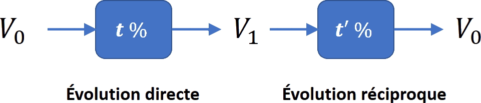

# Proportion et évolution

## Proportion

### Rappels

!!! def

    La proportion d'une **sous-population** (d'effectif $n$) parmi une **population totale** (d'effectif $N$) est :

    $$\boxed{p=\dfrac{n}{N}}$$

    En pourcentage :

    $$\boxed{p_{\%}=\dfrac{n}{N}\times 100}$$

!!! rem

    Pour calculer un effectif à l'aide d'une proportion, on peut utiliser :

    - $\boxed{n = p \times N}$
    - $\boxed{N = \dfrac{n}{p}}$

### Méthodes

!!! methode

    **Calculer une proportion**

    Dans la classe de 2$^{\text{nde}}$ de $35$ élèves, $14$ élèves ont les yeux bleus.

    $$p_{\%}=\dfrac{n}{N}\times 100=\dfrac{14}{35}\times 100=40$$

    Ils représentent $40\%$ de la classe.

!!! methode

    **Calculer un effectif**

    Dans un lycée de $856$ élèves, $35$% mangent à la cantine le midi.

    $$n = p \times N=\dfrac{35}{100}\times 856\approx300$$

    Il y a $300$ élèves qui mangent à la cantine le midi.

### Proportion de proportion

!!! propriete

    Soit "$A$ inclus dans $B$" et "$B$ inclus dans $C$".

    {width=75%}

    Soit :

    - $p_1$ la proportion de $A$ dans $B$
    - $p_2$ la proportion de $B$ dans $C$.

    Alors $\boxed{p=p_1\times p_2}$ est la proportion de $A$ dans $C$.

!!! methode

    **Calculer une proportion de proportion**

    Dans un car, il y a $40\%$ de scolaires et, parmi les scolaires, $60\%$ sont des filles.

    La proportion de "scolaires filles" dans le car est :

    $$60\%\text{  \ul{de}  }40\%=0.6\times0.4=0.24$$

## Évolution exprimée en pourcentage

### Taux d'évolution et coefficient multiplicateur

!!! definition

    On considère une valeur $V_i$ qui subit une évolution pour arriver à une valeur $V_f$.

    Le **taux d'évolution** est égal à : $\quad \boxed{t=\dfrac{V_f-V_i}{V_i}}$

    En pourcentage, le **taux d'évolution** est égal à : $\quad\boxed{t_\%=100\times \dfrac{V_f-V_i}{V_i}}$

!!! rem

    - Si $t>0$, l'évolution est une augmentation.
    - Si $t\lt 0$, l'évolution est une diminution.

!!! exemple

    La population d'un village est passé de $\np{8500}$ à $\np{10 400}$ entre $2008$ et $2012$.

    Le taux d'évolution de la population, en pourcentage, est :

    $$t=\dfrac{V_f-V_i}{V_i}=\dfrac{10 400-8 500}{8 500}\approx 0.224\quad\text{soit}\quad+22.4\%$$

!!! propriete

    - Faire évoluer une valeur de $\pm t\%$ revient à la multiplier par $\left(1+\dfrac{t}{100}\right)$
    - $\left(1+\dfrac{t}{100}\right)$ est appelé **coef. multiplicateur**

    $$\boxed{CM =\left(1+\dfrac{t}{100}\right)\quad\text{et}\quad t= \left(CM-1\right)\times 100}$$

!!! demo

    Si on fait évoluer une valeur $V_i$ de $t\%$ alors sa valeur $V_f$ après l'évolution est égale à :

    $$
    	\begin{aligned}
    		V_f & =V_i + V_i\times \dfrac{t}{100}          \\\\
    		~   & =V_i\times\left(1+ \dfrac{t}{100}\right)\end{aligned}
    $$

!!! exemple

    Le prix d'un survêtement est de $49$€. Il **augmente** de $8\%$.

    Son nouveau prix est égal à :

    - $CM =\left(1+\dfrac{t}{100}\right)=\left(1+\dfrac{+8}{100}\right)=1.08$
    - Le nouveau prix est : $49\times1.08=52.25$€

    {width=50%}

!!! exemple

    Le prix d'un polo est de $21$€. Il **diminue** de $12\%$.

    Son nouveau prix est égal à :

    - $CM =\left(1+\dfrac{t}{100}\right)=\left(1+\dfrac{-12}{100}\right)=0.88$
    - Le nouveau prix est : $21\times0.88=18.48$€

    {width=50%}

### Taux d’évolution global

!!! propriete

    Si une grandeur subit des **évolutions successives** alors le **coefficient multiplicateur global** est égal aux **produits** des **coefficients multiplicateurs** de chaque évolution.

    $$\boxed{CM_g=CM_1\times CM_2\times CM_3\times \ldots}$$

!!! exemple

    Une valeur subit une **baisse** de $20\%$ puis une **hausse** de $30\%$.

    {width=75%}

    Le **coef.multiplicateur global** est :

    $$
    	\begin{aligned}
    		CM_g & =CM_1\times CM_2 \\\\~&=0.8\times1.3\\\\~&=1.04
    	\end{aligned}
    $$

    Soit une augmentation de $4\%$

!!! exemple

    - En 2010, la boulangerie a **augmenté** ses ventes de $10\%$.
    - En 2011, elle a **diminué** ses ventes de $5\%$.

    On a :

    - $CM_1=1+\cfrac{+10}{100}=1.1\quad\text{et}\quad CM_2=1+\cfrac{-5}{100}=0.95$
    - Le coef. multiplicateur global est :

    $$\begin{aligned}CM_g&=CM_1\times CM_2\\\\~&=1.1\times0.95=1.045\end{aligned}$$

    - Soit une évolution de :

    $$\begin{aligned}t_g&=(CM_g-1)\times 100\\\\~&=(1.045-1)\times 100=+4.5\%\end{aligned}$$

    {width=90%}

### Taux d'évolution réciproque

!!! definition

    On considère le taux $t$ d'évolution de la valeur $V_0$ à la valeur $V_1$.

    On appelle **évolution réciproque** le taux $t'$ d'évolution de la valeur $V_1$ à la valeur $V_0$.

    {width=75%}

!!! propriete

    L'évolution **réciproque** possède un coefficient multiplicateur **inverse** de l'évolution directe.

    $$\boxed{CM_R= \dfrac{1}{CM}}$$

!!! exemple

    Le **coef. multiplicateur réciproque** d'une **baisse** de $20\%$ est :

    $$CM_R= \dfrac{1}{CM} \qquad= \dfrac{1}{0.8} \qquad=1.25$$

    Soit une **augmentation** de :

    $$
    	\begin{aligned}
    		t_{R} & = \pa{CM_R - 1}\times 100               \\\\
    		~     & = \pa{1.25 - 1}\times 100\quad & =+25\% \\\\
    	\end{aligned}
    $$

    {width=40%}
