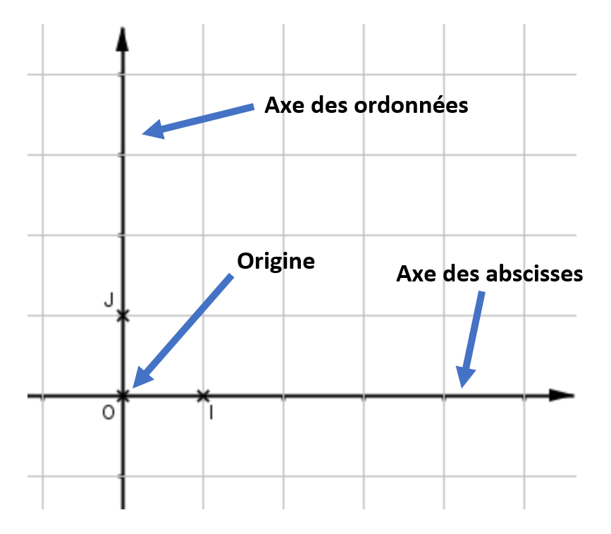
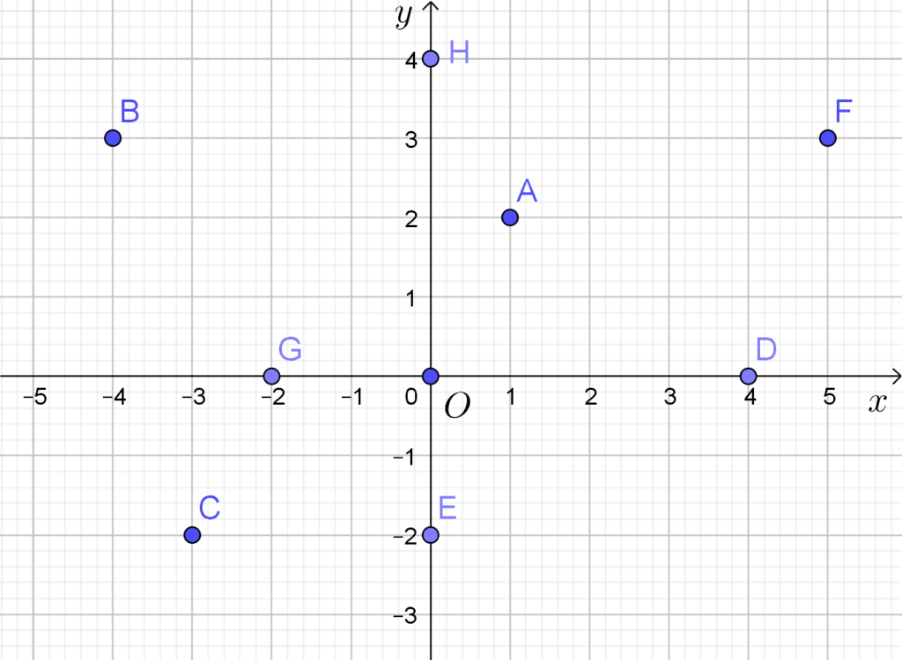
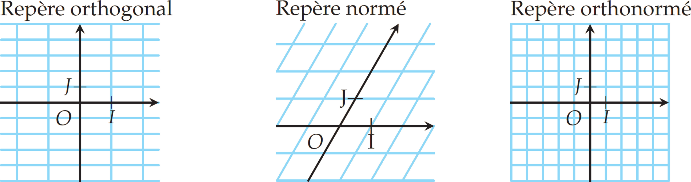
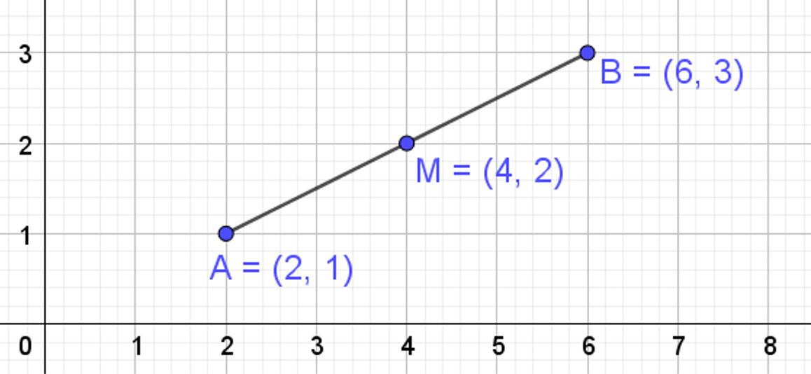
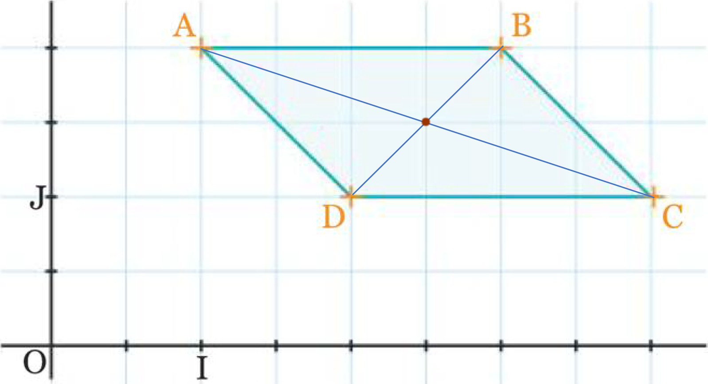
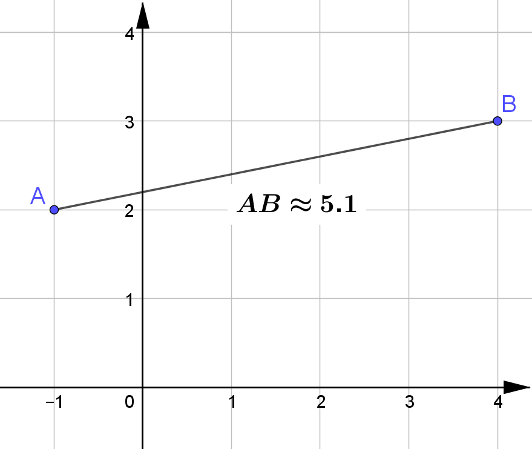
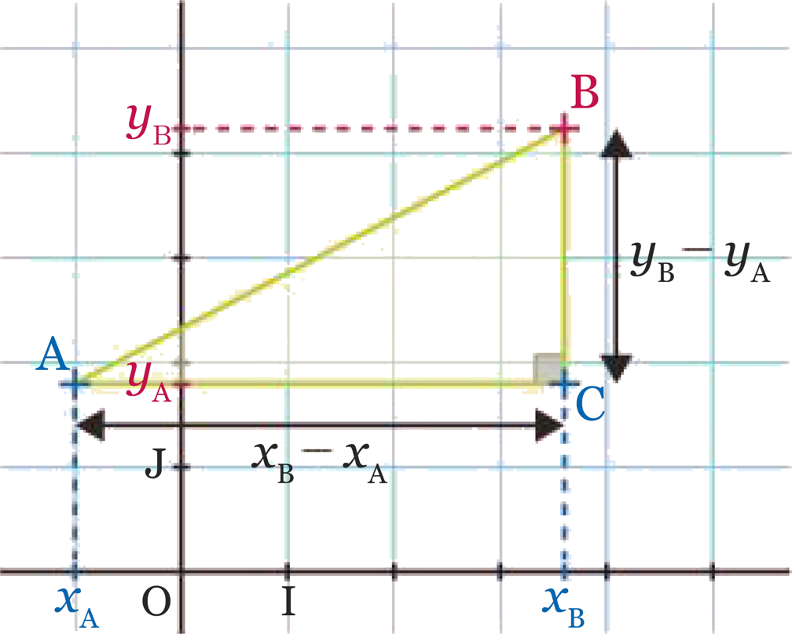
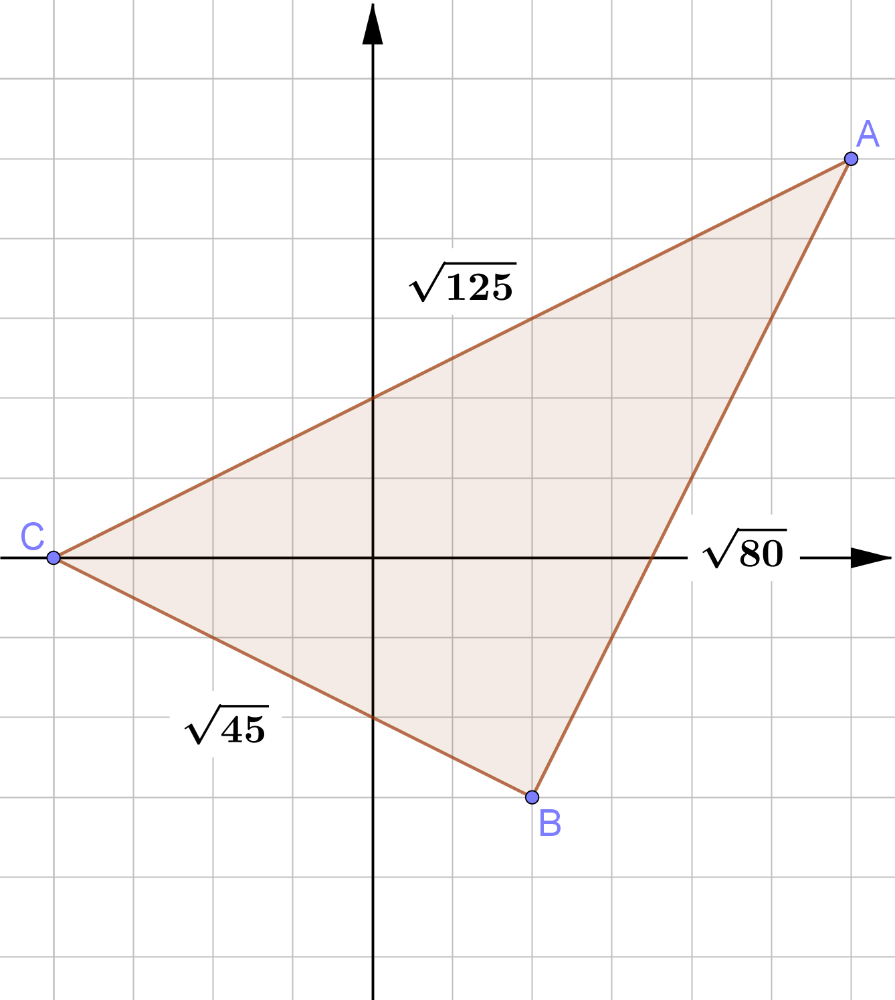
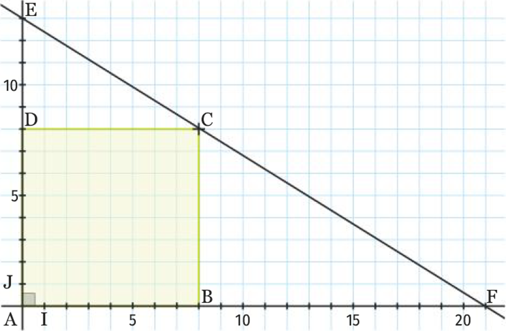
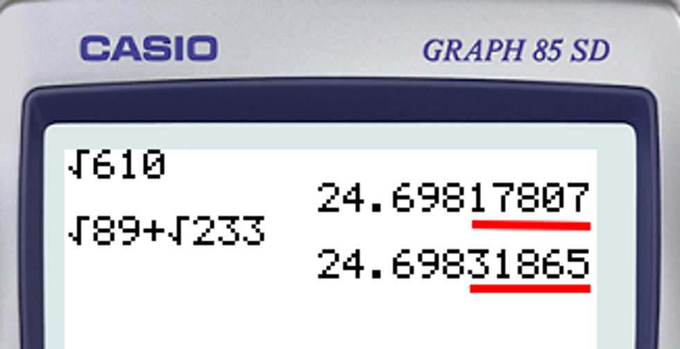

# Repérage dans le plan

## Coordonnées d'un point dans un repère

### Repère et coordonnées

!!! definition

    Définir un repère, c'est donner trois points $O$, $I$ et $J$ **non alignés** dans un ordre précis.

    On note $\OIJ$ ce repère.

    - Le point $O$ est appelé l'**origine du repère**.
    - La droite $(OI)$ est l'axe des **abscisses**.
    - La droite $(OJ)$ est l'axe des **ordonnées**.

    {width=75%}

!!! rem

    Dans le repère $\OIJ$, les coordonnées des points $O$,$I$ et $J$ sont : $$O(0;0)\qquad I(1;0)\qquad J(0;1)$$

!!! rem

    Les coordonnées d’un point sont toujours écrites dans le même ordre :

    $$(\text{abscisse};\text{ordonnée})\qquad\text{ou}\qquad\pa{x;y}$$

!!! exemple

    - $A(1;2)$
    - $B(-4;3)$
    - $C(-3;-2)$
    - $...$
    - $F(5;3)$

    {width=85%}

### Orthogonal, normé et orthonormé

!!! definition

    Soit le repère $\OIJ$

    - Si $(OI)\perp(OJ)$, on dit que le reprère est **orthogonal**
    - Si $OI=OJ$, on dit que le reprère est **normé**
    - **orthogonal** et **normé** = **orthonormé**

    

## Coordonnées du milieu d’un segment

### Propriété : coordonnées d'un milieu

!!! prop

    Soient les points $A(x_A;y_A)$ et $B(x_B;y_B)$.

    Les coordonnées du milieu $M$ du segment $[AB]$ sont données par :

    $$\boxed{x_M=\cfrac{(x_A+x_B)}{2}\qquad\text{et}\qquad y_M=\cfrac{(y_A+y_B)}{2}}$$

!!! rem

    Les coordonnées de $M$ sont la **"moyenne"** des coordonnées de $A$ et de $B$

!!! exemple

    Soient $A(\cbox{lightblue}{2};\cbox{palegreen}{1})$ et $B(\cbox{lightblue}{6};\cbox{palegreen}{3})$

    Les coordonnées de $M$ milieu de $[AB]$ sont :

    - $x_M=\cfrac{(x_A+x_B)}{2}=\cfrac{(\cbox{lightblue}{2}+\cbox{lightblue}{6})}{2}=\cfrac{8}{2}=4$
    - $y_M=\cfrac{(y_A+y_B)}{2}=\cfrac{(\cbox{palegreen}{1}+\cbox{palegreen}{3})}{2}=\cfrac{4}{2}=2$

    On a donc $M(4;2)$

    {width=80%}

!!! exemple

    **Rappel :** Un quadrilatère dont les diagonales se coupent en leurs milieux est un parallélogramme.

    Soient $A(1;2)$, $B(3;2)$, $C(4;1)$ et $D(2;1)$.

    - $K$ milieu de $[AC]$ : $\quad K\left(\cfrac{1+4}{2};\cfrac{2+1}{2}\right)\Rightarrow K\left(\cfrac{5}{2};\cfrac{3}{2}\right)$
    - $L$ milieu de $[BD]$ : $\quad L\left(\cfrac{3+2}{2};\cfrac{2+1}{2}\right)\Rightarrow L\left(\cfrac{5}{2};\cfrac{3}{2}\right)$

    $K$ et $L$ ont même coordonnées **donc** $[AC]$ et $[BD]$ se coupent en leurs milieux **donc** $ABCD$ est un parallélogramme.

    {width=75%}

## Distance entre deux points

### Propriété : distance entre deux points

!!! prop

    Soient les points $A(x_A; y_A)$ et $B(x_B; y_B)$.

    La distance entre $A$ et $B$ :

    $$\boxed{AB=\sqrt{(x_A-x_B)^2 +(y_A-y_B)^2 }}$$

!!! exemple

    Soient $A(\cbox{lightblue}{-1};\cbox{palegreen}{2})$ et $B(\cbox{lightblue}{4};\cbox{palegreen}{3})$. On a :

    $$
    	\begin{aligned}
    		AB & =\sqrt{(x_A-x_B)^2 +(y_A-y_B)^2 }                                                                    \\\\
    		~  & =\sqrt{(\cbox{lightblue}{(-1)}-\cbox{lightblue}{4})^2 +(\cbox{palegreen}{2}-\cbox{palegreen}{3})^2 } \\\\
    		~  & =\sqrt{(-5)^2 +(-1)^2 }                                                                              \\\\
    		~  & =\sqrt{26}\approx 5.1                                                                                \\\\
    	\end{aligned}
    $$

    {width=60%}

!!! demo

    Soient les points $A(x_A; y_A)$ et $B(x_B; y_B)$.

    Considérons le point $C$ tel que : $\quad C(x_B;y_A)$

    {width=50%}

    On a :

    - $AC=(x_B-x_A)~\text{et}~BC=(y_B-y_A)$

    D'après le théorème de Pythagore :

    - $AB^2 =AC^2 +BC^2 $

    Donc

    $$
    	\begin{aligned}
    		~     & ~AB^2 =(x_B-x_A)^2 +(y_B-y_A)^2       \\\\
    		\iff~ & ~AB=\sqrt{(x_B-x_A)^2 +(y_B-y_A)^2 }
    	\end{aligned}
    $$

!!! exemple

    Soient $A(6;5)$, $B(2;-3)$ et $C(-4;0)$

    $\begin{aligned}\tc{blue}{AB}&=\sqrt{(6-2)^2 +(5-(-3))^2 }\\\\~&=\sqrt{4^2 +8^2 }=\tc{blue}{\sqrt{80}}\end{aligned}$

    $\begin{aligned}\tc{green}{BC}&=\sqrt{(2-(-4))^2 +((-3)-0)^2 }\\\\~&=\sqrt{6^2 +(-3)^2 }=\tc{green}{\sqrt{45}}\end{aligned}$

    $\begin{aligned}\tc{red}{AC}&=\sqrt{(6-(-4))^2 +(5-0)^2 }\\\\~&=\sqrt{10^2 +5^2 }=\tc{red}{\sqrt{125}}\end{aligned}$

    On a : $\quad \tc{red}{AC}^2 =\tc{blue}{AB}^2 +\tc{green}{BC}^2 $ donc $ABC$ est un triangle rectangle

    {width=50%}

### Alignement de 3 points

!!! prop

    Soient $A$, $B$ et $C$ trois points distincts du plan.

    Si $AC=AB+BC$ alors $A$, $B$ et $C$ sont alignés dans cet ordre.

    {width=90%}

!!! exemple

    Soit $ABCD$ est un carré de coté $8$ et deux points $E(0;13)$ et $F(21;0)$.

    :question: $E$, $C$ et $F$ sont-ils alignés ?

    {width=80%}

    $~$

    On a $E(0;13)$, $F(21;0)$ et $C(8;8)$

    - $\tc{blue}{EC}=\sqrt{(8-0)^2 +(8-13)^2 }= \tc{blue}{\sqrt{89}}$
    - $\tc{green}{CF}=\sqrt{(21-8)^2 +(0-8)^2 }= \tc{green}{\sqrt{233}}$
    - $\tc{red}{EF}=\sqrt{(21-0)^2 +(0-13)^2 }=\tc{red}{\sqrt{610}}$

    $\tc{red}{EF}\neq \tc{blue}{EC}+\tc{green}{CF}$ donc $E$, $F$ et $C$ ne sont pas alignés.

    {width=50%}
