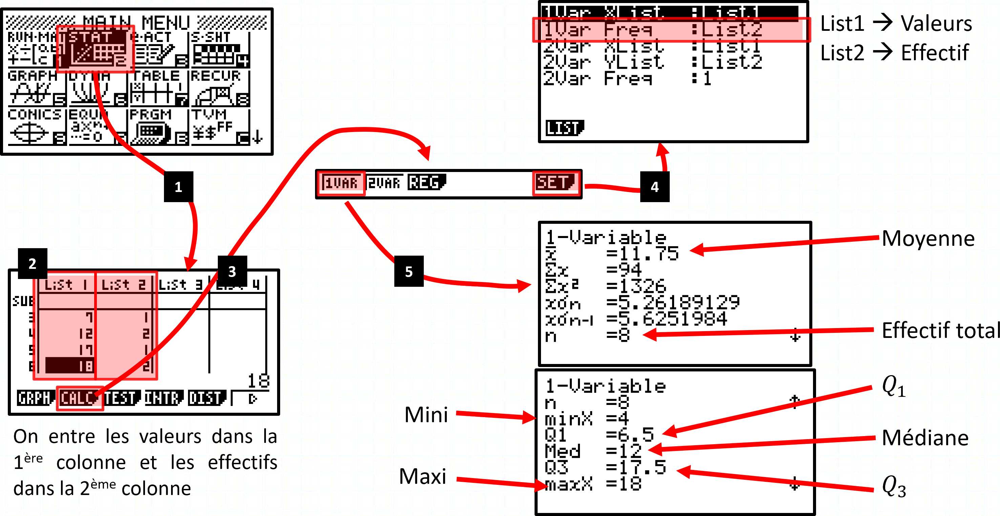

# Statistiques descriptives

## Caractéristiques d'une série statistique

!!! ex

- **Série statistique sous forme "brute"**

Voici une série de notes obtenues par un élève :

$$4 ; 6 ; 18 ; 7 ; 17 ; 12 ; 12 ; 18$$

$~$

- **Série statistique sous forme de tableau**

|    Notes $x_i$ : | $4$ | $6$ | $7$ | $12$ | $17$ | $18$ |
| ---------------: | :-: | :-: | :-: | :--: | :--: | :--: |
| Effectif $n_i$ : | $1$ | $1$ | $1$ | $2$  | $1$  | $2$  |

$~$

- **Série statistique sous forme de tableau avec effectifs cumulés croissants**

|    Notes $x_i$ : | $4$ | $6$ | $7$ | $12$ | $17$ | $18$ |
| ---------------: | :-: | :-: | :-: | :--: | :--: | :--: |
| Effectif $n_i$ : | $1$ | $1$ | $1$ | $2$  | $1$  | $2$  |
|                  |     |     |     |      |      |      |
|         E.C.C. : | $1$ | $2$ | $3$ | $5$  | $6$  | $8$  |

$~$

- **Série statistique sous forme de tableau avec fréquence et fréquences cumulées croissantes**

|    Notes $x_i$ : |  $4$  |  $6$  |  $7$  | $12$  | $17$  | $18$  |
| ---------------: | :---: | :---: | :---: | :---: | :---: | :---: |
| Effectif $n_i$ : |  $1$  |  $1$  |  $1$  |  $2$  |  $1$  |  $2$  |
|                  |       |       |       |       |       |       |
|    Fréq. $f_i$ : | $1/8$ | $1/8$ | $1/8$ | $2/8$ | $1/8$ | $2/8$ |
|         F.C.C. : | $1/8$ | $2/8$ | $3/8$ | $5/8$ | $6/8$ | $8/8$ |

### Moyenne

!!! definition

    La **moyenne** d'une série dont les valeurs sont $x_1$, $x_2$ , $\dots$, $x_k$ et les effectifs correspondants sont $n_1$, $n_2$, $\ldots$, $n_k$ est notée $\ol{x}$ est égale à :

    $$\boxed{~\ol{x}=\cfrac{(n_1\times x_1)+(n_2\times x_2)+\ldots+(n_k\times x_k)}{N}=\cfrac{1}{N}\sum\limits_{i=1}^{i=k} (n_i\times x_i)~}$$

    ... avec $\quad N=n_1+n_2+\ldots+n_k\qquad=\sum\limits_{i=1}^{i=k}n_i$

    La moyenne est une **$\cbox{lightgreen}{caractéristique de position}$**.

!!! exemple

    |    Notes $x_i$ : | $4$ | $6$ | $7$ | $12$ | $17$ | $18$ | Total $(=N)$ |
    | ---------------: | :-: | :-: | :-: | :--: | :--: | :--: | :----------: |
    | Effectif $n_i$ : | $1$ | $1$ | $1$ | $2$  | $1$  | $2$  |     $8$      |

    **Calcul de la moyenne :**

    $$\begin{aligned}\ol{x}~&=\cfrac{(n_1\times x_1)+\ldots+(n_k\times x_k)}{N}\\\\~&=\cfrac{(1\times 4)+(1\times 6)+\ldots+(1\times 17)+(2\times 18)}{8}=11.75\end{aligned}$$

### Médiane

!!! definition

    La médiane $m$ est une valeur telle que :

    - la moitié au moins de l'effectif ait des valeurs inférieures ou égales à $m$,
    - l'autre moitié des valeurs supérieures ou égales à $m$.

    La médiane est une **$\cbox{lightgreen}{caractéristique de position}$**.

!!! exemple

    |    Notes $x_i$ : | $4$ | $6$ | $7$ | $12$ | $17$ | $18$ |
    | ---------------: | :-: | :-: | :-: | :--: | :--: | :--: |
    | Effectif $n_i$ : | $1$ | $1$ | $1$ | $2$  | $1$  | $2$  |
    |         E.C.C. : | $1$ | $2$ | $3$ | $5$  | $6$  | $8$  |

    **Calcul de la médiane :**

    $N=8~\iff~\cfrac{N}{2}=4$

    $N$ est pair donc la médiane se situe entre la $4^\text{ème}$ et la $5^\text{ème}$ valeur.

    On a : $\qquad m=\cfrac{12+12}{2}=12$

    **Vérification :**

    Série ordonnée séparée en 2 :

    $$\boxed{4;6;7;12}~~\lvert~~\boxed{12;17;18;18}$$

    On a bien : $\qquad m=12$

### Étendue

!!! definition

    L'étendue d'une série statistique est la **différence** entre la plus **grande valeur** et la plus **petite valeur** de la série.

    L'étendue est une **$\cbox{lightblue}{caractéristique de dispersion}$**.

!!! exemple

    |    Notes $x_i$ : | $4$ | $6$ | $7$ | $12$ | $17$ | $18$ |
    | ---------------: | :-: | :-: | :-: | :--: | :--: | :--: |
    | Effectif $n_i$ : | $1$ | $1$ | $1$ | $2$  | $1$  | $2$  |

    L'étendue de la série est : $18-4=14$

### Quartiles, écart interquartile

!!! definition

    - Le 1er quartile $(Q_1)$ : Plus petite valeur de la série telle qu'**au moins $25\%$** des autres valeurs de la série sont $\le$ à cette valeur.

    {width=50%}

    - Le 3ème quartile $(Q_3)$ : Plus petite valeur de la série telle qu'**au moins $75\%$** des autres valeurs de la série sont $\le$ à cette valeur.

    {width=50%}

!!! exemple

    |    Notes $x_i$ : | $4$ | $6$ | $7$ | $12$ | $17$ | $18$ |
    | ---------------: | :-: | :-: | :-: | :--: | :--: | :--: |
    | Effectif $n_i$ : | $1$ | $1$ | $1$ | $2$  | $1$  | $2$  |
    |         E.C.C. : | $1$ | $2$ | $3$ | $5$  | $6$  | $8$  |

    **Calcul des quartiles :**

    $N=8~\iff~\cfrac{1}{4}\times N=2\quad\text{et}\quad\cfrac{3}{4}\times N=6$

    - $Q_1$ se situe entre la $2^{\text{ème}} $ et la $3^{\text{ème}} $ valeur de la série. $Q_1=\cfrac{6+7}{2}=6.5$
    - $Q_3$ se situe entre la $6^{\text{ème}} $ et la $7^{\text{ème}} $ valeur de la série. $Q_3=\cfrac{17+18}{2}=17.5$

!!! definition

    L'**écart interquartile** d'une série statistique est égal à $Q_3-Q_1$

    {width=40%}

!!! rem

    - L'**écart interquartile** mesure la **$\cbox{lightblue}{dispersion}$** autour de la médiane.
    - Il contient **au moins 50%** des valeurs de la série.
    - L'**écart interquartile** n'est pas influencé par les valeurs extrêmes.

!!! exemple

    |    Notes $x_i$ : | $4$ | $6$ | $7$ | $12$ | $17$ | $18$ |
    | ---------------: | :-: | :-: | :-: | :--: | :--: | :--: |
    | Effectif $n_i$ : | $1$ | $1$ | $1$ | $2$  | $1$  | $2$  |

    - $Q_1=6.5\quad$ et $\quad Q_3=17.5$
    - L'écart interquartile est de : $17.5-6.5=11$

### Variance - Écart-type

!!! definition

    - La **variance** $V$ est égale à :

    $$\boxed{V=\cfrac{1}{N}\times\pa{n_1\times\pa{x_1-\ol{x}}^2 +\ldots+n_k\times\pa{x_k-\ol{x}}^2 }}$$

    - L'**écart-type** est égal à : $\boxed{\sigma=\sqrt{V}}$

    L'écart-type et la variance sont des **$\cbox{lightblue}{caractéristiques de dispersion}$**.

!!! rem

    La variance est la **moyenne pondérée** du **carré** de la **différence entre les valeurs et la moyenne**.

!!! exemple

    |    Notes $x_i$ : | $4$ | $6$ | $7$ | $12$ | $17$ | $18$ |
    | ---------------: | :-: | :-: | :-: | :--: | :--: | :--: |
    | Effectif $n_i$ : | $1$ | $1$ | $1$ | $2$  | $1$  | $2$  |

    - On a : $\ol{x}= 11.75$

    |      Notes $x_i$ : |    $4$    |    $6$    | $\ldots$ |    $18$    |
    | -----------------: | :-------: | :-------: | :------: | :--------: |
    |   Effectif $n_i$ : |    $1$    |    $1$    | $\ldots$ |    $2$     |
    |                    |           |           |          |            |
    |     $x_i-\ol{x}$ : | $4-11.75$ | $6-11.75$ | $\ldots$ | $18-11.75$ |
    |                    | $=-7.75$  | $=-5.75$  |          |  $=6.25$   |
    | $(x_i-\ol{x})^2$ : | $60.0625$ | $33.0625$ | $\ldots$ | $39.0625$  |

    On a :

    $$
        \def\arraystretch{2}\begin{array}{rlll}
    	    V & =\cfrac{1}{N}\times\big(n_1\times(x_1-\ol{x})^2 & +\ldots & +n_k\times(x_k-\ol{x})^2 \big)                \\\\
    	    ~ & =\cfrac{1}{8}\times\big(1\times(4-11.75)^2      & +\ldots & +2\times(18-11.75)^2 \big)                    \\\\
    	    ~ & =\cfrac{1}{8}\times\big(1\times 60.0625         & +\ldots & +2\times 39.0625\big)\qquad\qquad\approx 27.7
        \end{array}
    $$

    Et donc :

    $$\sigma=\sqrt{V}=\sqrt{27.7}\approx 5.26$$

!!! prop

    $$V=\cfrac{1}{N}\sum\limits_{i=1}^{i=N} n_i\times(x-\ol{x})^2 =\underbrace{\left(\cfrac{1}{N}\sum\limits_{i=1}^{i=N} n_i \times (x_i)^2\right)}\_{\textstyle\text{Moyenne des } x^2 } - \underbrace{\left(\cfrac{1}{N}\sum\limits_{i=1}^{i=N} n_i\times x_i\right)^2 }\_{\textstyle\text{Moyenne}^2}$$

## Calculatrice

!!! ex

    - Utilisation de la calculatrice avec une série "brute"
      $$4 ; 6 ; 18 ; 7 ; 17 ; 12 ; 12 ; 18$$

    

    $~$

    - Utilisation de la calculatrice avec un "tableau"

    |    Notes $x_i$ : | $4$ | $6$ | $7$ | $12$ | $17$ | $18$ |
    | ---------------: | :-: | :-: | :-: | :--: | :--: | :--: |
    | Effectif $n_i$ : | $1$ | $1$ | $1$ | $2$  | $1$  | $2$  |

    

## Cas de pondération d'une série statistique

!!! ex

    - Tailles des $27$ élèves des $4^\text{ème}$ B en cm : (série brute)

    174 - 160 - 161 - 166 - 177 - 172 - 157 - 175 - 162 - 169 - 160 165 - 170 - 152 - 168 - 156 - 163 - 167 - 169 - 158 - 164 - 151 - 162 - 166 - 156 - 165 - 179

    $~$

    - Regroupement par classe : (sous forme de tableau)

    |   Taille : | $\big[150;155\big[$ | $[155;160[$ | $[160;165[$ | $[165;170[$ | $[170;175[$ | $[175;180[$ |
    | ---------: | :-----------------: | :---------: | :---------: | :---------: | :---------: | :---------: |
    | Effectif : |         $2$         |     $4$     |     $7$     |     $8$     |     $3$     |     $3$     |
    |    Fréq. : |       $0.07$        |   $0.15$    |   $0.26$    |    $0.3$    |   $0.11$    |   $0.11$    |

### Représentation sous forme d'histogramme

!!! ex

    | Sans groupement de classes | Avec regroupement de classes |
    | :------------------------: | :--------------------------: |
    |        |          |

### Calcul de la moyenne

!!! ex

    Dans le cas où les valeurs sont regroupées en classes, on calcule le **centre** de chaque classe pour calculer la moyenne.

    - Le centre de la classe $[150;155[~$ est $~\left(\cfrac{150+155}{2}\right)= 152.5$
    - Le centre de la classe $[155;160[~$ est $~\left(\cfrac{155+160}{2}\right)= 157.5$
    - $\ldots$

    $~$

    - Tableau avec les **classes centrées**

    | Classes centrées $x_i$ : | $152.5$ | $157.5$ | $162.5$ | $167.5$ | $172.5$ | $177.5$ |
    | -----------------------: | :-----: | :-----: | :-----: | :-----: | :-----: | :-----: |
    |         Effectif $n_i$ : |   $2$   |   $4$   |   $7$   |   $8$   |   $3$   |   $3$   |

    - Calcul de la moyenne :

    $$\ol{x}=\cfrac{1}{27}\times\big(\left(2\times 152.5\right)+\ldots+\left(3\times 177.5\right)\big)\approx 165.28\text{cm}$$
