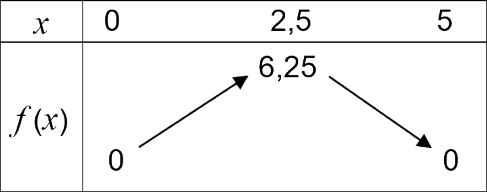
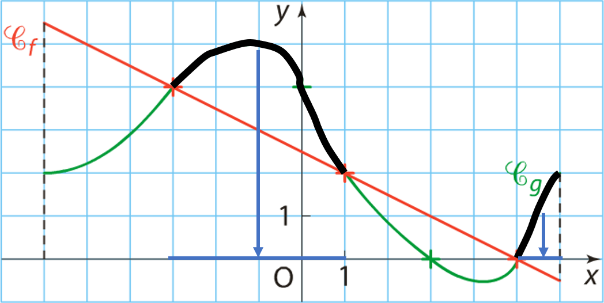

# Variation de fonctions

## Variations d'une fonctions

### Définition

!!! definition

    Soit $f$ une fonction définie sur $I$.

    Pour tout $a$ et $b \in I$, tel que $a\lt b$ :

    - Si $f(a) \lt f(b) \Rightarrow f$ est **croissante** sur $I$
    - Si $f(a) > f(b) \Rightarrow f$ est **décroissante** sur $I$
    - Si $f(a) = f(b) \Rightarrow f$ est **constante** sur $I$

    **Représentation :**

    - Pour tout $a$ et $b$, tel que $a\lt b$, on a $f(a)\lt f(b)$ donc $f$ est **croissante**
    - Pour tout $a$ et $b$, tel que $a\lt b$, on a $f(a)>f(b)$ donc $f$ est **décroissante**

    |      $f$ croissante       |     $f$ décroissante      |
    | :-----------------------: | :-----------------------: |
    |  |  |

!!! rem

    Dire que $f$ est **monotone** sur $I$ signifie que $f$ est soit **croissante**, soit **décroissante** sur $I$.

!!! exemple

    | Fonctions monotones sur $[1~;~7]$ | Fonction non monotone sur $[1~;~7]$ |
    | :-------------------------------: | :---------------------------------: |
    |         |            |
    |         |                                     |

!!! exemple

    Soit $f$ définie sur $[0;5]$ tel que :

    $$f(x)=5x-x^2$$

    {width=50%}

    Graphiquement :

    - Sur $[0~;~2.5]$, $f$ est **croissante**.
    - Sur $[2.5~;~5]$, $f$ est **décroissante**.

    $f$ n'est pas monotone sur $\brack{0~;~5}$ mais elle est monotone sur $\brack{0~;~2.5}$ et sur $\brack{2.5~;~5}$

!!! definition

    Soit $f$ une fonction définie sur $I$.

    - Dire que $f$ admet un **maximum** en $a$ signifie que pour tout $x\in I$ on a : $$f(x)\le f(a)$$
    - Dire que $f$ admet un **minimum** en $b$ signifie que pour tout $x\in I$ on a : $$f(x)\ge f(b)$$

!!! exemple

    {width=50%}

    $f$ admet un **mini.** en $x=1$ sur $[0~;~3]$ car, pour tout $x\in [0~;~3]$, on a $~f(x)\ge f(1)$.

    Ce **minimum** vaut $(-1)$

!!! exemple

    Soit $f$ définie sur $[0;5]$ tel que $~f(x)=5x-x^2$

    {width=50%}

    Graphiquement :

    - $f$ admet un **maximum** en $2.5$
    - Ce maximum vaut :

    $$f(2.5)=5\times\pa{2.5}-\pa{2.5}^2=6.25$$

### Tableau de variations

!!! definition

    Un tableau de variations _résume_ les variations d'une fonction en faisant apparaître les intervalles où elle est **monotone**.

!!! exemple

    Soit la fonction $f$ dont on donne le tableau de variations ci-dessous.

    {width=50%}

    La fonction $f~\ldots$

    - $\ldots$ est **définie** sur $[-3;7]$
    - $\ldots$ est **croissante** sur $[-3;0]$ et sur $[4;7]$
    - $\ldots$ est **décroissante** sur $[0;4]$
    - $\ldots$ admet un **maximum** en $x=0\quad\rarr\quad$ Le **maximum** de $f$ est $4$
    - $\ldots$ admet un **minimum** en $x=4\quad\rarr\quad$ Le **minimum** de $f$ est $-2$

!!! exemple

    Soit $f$ définie sur $[0;5]$ tel que : $~f(x)=5x-x^2$

    {width=50%}

    $~$

    - Le tableau de variations de $f$ est :

    {width=50%}

!!! exemple

    Soit la représentation graphique de $f$ définie sur $[-5;7]$.

    

    On a :

    - L'ensemble de définition de $f$ est $[-5;7]$
    - Le tableau de variations de $f$ est :

    {width=75%}

    $~$

    - $f$ est **croissante** sur $[-4;0]$ et sur $[5;7]$
    - $f$ est **décroissante** sur $[-5;-4]$ et sur $[0;5]$
    - $f$ admet un **minimum** pour $x=(-4)$ et ce **minimum** vaut $(-4)$
    - $f$ admet un **maximum** pour $x=0$ et ce **maximum** vaut $3.5$

## Équation / inéquations

!!! methode

    On peut résoudre graphiquement une équation (ou inéquation) à l'aide de la représentation graphique d'une fonction.

    Pour cela, il suffit de trouver les antécédents d'une valeur (ou plusieurs) par une fonction.

### Résoudre $f(x)=k$ ou $f(x)\ge k$

!!! exemple

    **Résoudre l'équation $~5x-x^2=6$**

    On considère la fonction : $\quad f(x)=5x-x^2$

    On doit trouver les antécédents de $6$ par la fonction $f$.

    {width=50%}

    Graphiquement, on lit $~x=2~$ et $~x=3~$

    $$f(x)=6\iff S=\brace{2~;~3}$$

!!! exemple

    **Résoudre l'équation $~5x-x^2>6$**

    On considère la fonction : $\quad f(x)=5x-x^2$

    On doit trouver **les abscisses** des points dont **l'ordonnée** est $6$.

    {width=50%}

    Graphiquement, on lit :

    $$f(x)>6\iff x\in \big]2~;~3\big[$$

### Résoudre $f(x)=g(x)$ ou $f(x)\ge g(x)$

!!! methode

    Pour résoudre $f(x)=g(x)$, il faut trouver les **abscisses** des points d'intersection entre $\Cf$ et $\Cg$.

!!! exemple

    Dans le cas ci-dessous, on a :

    $$f(x)=g(x)~\iff~\begin{cases}x_1=0\\\\x_2=4\end{cases}~\iff~S=\brace{0~;~4}$$

    {width=50%}

!!! methode

    Pour résoudre $g(x)\ge f(x)$, il faut trouver les **abcisses** des points pour lesquelles la courbe $\Cg$ est située **au dessus** de la courbe $\Cf$.

!!! exemple

    Dans le cas ci-dessous, on a :

    $$g(x)\ge f(x)\iff x\in [-3;1]\cup [5;6]$$

    {width=90%}
