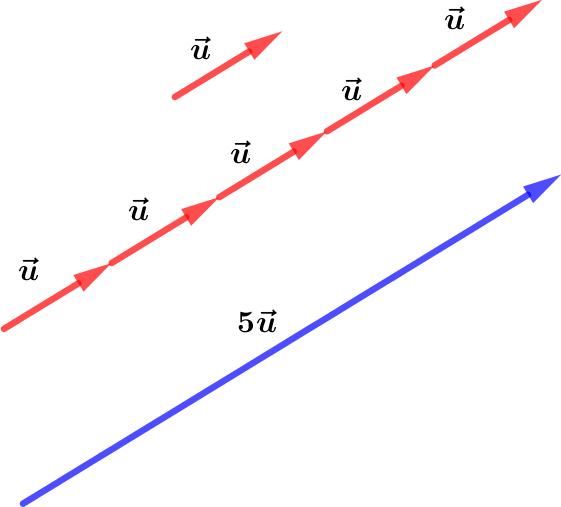
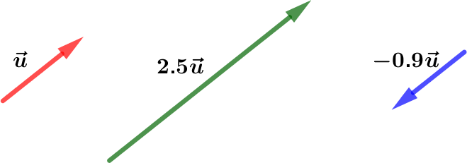
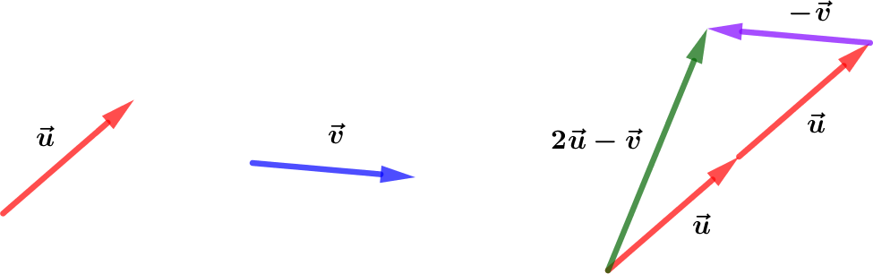

# Vecteurs et colinéarité

## Produit d'un vecteur par un réel

!!! exemple

    Soit $\vec{u}$ un vecteur du plan.

    Appliquer $5$ fois la translation de vecteur $\vec{u}$ revient à appliquer la translation de vecteur :

    $$\vec{w} = \vec{u}+\vec{u}+\vec{u}+\vec{u}+\vec{u}=5\times \vec{u}$$

    {width=70%}

### Définition

!!! definition

    On appelle **produit** du vecteur $\vec{u}$ par le réel $k$, le vecteur noté $k\vec{u}$ :

    - de **même direction** que $\vec{u}$
    - de :
        - **même sens** que $\vec{u}$ si $k>0$
        - **sens contraire** que $\vec{u}$ si $k\lt 0$
    - de **norme** égale à :
        - $k$ fois la norme de $\vec{u}$ si $k> 0$
        - $(-k)$ fois norme de $\vec{u}$ si $k\lt 0$

    {width=90%}

!!! exemple

    - La norme de $2.5\vec{u}$ est égale à $2.5$ fois la norme de $\vec{u}$
    - La norme de $-0.9\vec{u}$ est égale à $0.9$ fois la norme de $\vec{u}$

    {width=90%}

!!! methode

    **Représenter un vecteur défini comme produit et somme de vecteurs**

    Soit deux vecteurs $\vec{u}$ et $\vec{v}$.

    Représentons les vecteurs $\vec{w}=2\vec{u}-\vec{v}$.

    - Pour représenter $2\vec{u}$, on place bout à bout deux vecteurs $\vec{u}$.
    - Pour représenter $-\vec{v}$, on représente un vecteur de même direction et même longueur que $\vec{v}$ mais de sens opposé.
    - Pour représenter le vecteur $\vec{w}=2\vec{u}-\vec{v}$ (ou $2\vec{u}+(-\vec{v})$, on place bout à bout les vecteurs $2\vec{u}$ et $-\vec{v}$.

    {width=90%}

!!! exemple

    Soit les points $A$, $B$ et $C$

    Construisons $M$ tel que : $\quad \vec{AM}=-\vec{AB}+3\vec{AC}$

    Pour représenter $\vec{AM}$, on place bout à bout à partir de $A$ :

    - $\vec{-AB}$
    - $3\vec{AC}$.

    Le point $M$ se trouve à l'extrémité du vecteur $3\vec{AC}$.

    {width=90%}

!!! methode

    **Exprimer, par lecture graphique, un vecteur en fonction d'autres vecteurs**

    Par lecture graphique, exprimons $\vec{u}$ en fonction de $\vec{a}$ et $\vec{b}$.

    On construisons **"un chemin"** de vecteurs $\vec{a}$ et $\vec{b}$ mis bout à bout reliant l'origine et l'extrémité du vecteur $\vec{u}$.

    On peut ainsi compter ainsi le nombre de $\vec{a}$ et $\vec{b}$ formant le **"chemin"**.

    On a : $\quad \vec{u}=3\vec{a}+3\vec{b}$

    {width=40%}

## Notion de colinéarité

### Définition : Colinéarité

!!! def

    $\vec{u}$ et $\vec{v}$ sont **colinéaires** signifie qu'ils ont **même direction**.

    Dans ce cas, il existe un nombre réel $k\neq 0$ tel que : $~\vec{u}=k\times\vec{v}$

    $$\boxed{\vec{u}~\text{et}~\vec{v}~\text{colinéaires}~\iff~\exists k\in\R^{*}~\text{tel que}~\vec{u}=k\times\vec{v}}$$

    {width=90%}

!!! methode

    **Démontrer que des vecteurs sont colinéaires**

    On donne $~\vec{u}~$ et $~\vec{v}~$ tel que $~-4\vec{u}+3\vec{v}=\vec{0}~$

    :question: $\vec{u}$ et $\vec{v}$ sont-ils colinéaires ?

    $$
        \begin{aligned}
    	    -4\vec{u}+3\vec{v}=\vec{0}\quad & \iff -4\vec{u}=-3\vec{v}                                                                       \\\\
    	    \quad                           & \iff\vec{u}=\cfrac{-3}{-4}\vec{v}                                                              \\\\
    	    \quad                           & \iff\vec{u}=\cfrac{3}{4}\vec{v}\quad & \iff\quad\vec{u}~\text{et}~\vec{v}~\text{colinéaires}
        \end{aligned}
    $$

### Applications

!!! prop

    - $\vec{AB}$ et $\vec{CD}$ colinéaires $\iff (AB)\parallel(CD)$
    - $\vec{AB}$ et $\vec{AC}$ colinéaires $\iff A$, $B$ et $C$ alignés

    |  $(AB)\parallel(CD)$  | $A$, $B$ et $C$ alignés |
    | :-------------------: | :---------------------: |
    |  |    |

## Propriétés : Colinéarité de vecteurs

### Propriété : À l'aide des coordonnées

!!! prop

    Soient $\vec{u}\coord{x}{y}$ et $\vec{v}\coord{x'}{y'}$ deux vecteurs dans un repère $(O;\vec{i},\vec{j})$.

    $$\boxed{\vec{u}~\text{ et }~\vec{v}~\text{ colinéaires }\iff (x\times y')-(y\times x')=0}$$

!!! methode

    **Vérifier si deux vecteurs sont colinéaires**

    Soient $~\vec{u}\coord{4}{-7}~$ et $~\vec{v}\coord{-12}{21}~$

    $$\begin{aligned}xy'-yx'~&=\left(4\times 21\right)-\left((-7)\times (-12)\right)\\\\~&=84-84=0\qquad\Rarr\vec{u}~\text{ et }~\vec{v}~\text{colinéaires}\end{aligned}$$

!!! demo

    Dire que les vecteurs $\vec{u}\coord{x}{y}$ et $\vec{v}\coord{x'}{y'}$ sont colinéaires équivaut à dire qu'il existe un nombre réel $k$ tel que $\vec{u}=k\times \vec{v}$.

    $$
        \begin{aligned}
    	    \vec{u}~\text{et}~\vec{v}~\text{colinéaires}~ & ~\Rarr~\vec{u}=k\times \vec{v}~\Rarr~\begin{cases}x=k\times x'\\\\y=k\times y'\end{cases}~\Rarr~\begin{cases}k=\cfrac{x}{x'}\\\\k=\cfrac{y}{y'}\end{cases} \\\\
    	    ~                                             & ~\Rarr~\cfrac{x}{x'}=\cfrac{y}{y'}                                                                                                                         \\\\
    	    ~                                             & ~\Rarr~(x\times y')=(y\times x')                                                                                                                           \\\\
    	    ~                                             & ~\Rarr~(x\timesy')-(y\timesx')=0
        \end{aligned}
    $$

    ---

    Réciproquement, si $~xy'-yx'=0~$ et $\vec{v}$ étant non nul, l'une de ses coordonnées est non nulle.

    Supposons que $x'\neq 0$. Posons $k = \cfrac{x}{x'}$.

    On a :

    $$xy'-yx'=0~\Rarr~yx'=xy'~\Rarr~y=\cfrac{x}{x'}y~\Rarr~y=ky'$$

    Donc :

    $$\begin{aligned}xy'-yx'=0~&~\Rarr~\begin{cases}x=kx'\\\\y=ky'\end{cases}\\\\~&~\Rarr~ \vec{u}=k\vec{v} ~\Rarr~ \vec{u}~\text{ et }~\vec{v}~\text{colinéaires}\end{aligned}$$

!!! ex

    Soient $\vec{u}\coord{5}{-2}$ et $\vec{v}\coord{15}{-7}$

    $$\begin{aligned}xy'-yx'~&=\left(5\times (-7)\right)-\left((-2)\times 15\right)\\\\~&=-35+30=-5\qquad\Rarr\vec{u}~\text{ et }~\vec{v}~\text{non colinéaires}\end{aligned}$$

### Définition : Déterminant de $\vec{u}$ et $\vec{v}$

!!! definition

    Soient $\vec{u}\coord{x}{y}$ et $\vec{v}\coord{x'}{y'}$ deux vecteurs dans un repère $(O;\vec{i},\vec{j})$.

    On note :

    $$\boxed{\qquad\det(\vec{u};\vec{v})=\begin{vmatrix}x&x'\\\\y&y'\end{vmatrix}=xy'-yx'}$$

### Propriété : Colinéarité et déterminant

!!! prop

    $$\boxed{\vec{u}~\text{ et }~\vec{v}~\text{ colinéaires }\quad\iff\quad\det(\vec{u};\vec{v})=0}$$

!!! methode

    **Vérifier si deux vecteurs sont colinéaires à l'aide du déterminant**

    Soient $~\vec{u}\coord{-6}{10}~$ et $~\vec{v}\coord{9}{-15}~$

    $$\begin{aligned}\det(\vec{u};\vec{v})=\begin{vmatrix}-6&9\\\\10&-15\end{vmatrix}~&=\big((-6)\times (-15)\big)-\big(10\times 9\big)\\\\~&=90-90=0~\Rarr\quad\vec{u}~\text{ et }~\vec{v}~\text{colinéaires}\end{aligned}$$

!!! methode

    **Utiliser la colinéarité pour démontrer que 2 droites sont parallèles**

    Soient $A(-1,1;)$, $~B(3;2)$, $~C(-2;-3)$, $~D(6;-1)$ et $~E(5;0)$.

    Démontrons que $(AB)\parallel(CD)$.

    On a :

    $$\vec{AB}=\begin{pmatrix}3-(-1)\\\\2-1\end{pmatrix}=\begin{pmatrix}4\\\\1\end{pmatrix}\quad\text{et}\quad\vec{CD}=\begin{pmatrix}6-(-2)\\\\-1-(-3)\end{pmatrix}=\begin{pmatrix}8\\\\2\end{pmatrix}$$

    Et donc :

    $$\det(\vec{AB};\vec{CD})=\begin{vmatrix}4&8\\\\1&2\end{vmatrix}=(4\times 2)-(8\times 1)=0$$

    Donc $~\vec{AB}~$ et $\vec{CD}$ sont colinéaires $\iff(AB)\parallel(CD)$

!!! methode

    **Utiliser la colinéarité pour démontrer que 3 points sont alignés**

    Soient $A(-1,1;)$, $~B(3;2)$, $~C(-2;-3)$, $~D(6;-1)$ et $~E(5;0)$.

    Démontrons que $E$, $B$ et $D$ sont alignés

    On a :

    $$\vec{EB}=\begin{pmatrix}3-5\\\\2-0\end{pmatrix}=\begin{pmatrix}-2\\\\2\end{pmatrix}\quad\text{et}\quad\vec{ED}=\begin{pmatrix}6-5)\\\\-1-0)\end{pmatrix}=\begin{pmatrix}1\\\\-1\end{pmatrix}$$

    Et donc :

    $$\det(\vec{EB};\vec{ED})=\begin{vmatrix}-2&1\\\\2&-1\end{vmatrix}=\big((-2)\times (-1)\big)-(2\times 1)=0$$

    Donc $~\vec{EB}~$ et $\vec{ED}$ sont colinéaires $\iff E$, $B$ et $D$ sont alignés
