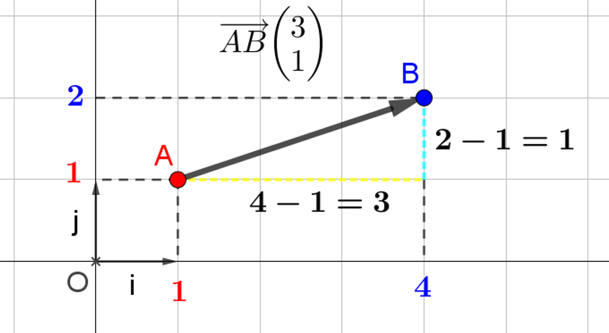

# Vecteurs et coordonnées

## Repère du plan

!!! rem

    Trois points distincts $O$, $I$ et $J$ forment un **repère**, que l'on peut noter $\OIJ$.

    L'origine $O$ et les unités $OI$ et $OJ$ permettent de **graduer** les axes $(OI)$ et $(OJ)$.

    Si on pose $\vec{i}=\vec{OI}$ et $\vec{j}=\vec{OJ}$, alors ce repère se note également $\vOIJ$.

    {width=50%}

### Definition : repère du plan

!!! definition

    - On appelle **repère du plan** tout triplet $(O;\vec{i},\vec{j})$ où $O$ est un point et $\vec{i}$ et $\vec{j}$ sont deux vecteurs **non colinéaires**.
    - Un repère est dit **orthogonal** si $\vec{i}$ et $\vec{j}$ ont des directions **perpendiculaires**.
    - Un repère est dit **orthonormé** s'il est **orthogonal** et si $\vec{i}$ et $\vec{j}$ sont de **même norme**.

    

## Coordonnées d'un vecteur

### Définition : Coordonnées d'un vecteur

!!! definition

    Soit $M$ un point d'un repère $\vOIJ$ et $\vec{u}$ tel que $\vec{OM} = \vec{u}$.

    Les coordonnées du vecteur $\vec{u}$ sont les coordonnées du point $M$.

    On note : $\qquad\boxed{\vec{u}(x, y)~\text{ou}~\vec{u}\coord{x}{y}}$.

    {width=80%}

!!! methode

    **Lire les coordonnées d'un vecteur**

    {width=80%}

    Dans cet exemple, pour aller de $A$ vers $B$, on effectue :

    - Une translation de $3$ carreaux vers la droite $(+3)$
    - une translation de $2$ carreaux vers le haut $(+2)$.

    On trace ainsi un "chemin" de vecteurs $\vec{i}$ et $\vec{j}$ mis bout à bout reliant l'origine et l'extrémité du vecteur $\vec{AB}$.

    Ainsi $~\vec{AB}= 3\vec{i} + 2\vec{j}$

    Les coordonnées de $\vec{AB}$ sont donc $\coord{3}{2}$.

    De même, les vecteurs suivants ont pour coordonnées :

    - $\vec{AB}\coord{3}{2}$
    - $\vec{u}\coord{3}{2}\qquad$ (et donc $\vec{AB}=\vec{u}$)
    - $\vec{v}\coord{-1}{5}$
    - $\vec{w}\coord{0}{-2}$

### Propriété : coordonnées d'un vecteur dans un repère

!!! prop

    Dans un repère $\vOIJ$, on considère les points $A(x_A;y_A)$ et $B(x_B;y_B)$.

    Le vecteur $\vec{AB}$ a pour coordonnées :

    $$\boxed{\vec{AB}\begin{pmatrix}x_B-x_A\\\\y_B-y_A\end{pmatrix}}$$

    {width=80%}

!!! exemple

    Soient $A(1;1)$ et $B(4;2)$

    {width=80%}

    Les coordonnées de $\vec{AB}$ sont $\begin{pmatrix}4-1\\\\2-1\end{pmatrix}$ donc $\quad\vec{AB}\begin{pmatrix}3\\\\1\end{pmatrix}$

### Propriétés

!!! prop

    Soit $\vec{u}$ et $\vec{v}$ deux vecteurs de coordonnées $\coord{x}{y}$ et $\coord{x'}{y'}$ dans un repère $\vOIJ$ et un réel $k$.

    - $\boxed{\vec{u} = \vec{v}}$ équivaut à $\boxed{x = x'~\text{et}~y = y'}$
    - Le vecteur $\boxed{\vec{u} + \vec{v}}$ a pour coordonnées $\boxed{\begin{pmatrix}{x+x'}\\\\{y+y'}\end{pmatrix}}$
    - Le vecteur $\boxed{k\times\vec{u}}$ a pour coordonnées $\boxed{\begin{pmatrix}k\times x\\\\k\times y\end{pmatrix}}$

!!! exemple

    Soient $\vec{u}\coord{-1}{2}~$, $~\vec{v}\coord{0.5}{-2}~$ et $~\vec{w}=2(\vec{u}+3\vec{v})$

    On a :

    - $3\vec{v}\coord{3\times0.5}{3\times -2}\quad\iff\quad 3\vec{v}\coord{1.5}{-6}$
    - $\vec{u}+3\vec{v}\coord{-1+1.5}{2-6}\quad\iff\quad \vec{u}+3\vec{v}\coord{0.5}{-4}$
    - $\vec{w}=2(\vec{u}+3\vec{v})\quad\iff\quad \vec{w}\coord{2\times 0.5}{2\times -4}\quad\iff\quad \vec{w}\coord{1}{-8}$

!!! methode

    **Calculer les coordonnées d'un point défini par une égalité vectorielle**

    Dans un repère, soient les points $A(1;2)$, $B(-4;3)$, $C(1;-2)$.

    Déterminons les coordonnées de $D$ tel que $ABCD$ soit un parallélogramme.

    {width=80%}

    $ABCD$ est un parallélogramme si et seulement si $\vec{AB}=\vec{DC}$

    On a :

    - $\vec{AB}\coord{-4-1}{3-2}=\coord{-5}{1}$
    - $\vec{DC}\coord{1-x_D}{-2-y_D}$

    Donc $\begin{cases}1-x_D=-5\\\\-2-y_D=1\end{cases}~\iff~\begin{cases}x_D=6\\\\y_D=-3\end{cases}$

### Norme d'un vecteur

!!! prop

    Soit $\vec{u}$ un vecteur de coordonnées $\coord{x}{y}$ dans un repère $\vOIJ$.

    On a : $$\boxed{\norm{\vec{u}} = \sqrt{x^2 +y^2 }}$$

!!! exemple

    Soit $\vec{u}\coord{3}{1}$.

    On a : $\quad\norm{\vec{u}} = \sqrt{x^2 +y^2 } = \sqrt{3^2 +1^2 }= \sqrt{10}$

    {width=80%}
