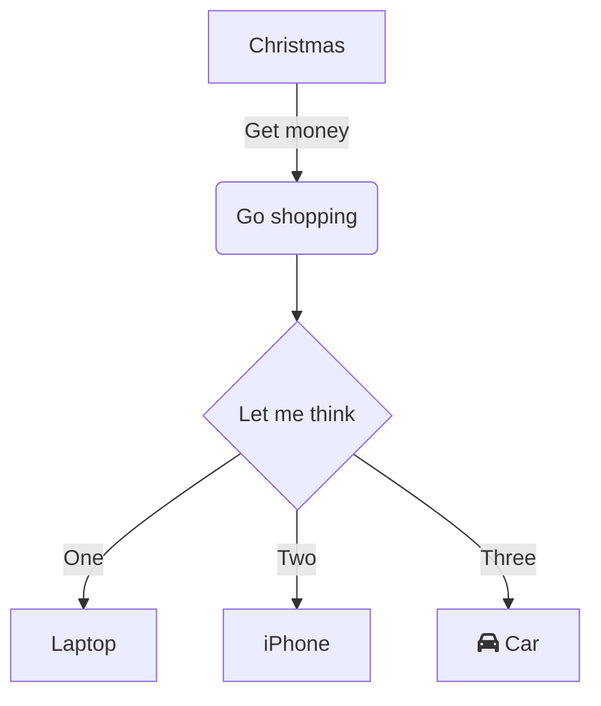
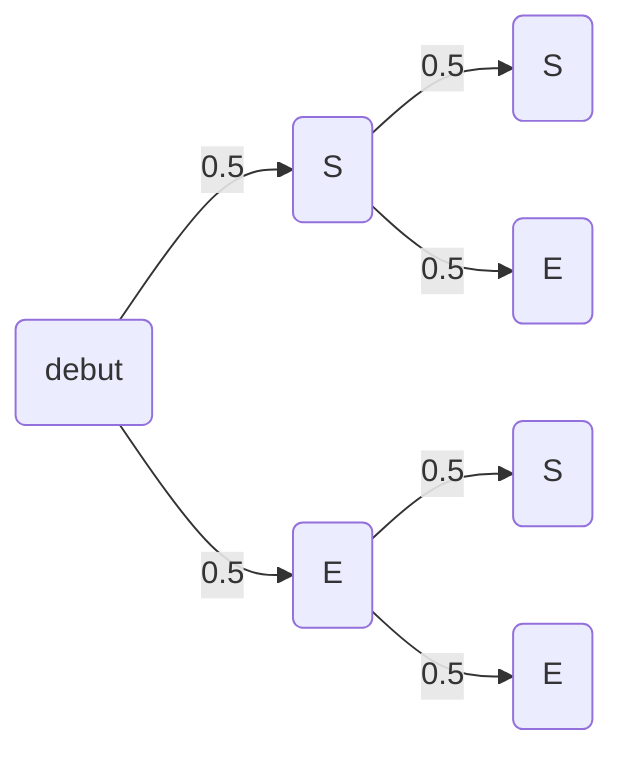

# Markdown in mkdocs

For full documentation visit [mkdocs.org](https://www.mkdocs.org).

Read : [Markdown guide for Mkdocs](https://www.markdownguide.org/tools/mkdocs/)

## Basic Syntax

These are the elements outlined in John Gruber’s original design document. All Markdown applications support these elements.

### Heading

```
# H1

## H2

### H3
```

### Bold

**bold text**

### Italic

_italicized text_

### Blockquote

> blockquote

### Ordered List

1. First item
2. Second item
3. Third item

### Unordered List

- First item
- Second item
- Third item

### Code

`code`

### Horizontal Rule

---

### Link

[Markdown Guide](https://www.markdownguide.org)

### Image


## Extended Syntax

These elements extend the basic syntax by adding additional features. Not all Markdown applications support these elements.

### Table

| Syntax    | Description |
| --------- | ----------- |
| Header    | Title       |
| Paragraph | Text        |

### Fenced Code Block

```
{
  "firstName": "John",
  "lastName": "Smith",
  "age": 25
}
```

## Extensions

### Footnotes

Footnotes[^1] have a label[^@#$%] and the footnote's content.

[^1]: This is a footnote content.

[^@#$%]: A footnote on the label: "@#$%".

```
Footnotes[^1] have a label[^@#$%] and the footnote's content.

[^1]: This is a footnote content.

[^@#$%]: A footnote on the label: "@#$%".
```

### Admonition

!!! type "optional explicit title within double quotes"

    Any number of other indented markdown elements.

    This is the second paragraph.

```
!!! type "optional explicit title within double quotes"

    Any number of other indented markdown elements.

    This is the second paragraph.
```

!!! Définition

    You should $x=1$ note that the title will be automatically capitalized.

    $$\sum\limits_{n=1}^{100} n^2=\ldots$$

```
!!! Définition

    You should $x=1$ note that the title will be automatically capitalized.

    $$\sum\limits_{n=1}^{100} n^2=\ldots$$
```

### Definition List

Apple
: Pomaceous fruit of plants of the genus Malus in the family Rosaceae.

Orange
: The fruit of an evergreen tree of the genus Citrus.

```
Apple
: Pomaceous fruit of plants of the genus Malus in the family Rosaceae.

Orange
: The fruit of an evergreen tree of the genus Citrus.
```

### Emoji :thumbsup:

I love you :heart: and :joy: and :smile: ...

:spades: :diamonds: :hearts: :clubs: :diamond_shape_with_a_dot_inside:

`:spades: :diamonds: :hearts: :clubs: :diamond_shape_with_a_dot_inside:`

[Emoji list :speech_balloon:](https://raw.githubusercontent.com/facelessuser/pymdown-extensions/refs/heads/main/pymdownx/emoji1_db.py)

### Details

[Docs](https://facelessuser.github.io/pymdown-extensions/extensions/blocks/plugins/details/)

/// details | Un contenu caché


Ça marche

///

```
/// details | Un contenu caché


Ça marche

///
```

### Caption

[Docs](https://facelessuser.github.io/pymdown-extensions/extensions/blocks/plugins/caption/)

| Fruit      | Amount |
| ---------- | ------ |
| Apple      | 20     |
| Peach      | 10     |
| Banana     | 3      |
| Watermelon | 1      |

/// figure-caption
Fruit Count
///

```
Fruit      | Amount
---------- | ------
Apple      | 20
Peach      | 10
Banana     | 3
Watermelon | 1

/// figure-caption
Fruit Count
///
```

### Task List

- [x] item 1
    - [x] item A
    - [ ] item B
          more text
        - [x] item a
        - [ ] item b
        - [x] item c
    - [x] item C
- [ ] item 2
- [ ] item 3

```
- [x] item 1
    - [x] item A
    - [ ] item B
          more text
        - [x] item a
        - [ ] item b
        - [x] item c
    - [x] item C
- [ ] item 2
- [ ] item 3
```

### Mermaid

[docs](https://mermaid.live/)



````

````

/// details | Arbre de probabilité



///

# Mkdocs

## Commands

- `mkdocs new [dir-name]` - Create a new project.
- `mkdocs serve` - Start the live-reloading docs server.
- `mkdocs build` - Build the documentation site.
- `mkdocs -h` - Print help message and exit.

## Project layout

    mkdocs.yml    # The configuration file.
    docs/
        index.md  # The documentation homepage.
        ...       # Other markdown pages, images and other files.

```

```

```

```
